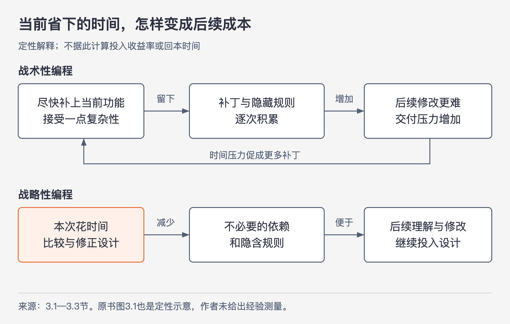

# 《软件设计的哲学》第3章｜能工作的代码是不够的 · 书镜8.2

第 2 章说明复杂性会逐次累积。本章追问：为什么明知小补丁会留下问题，开发者仍然不断选择它？作者以“战略性编程与战术性编程”为副题，讨论如何把长期结构纳入今天的开发决策。

## 一、原书回顾：把未来的修改成本计入今天

章首指出，开发时采用的思维方式会影响最终设计。组织常鼓励尽快完成特性；作者主张持续投入简洁设计和问题修复，并认为这有利于降低长期成本。

### 3.1 战术性编程

战术性编程以尽快让当前特性或修复“能工作”为主要目标。这个目标本身合理，问题出在它排除了未来的理解和修改成本。为了赶截止时间，开发者不比较更好的设计，而是接受一点复杂性或一两个临时补丁，认为先完成眼前任务更重要。

这种妥协会重复发生。每次只留下一个小问题，累积后却会让后续工作变难。等开发者开始后悔，下一项特性又成为推迟重构的理由；继续打补丁，又产生新的复杂性。等到整理需要几个月时，排期更无法容纳；只改一两处又没有明显效果，团队便继续沿用原做法。这里最重要的是这个自我加强的过程：过去的捷径增加现在的压力，压力又推动新的捷径。

作者把极端采用这种方式、产出速度很快的人称为“战术龙卷风”。管理者可能把他当英雄，因为新增特性迅速可见；其他工程师却需要花时间清理和维护他的代码，显得进度更慢。这个例子指出了成本归属的偏差：一个人的交付速度，没有包含其他人后来承担的工作。它是作者描述的一类行为，不宜据此给某位同事贴固定标签。

### 3.2 战略性编程

战略性编程把系统的长期结构放进当前任务。代码仍然必须工作，但还要方便未来的扩展。作者的理由是，大量开发发生在已有代码上；今天的设计会成为后续工作的起点。为眼前速度增加不必要的复杂性，会削弱这一基础。

战略性编程需要投资。主动投资包括：设计新类时比较几种方案，考虑几种合理的后续变更，寻找较简洁的结构，并编写有用的文档。被动投资则发生在旧决定的问题逐渐显现之后：发现设计缺陷时，花时间修正它，而不是继续叠补丁。两者结合，形成持续的小改进。

图3-1｜依据 3.1—3.3 节绘制的影响链。箭头表示作者提出的成本传导；没有用曲线位置暗示可测得的收益大小或回本时间。

原书图3.1用“时间—总体进度”曲线表达同一判断：战术性编程初期较快，后来因复杂性增长而减速；战略性编程初期要投入设计，较长期可能取得更多进展。原图注明确说，这只是定性说明，作者不知道曲线精确形状的经验测量。不能把示意曲线读成预测模型。

### 3.3 投资多少？

作者没有主张在开始时投入巨量时间设计完整系统。那会重新遇到第 1 章的问题：许多合适的设计要靠实现经验才能看见。他建议持续进行小额投入，把总开发时间的 **10%—20%** 用于设计改进，以兼顾当前进度与长期结构。

原文接着用若干比例说明作者预期的回报：开始阶段会有额外时间投入；随着设计收益出现，战略性编程可能比战术性编程快 10%—20%，节约出的时间便可支付后续设计投入。相对地，战术性编程最初可能快 10%—20%，后来又可能至少慢 10%—20%；作者还认为，严重退化的代码质量会使开发速度至少降低 20%。这些是本章用于劝说和估算的说法，没有给出测量设计、样本或数据，不能作为项目排期的已验证收益率。

“技术债”在这里表示为当前进度借用未来时间：现在省下时间，后续修改时却需要反复额外付出。作者特别指出，很多这样的债不会通过一次偿还就结束，而是持续让开发变慢。

关于多久回本，作者明确表示不知道数据，也认为难以做有说服力的对照实验。他个人估计是 **6—18 个月**，推理之一是：写代码数月后，连作者也会忘掉当初的想法，复杂代码带来的理解成本便显现出来。这一估计和推理都属于作者观点；图中的交叉点也没有实测依据。

另有一个源文表述问题：PDF 第 45 页把初始项目写成“将花费10%～20%的时间”，紧接着又说“这些额外的时间”，并与总开发时间的投入比例混用。上下文清楚表达有额外投入，但没有统一这些比例的计算基数。这里保留建议的比例和方向，不把它进一步换算成精确的项目工期。

### 3.4 初创企业与投资

初创公司常面临尽快发布的生存压力，连少量设计投入也可能觉得承担不起。一种常见辩护是：先成功，之后拿钱招聘更多工程师清理代码。作者反对这种预期。他认为，严重退化的代码很难修复，维护成本可能持续整个产品生命周期；坏设计的影响还可能很早出现，战术方式未必真的让首发更快。

他进一步把代码质量与招聘联系起来：优秀工程师有较高生产效率，也重视良好设计；混乱的代码口碑会增加吸引他们的难度，未来成本与结构退化便可能相互强化。这是作者的经验判断，本章未提供招聘数据或控制其他因素的研究。

随后作者讨论书中所处时期的公司案例。他把 Facebook 曾经强调快速行动、容许破坏的文化作为战术方式的显著例子：新人很早就能把代码投入生产，自由度高，员工获得授权的感受也强；与此同时，作者批评其代码不稳定、难理解，注释和测试不足。他还记述了公司后来转向强调坚实基础设施的口号，并在书中保留了对能否清理历史问题的疑问。作者同时说明，Facebook 未必比一般初创公司更差，只是一个较明显的例子。

作为另一组案例，作者描述 Google 和 VMware 重视代码质量及设计、构建可靠复杂产品，并凭技术文化吸引人才。两组案例在文中的作用是说明：采用不同方式的公司都可能商业成功，战略方式也不妨碍成功。它们不能证明某一种编程方式单独导致了公司的商业结果。以上均为原书历史叙述与评价，不是对这些公司当前代码状态的核查。

### 3.5 结论

好的设计需要持续投入。作者要求把投入放在今天，因为“等危机结束再整理”很容易无限延期：下一次危机接着出现，问题继续增长，修复越来越吓人，又让人更想拖延。每位工程师持续做小额改进，才能避免团队长期滑向只顾眼前的方式。

## 二、主题讲解：怎样让设计投入有具体对象

### 从一段反复补丁的退款逻辑看起

以下为假设案例。一段退款代码先支持一种支付渠道，后来增加第二种渠道。因为各渠道返回的结果表示不同，开发者在退款主流程里不断补条件：“这个值要当成功”“那个值要再查询”“某渠道还要读另一个字段”。每次补丁都能修复一个案例，但下一位开发者需要重新记住所有渠道差异。

战术性选择是把这次条件补上，就算结束。它省下的只是本次梳理的时间；未来新增渠道、排查问题和修改判断的人仍要支付理解成本。若评估交付只统计完成多少需求，这部分成本还可能落到其他人名下。

战略性投入可以从已经出现的重复问题入手：比较是否能把各渠道结果的解释留在各自处理代码内，让退款主流程读取含义明确的处理结果。这里不必为尚未出现的所有支付方式设计一个框架。当前的可见困难已经提供了改进对象：主流程承担了多个渠道内部规则。

### 用下一次修改检查这次投入

先记录一个具体任务：“新增一种渠道返回状态，应改哪些位置？”调整前可能要修改渠道处理和多个业务条件；调整后，希望只修改该渠道的解释，并检查既有业务结果是否仍正确。如果某种状态确实改变退款业务含义，主流程仍可能需要修改，不能以“主流程永远不变”为验收条件。

主动投入发生在新增渠道前比较方案、明确结果含义时；被动投入发生在已经观察到错误解释后，整理旧代码并修正接口时。两种投入都应说明减少了哪一类理解或修改困难。类数增加、代码变漂亮，都不能单独证明收益。

若改造反而要求所有调用者理解一个庞大的万能结果对象，投入就可能没有达到目的。设计工作也需要被检查，不能只因为花了更多时间就称为战略性编程。

### 把时间建议用作讨论起点

可以用原书的 10%—20% 建议提醒团队为设计留下空间，但当前应做多少，需要结合真实困难、改动风险与后续使用来判断。某个小问题就在本次修改处，修复成本低、后续会反复遇到，适合一起处理；某项整体替换影响许多模块，尚未证明更简单，就不应仅凭“长期投资”直接启动。

上述划定范围的方法是本文依据本章做的应用推论。原书的强主张是持续投入，本文补充的是如何观察一项具体投入是否减轻了负担。我们尚无这个假设项目的工时和返工记录，不能给出回本日期。

## 检验理解：花了更多时间，就算战略性编程吗

两位开发者都额外用了半天。甲把三个重复的渠道判断集中，并用现有退款案例核对行为；乙为十种尚未计划接入的渠道设计了插件框架，使当前渠道也要填写更多配置。该怎样评价？

核对思路：看投入是否针对已识别的问题、是否减少后续理解和修改负担。甲有明确的当前困难与核对对象，但仍需确认集中后没有隐藏业务差别。乙的未来收益尚未出现，当前接口成本已经增加，不能仅凭“考虑长远”判为更好设计。两人的投入时长相同，并不说明收益相同。

## 来源、范围与阅读连接

依据 John Ousterhout《软件设计的哲学》第 3 章，PDF 物理页 42—49。3.1 第 42 页，3.2 第 44 页，3.3 第 45 页，3.4 第 47 页，3.5 第 48—49 页。已实际查看第 44 页定性曲线及图注、第 45 页投入比例、第 46 页回本估计与无数据限定。

图3-1是按本章机制绘制的解释图；退款案例和评估做法为本文假设与应用推论。公司材料仅回顾原书，不补充当前状态。第 4 章将把“改进设计”落实到模块接口与实现的关系。

<!-- source_sha256: c751f0fc575096584dcdb5a365ae558a71b32a6aa241d90d7bc248f21fbdbbf7 -->
