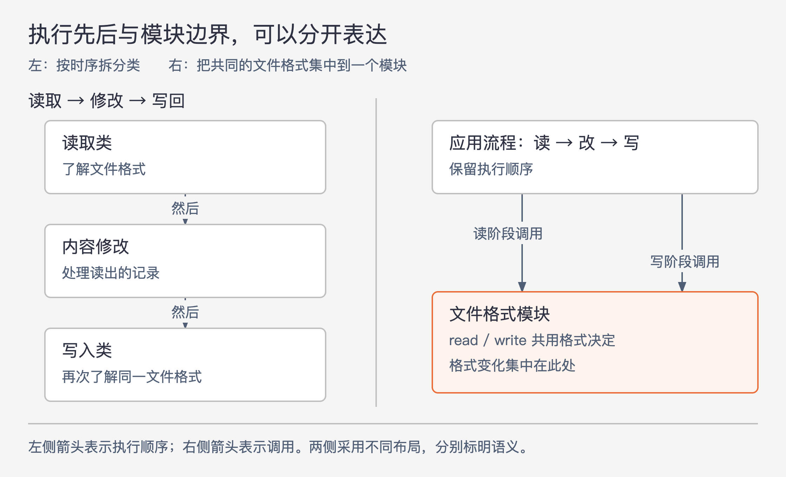
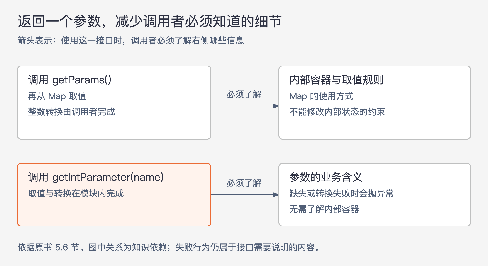

# 《软件设计的哲学》第5章｜信息隐藏（和泄露） · 书镜8.2

第 4 章说明深模块的价值，本章开始回答怎样设计它。主要线索是信息隐藏：让某项设计决定留在一个模块中，使用者不必理解它，改变它也尽量不牵动其他模块。HTTP 课程项目展示了划分类、返回数据和设置默认值怎样影响这一结果。

## 一、原书回顾：让一项设计决定尽量只影响一个模块

### 5.1 信息隐藏

作者把信息隐藏追溯到 David Parnas 的经典论文。这里的“信息”主要指设计决定及实现机制所需的知识，例如 B 树怎样存储和访问数据、逻辑文件块怎样对应物理块、TCP 怎样实现、多核线程怎样调度，以及 JSON 怎样解析。它既包括数据结构、算法和页面大小，也可能包括“多数文件很小”这样的设计假设。

**信息隐藏**让这些知识存在于模块实现中，而不成为使用者必须掌握的接口内容。收益有两方面。使用 B 树的人不必知道节点扇出或再平衡细节，认知负担减少；修改 TCP 内部拥塞控制机制时，高层收发代码若不依赖它，就可保持不变，系统更容易演进。

本节插入“警示信号：过度暴露”：常见功能若迫使用户先了解少用的特性，会增加没有必要的学习负担。设计时应主动寻找还能隐藏的内容，让接口更简单。

把字段设为 `private` 只能限制直接访问，不能证明相关知识已隐藏。若 getter、setter 原样暴露内部表示及其使用规则，外部仍然依赖这些决定。最充分的隐藏，是调用者根本不必知道这项信息；部分隐藏也有价值，例如少数人需要的功能通过独立方法提供，普通调用者无需了解它。

### 5.2 信息泄露

**信息泄露**发生在同一项设计决定体现于多个模块中。改变这个决定时，多处要配合修改，就形成依赖。接口暴露是容易看见的一种；另一种更隐蔽：读取类和写入类都在内部实现同一种文件格式，虽然公有方法没有展示格式，两者仍必须跟着格式一起改变。

本节的警示信号要求关注“同一知识在多个地方使用”。发现后，应寻找让这一知识只影响一个类的组织方式。若相关类较小且紧密围绕该知识，可以合并；也可把共同知识提取到新类中。不过，新类必须提供能隐藏细节的简单接口。若它把格式规则全数作为参数和配置暴露，便只是把隐蔽泄露换成接口泄露。

### 5.3 时序分解

图5-1｜根据 5.2—5.3 节文件处理案例绘制。左侧箭头表示执行顺序；右侧箭头表示调用。同一类可在不同阶段被使用，执行先后不必变成类的边界。

作者把按操作发生时间划分类的做法称为**时序分解**。一个程序先读文件、再修改内容、最后写回，直觉上可以拆成读取类、修改类和写入类。但读和写都要了解文件格式，这使同一个决定散落两处。

较好的分工可以是：一个类统一处理读写格式，另一个部分负责修改所得到的内容。程序仍然按先读后改再写的顺序运行，只是读写阶段调用同一个模块。许多设计决定在多个时刻都会用到，因此单凭时间拆分，很容易制造信息泄露。

“警示信号：时序分解”并没有禁止表达执行顺序。顺序当然需要体现在程序中；若各阶段恰好使用完全不同的信息，按阶段划分也可能合理。关键是核对每个任务所需的知识，判断模块边界是否能把共同决定留在一处。

### 5.4 示例：HTTP服务器

作者转向软件设计课的 HTTP 项目。课程要求提供一个或多个类，让服务器容易接收请求和发送响应。原书以 HTTP/1.1 的文本请求为示例：浏览器提交表单，服务器处理后返回响应，通常包含要显示的网页。

原书图5.1的首行是 `POST /comments/create?photo_id=246 HTTP/1.1`，同时包含方法、操作路径、参数和协议版本。之后是按名称和值组织的报头，空行结束报头，再接可选正文。正文包含 `comment` 和 `priority` 参数；图中 `Content-Length: 40` 描述这一示例的正文长度。

这段请求在后面承担两个作用：读取完整请求时，需要理解结构和长度；业务读取参数时，希望直接得到有意义的值。图中 Host 地址印刷模糊，本章不复写它，它也不参与后续设计论证。这里回顾的是书中的协议示例，不把文本格式概括为所有 HTTP 版本的共同编码形式。

### 5.5 示例：类过多

有团队把接收请求拆成两个类：第一个从网络连接读出请求字符串，第二个解析字符串。这看起来对应“先读再解析”，但在原例中，读取类要知道何时已经读完，就必须先解析报头中的 `Content-Length`。因此两个类都理解大量 HTTP 结构，还重复了解析逻辑。

调用者也受到影响：它必须知道两个类，并按特定顺序调用方法才能得到请求。作者建议合并读取与解析，让格式知识集中在一处，对外一个接收请求的方法就能完成工作。改善同时发生在内部和外部：共同知识不再散落，调用者也不再安排中间步骤。

这说明稍微扩大类可能更有利于信息隐藏。一方面，把同一功能的相关代码放在一起；另一方面，把多个内部步骤提升为一个完整操作，对外接口更简单。作者也限制这一建议：把整个应用放进一个类显然可能过头，第 9 章将讨论合理拆分的情形。

### 5.6 示例：HTTP参数处理

学生在参数处理上做对了两件事。第一，把首行 URL 中的参数和正文中的参数合并，使本例的业务处理无需关心参数原来在哪。第二，解析器完成编码转换，返回业务要用的值。在原书表单案例中，`What+a+cute+baby%21` 应返回 `What a cute baby!`：`+` 表示空格，`%21` 表示感叹号。这个解释限定于本例的表单参数编码，不推广成所有 URL 字符串的处理规则。

图5-2｜依据 5.6 节接口变化绘制。箭头表示调用者对接口相关知识的依赖；上方需要了解内部容器，下方保留参数含义与失败条件，隐藏容器和转换步骤。

问题出在后续接口：不少项目用 `getParams()` 直接返回内部 `Map<String, String>` 的引用。这造成三种额外负担。调用者依赖参数存储的表示法，内部表示变化可能迫使接口及外部代码改变；调用者先取 Map、再取具体值，需要多做一步；还必须知道自己不能修改返回的 Map，否则会改变请求对象的内部状态。

作者建议按需要提供 `getParameter(String name)`，直接返回一个字符串参数；再提供 `getIntParameter(String name)`，把取值和整数转换放在模块内。必要时也可增加其他类型的方法，例如 `getDoubleParameter`。这样调用者不必知道内部容器，也不必重复实现转换过程。

这个例子没有隐藏所有错误。原书明确说明，参数缺失或无法转换为所需类型时，这些方法会抛出异常，示例只省略了异常声明。调用者仍需知道这种可见行为；信息隐藏不等于把错误变成无声默认值。

### 5.7 示例：HTTP响应中的默认值

有团队要求创建响应对象时显式指定协议版本。作者指出，在本例中，响应版本应与请求对应，而发送响应时请求对象本来就会传入，库已经有作出决定所需的信息。再让调用者重复选择，会把协议知识泄露到外部，还可能选错。类似地，库应为响应发送时间的 `Date` 报头提供合理默认值。

默认值属于部分信息隐藏：普通调用者无须知道某个选项，少数需要覆盖的人通过独立方法调整。作者将它接回第 4 章缓冲 I/O 的例子：常见情况下应由模块主动提供预期行为，避免用户必须先了解实现机制、再提出请求。这里的版本对应规则与 Date 默认值，是原书课程示例的设计主张，不是完整协议合规规范。

### 5.8 类内的信息隐藏

信息隐藏也适用于类内。私有方法应封装某些信息或完整功能，让其他方法不必掌握其内部步骤。实例变量也不必都被全类任意使用：有些状态确实广泛需要，另一些只在少数位置有意义。缩小后者的使用范围，可以减少类内部的依赖，使修改更容易定位。

### 5.9 过犹不及

只有模块外不需要的信息才适合隐藏。如果不同用途需要不同配置才能获得合适性能，而模块自己无法判断，就应把配置公开，让使用者有办法正确设置。能自动调整当然更好，但不能用“隐藏”剥夺外部真正需要的控制能力。

这个限制也解释了前面参数方法为何保留失败条件、特殊用途为何保留覆盖默认值的入口：目标是减少不必要的知识，仍然要提供正确使用所需的信息。

### 5.10 结论

隐藏更多知识，通常让模块承接更多工作、减少外部接口，从而更深。划分系统时，应先考虑任务涉及哪些设计决定，再让模块各自封装其中一项或几项；运行时顺序可以继续存在，但不应自动决定模块边界。

## 二、主题讲解：从“字段私有”走到“调用者不必知道”

### 先找会一起改变的决定

以下是本文假设的商品批量文件功能。导入类解释列顺序，导出类按同一顺序写列。两边字段全部私有，也没有互相调用；但当“价格”从第三列改为第四列时，两边都必须改。它们共同依赖文件格式，因此存在信息泄露。

可以先列出这项决定涉及什么：列名、列顺序、日期与金额如何表示、缺失值如何写出。再比较两种组织方法：继续让导入、导出各自理解，或让一个格式处理模块负责读取和写出，两端围绕它提供的商品记录工作。调整的目标是让格式变化只影响这个模块，而非把两个文件机械合并。

### 检查新接口有没有把决定原样交出去

假如新模块提供 `readCell(row, columnIndex)` 和 `writeCell(row, columnIndex, value)`，导入、导出依然自己决定价格在哪一列。虽然多了一个公共类，格式规则还在外部。新类封装的主要是读写单元格，未必封装了此处希望隔离的商品格式。

若它能读取或写出含义明确的商品记录，并处理列映射及格式转换，调用者才可能不再了解列位置。但如果实际需求就是让用户任意映射外部表格，各次导入的列安排都不同，映射信息就确实需要由外部提供。必须围绕已知需求选择要隐藏的决定，不能凭一个类名断言完成了信息隐藏。

### 让默认值承担常见工作，并说清例外

假设大多数内部导出固定使用同一格式，而少数外部伙伴有不同版本。常用入口可以选择内部默认格式，特殊入口明确接受版本。普通业务不用每次重复设置列规则，特殊调用者仍有控制能力。

同时，金额缺失、格式无法识别或者版本不支持的处理方式必须清楚。它们影响业务判断，不能为了让 `read` 看起来简洁而隐藏。可以把“如何解析”交给模块，把“解析成功意味着什么、失败时会怎样”留在接口说明中。这样才同时满足信息隐藏与第 4 章对正确抽象的要求。

## 检验理解：把读写类合并后，格式就隐藏了吗

一个新类同时提供读取和写出功能，但调用者每次都要传入列数、各列位置和日期格式。另一设计由模块内部维护标准格式，调用者只提供记录；特殊用途另有格式选择。何时后者更合适，何时前者可能有必要？

核对思路：若所有调用者遵循同一标准格式，重复传入规则会扩大接口并制造泄露；后者更可能减少负担。若调用者本来负责解释来自不同来源的任意格式，规则就是它们拥有的必要信息，不能无条件隐藏。判断依赖用途和信息需求，不能仅以“合并为一个类”作结论。

## 来源、范围与阅读连接

依据 John Ousterhout《软件设计的哲学》第 5 章，PDF 物理页 62—73，主要正文 62—72 页。小节起始页依次为 62、64、65、66、67、68、70、71、72、72。已实际查看第 62、66、67、69、70 页，核对人名脚注、5.4 标题、请求参数及接口示例。

第 62 页脚注列出 David Parnas 的 “On the Criteria to be Used in Decomposing Systems into Modules”，发表于 1972 年 12 月的 Communications of the ACM；这里只转记书中来源，没有另读论文。5.4 的解析乱码按页图恢复为“示例：HTTP服务器”。第 69 页正文把请求首行参数位置称作“报头行”，本文依图5.1明确为首行 URL。Host 地址无法从页图可靠读出，未复写。

图5-1、图5-2按本章案例关系重绘；商品文件案例为本文假设。下一章将说明怎样用较通用的操作，把上层场景细节留在需要它的地方。

<!-- source_sha256: c751f0fc575096584dcdb5a365ae558a71b32a6aa241d90d7bc248f21fbdbbf7 -->
