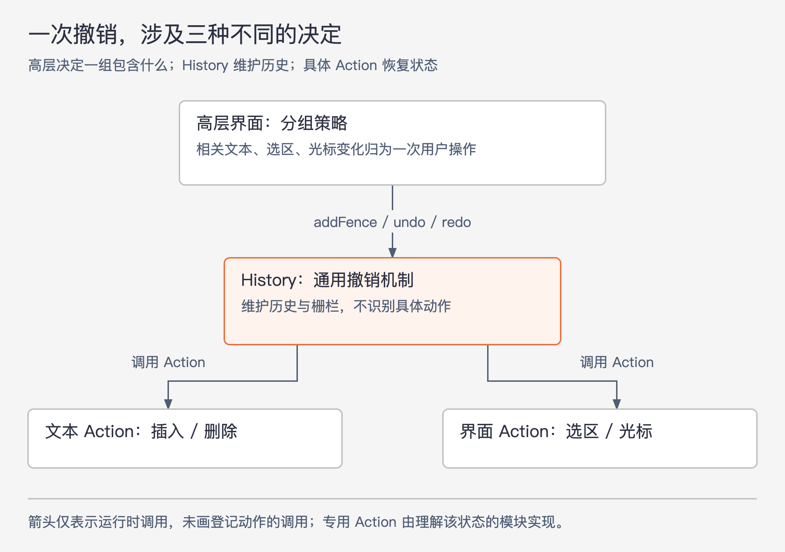
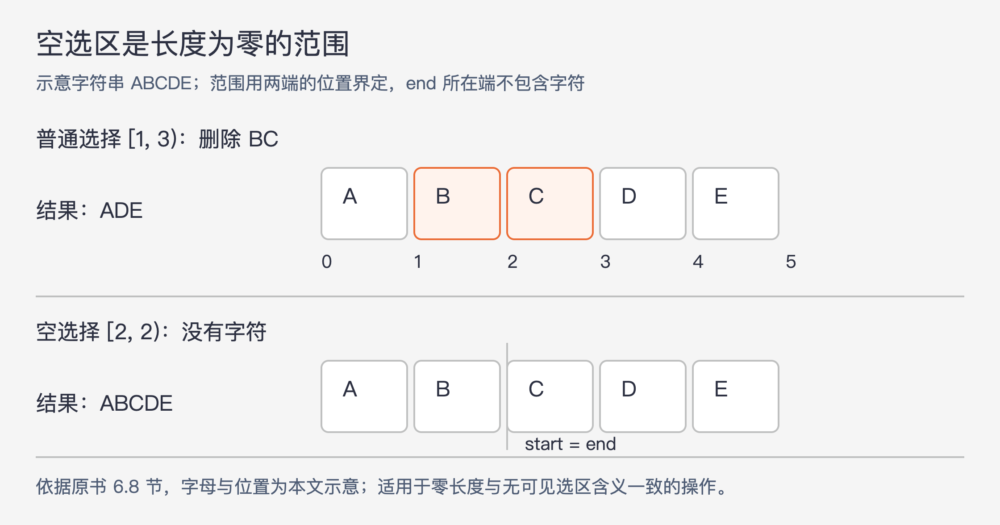

# 《软件设计的哲学》第6章｜通用模块更深 · 书镜8.2

第 5 章要求把设计决定留在合适的模块中。本章进一步讨论怎样选接口：用少数适用于多种场景的操作，替代紧贴某个按钮、某次操作的大量专用方法。作者也把同一思路用到方法内部，让正常处理过程自然覆盖边缘情况。

## 一、原书回顾：让通用机制与具体用途各有位置

章首的判断来自作者审阅学生项目的经验。他越来越认为，过度的专用性是复杂性的重要来源；通用接口往往更深，消除特例也能简化代码。这不是一项给出统计数据的实验，本章通过编辑器等案例说明其理由。专用性不能全部消除，接下来要解决的是如何减少它，以及把必要的专用代码放在哪里。

### 6.1 让类有点通用

作者先比较两种直觉。预先设计广泛适用的机制，可能给未来复用留下空间，却也容易实现永远用不上的功能；只按眼前用途定制，可以避免预测未来，但也可能把接口绑在当前场景上。作者早期倾向后一种，后来在课程中发现，通用类即使没有被再次复用，也常常有更简单的接口、更少的方法和更少的实现代码。

他因此建议采用“有点通用”的方式：**功能满足当前需要，接口用较一般的概念表达这些功能。** 这既不要求提前补齐未来功能，也不允许为了通用而让当前用法变得困难。评判标准包括现在是否好用，不能只靠“未来也许有人用”支持设计。

### 6.2 示例：为编辑器存储文本

课程要求学生实现图形文本编辑器：显示文件，通过指向、点击和输入修改它；同一文件可同时有多个窗口视图，并支持多级撤销和重做。文本类负责载入文件、读取和修改内存文本，以及写回文件。

一些团队按照界面操作设计文本 API。退格键删除光标左侧字符，于是提供 `backspace(Cursor cursor)`；删除键删除右侧字符，于是提供 `delete(Cursor cursor)`；删除选区则另设 `deleteSelection(Selection selection)`。接口直接出现了 `Cursor` 和 `Selection` 这些界面概念。

这种设计看似方便界面调用，实际产生大量仅适用于一个操作的浅方法。界面开发者要学习很多方法，每添一种操作，往往也要给文本类添方法。文本类开发者又必须理解界面行为。两层因此共享原本应由界面决定的知识，难以独立演进。

### 6.3 更通用的API

作者改用基本文本操作：`insert(Position position, String newText)` 在任意位置插入字符串，`delete(Position start, Position end)` 删除从 `start` 开始、到 `end` 之前的字符，即区间 `[start, end)`。位置类型叫 `Position`，使它不必附带“界面光标”的含义。

接口还提供 `changePosition(Position position, int numChars)`：沿文本移动指定字符数，正数向后、负数向前，必要时跨行。于是删除键由界面选择区间 `[cursor, changePosition(cursor, 1))`；退格键选择 `[changePosition(cursor, -1), cursor)`，再调用同一个 `delete`。

每处界面调用可能比原来长一点，但“删左边还是右边”现在直接出现在需要作此决定的位置。以前开发者还得进入文本类，查 `backspace` 的文档或实现才能确认。文本类的方法总量也减少了，几个通用操作可以替代许多按钮专用方法。

作者随后换一个用途验证接口：批量把文件中的某个字符串替换成另一个字符串。退格键等专用方法帮助不大，而通用接口已有插入和删除能力，只需再有 `findNext(Position start, String string)` 查找下一处匹配。交互式编辑器如果已实现查找替换，连这个能力也可能已经存在。复用是此设计的额外收益，前面的界面简化已经有独立价值。

### 6.4 通用性带来更好的信息隐藏

改造后，文本类封装文本的表示、修改和位置移动；界面封装按键、选择与操作规则。许多新的界面功能可以组合已有文本操作实现，界面开发者也只需学习较少的方法。

原来的 `backspace` 是一个错误抽象，因为它试图隐藏“删除哪些字符”，而界面恰好必须知道并决定这件事。把信息放远了，开发者仍然要追过去确认。信息隐藏需要判断谁真正需要什么信息：实现文本修改的内部细节可以藏，界面自身的行为决定应在界面中清楚可见。

### 6.5 要问自己的问题

作者给出三个互相制约的问题。

- **满足当前所有需求的最简单接口是什么？** 三个删除方法可以合成一个范围删除方法，但若靠大量额外参数才能减少方法数，接口未必更简单。
- **一个方法能用于多少种情形？** 只在单一位置调用的按钮专用方法值得检查，看看它是否能被较一般的操作取代。这是检查线索，并非按调用次数判定好坏。
- **当前需求用起来是否方便？** 只提供单字符插入、删除也很通用，却迫使高层到处循环处理范围，大操作的效率也可能较差。文本类需要直接支持范围操作。

三个问题合起来要求同时查看接口数量、每个接口的负担，以及完成实际任务所需的调用代码，不能只优化其中一个数字。

### 6.6 将专用性向上推（和向下推）

用户需要的功能本来就有具体用途，因此应用顶层通常包含专用代码。编辑器把退格键行为放回界面，是把专用性向上推；文本类由此保持通用。

另一方向是把专用性下推到具体实现。操作系统对存储设备使用“读块”“写块”等通用操作；不同设备有不同命令，由各自的驱动程序负责处理。主操作系统代码无需知道设备细节。新增设备若具备实现通用接口所需的能力，就可以增加驱动而不改主系统。这里的前提是设备确实能实现该接口，不能把能力差异凭空抹平。

这两个方向都在保护中间的通用机制：用途决定放在使用者一侧，具体实现差异放在实现者一侧。

### 6.7 示例：编辑器撤销机制

撤销要求比恢复字符串更广。用户选中文本、删除、滚动到别处后执行撤销，编辑器还要恢复原来的选择，并让恢复的文本在窗口中可见。光标、选区和视图都参与这一行为。

有团队把整个撤销机制放进文本类。文本变化自动记录，选区等界面变化则通过额外方法登记；执行撤销时，文本类有时修改自身，有时回调界面。这样一来，通用的历史列表管理、文本修改和界面状态恢复混在一起。增加一种可撤销实体，也要修改文本类，并继续增加双方传递信息的方法。

图6-1｜依据 6.7 节重绘。箭头表示运行时调用。History 调用统一的 Action 方法，不了解具体动作；高层决定哪些动作应当一起撤销。

作者提出独立的 `History` 类。它维护操作历史，提供 `addAction`、`undo`、`redo` 等操作，并通过 `History.Action` 的 `undo()`、`redo()` 执行具体行为。它知道历史前后如何移动，却不知道某个动作保存了哪些文本或怎样恢复光标。

具体动作由了解它的模块实现。文本类可实现 `UndoableInsert` 和 `UndoableDelete`，发生插入时创建相应对象并交给 `History.addAction`；界面可实现 `UndoableSelection` 和 `UndoableCursor`。专用细节由此下推到具体 Action 中。

一次用户撤销还可能要恢复多个相关变化。History 用**栅栏**标记历史中的组边界，高层通过 `addFence` 决定边界放在哪。本文据上下文将其理解为：一次撤销或重做按相应方向处理一组动作，到组边界停止。原页关于栅栏的一句同时写了 `History.redo` 和“撤销操作”，两者冲突；不能据此把 redo 解释成撤销。这个疑点不改变“高层决定分组，History 执行分组”的设计关系。

现在可以分别看三件事：History 管历史、分组机制和统一调用；Action 实现某一种恢复行为；高层决定用户认为的“一次操作”包含什么。各部分仍通过明确接口协作，但不必知道另外两部分的内部实现。

本节最后有一个重要限制：通用或专用是相对于某种机制而言的。文本类对管理文本是通用的，对撤销却只负责文本变化这一种专用操作。因此，把文本的撤销代码放在文本类中合理；把各种无关实体的撤销都塞进文本类才造成问题。不能因为某个类包含专用代码，就断言它违反本章原则。

### 6.8 消除代码中的特例

专用性也会出现在方法内部。学生常用一个额外状态变量表示“是否有选区”，于是复制、删除等操作到处先判断这个状态。作者建议让选择区域始终存在，没有可见选区时用起点等于终点的空范围表示。

图6-2｜依据 6.8 节的空选区思路，用字母串作本文示意。两端位置之间的内容被选中；空范围没有字符，执行删除后字符串保持不变。

复制空选区会插入零字节，设计得当的插入操作无需另设分支；删除空选区也可以沿用正常算法。对于同一行内的选区，删除可理解为连接“选区之前的前缀”和“选区之后的后缀”。当起终点相同时，两部分正好拼回原行。

这里的目标是让正常规则覆盖边缘条件，前提是零长度确实有同样的语义、底层操作也能正确处理。作者并未要求删除所有 `if`。第 10 章会继续讨论异常带来的特例。

### 6.9 结论

减少不必要的专用方法和特例，可以使类更深、信息隐藏更好。必要的专用性应有清楚的位置，与同一机制的通用部分分开，同时仍然方便当前用途。

## 二、主题讲解：怎样判断一个接口“有点通用”

### 从用户动作里找出重复的文本变化

沿用原书编辑器，假设现在要增加“删除当前单词”。若文本类继续按按钮命名，它会新增 `deleteWord`，随后还可能有“删除到行尾”等方法。界面在决定用户想删什么，文本类也在重复了解这些规则，修改一个交互行为可能涉及两层。

先把当前需求展开：退格、删除键、删除选区、删除单词，都先确定起点与终点，再删除该范围。文本类可以承接“给定范围后正确修改文本”，包括跨行拼接；界面负责确定范围。这项改动立即覆盖已有需求，不需要猜测尚未出现的编辑功能。

如果确定单词边界本身被多种功能反复使用，还可以进一步寻找适合它的文本分析操作；是否加入文本类，应看它是否属于需要共享的文本规则。这里不能仅凭“多加一个参数就万能”继续扩张接口。

### 把调用代码和实现代码一起比较

删除键改成“计算右边一个位置，再删除范围”后，调用处确实多了一步。这一步揭示了界面必须知道的行为，因而有价值。相反，若调用者得逐行拆分、搬运和合并字符串，说明本应由文本模块处理的工作仍在外部。

可以用两个具体变更检查分工。改变退格键的交互规则，应主要影响界面；改变文本内部从按行存储到其他表示，应主要影响文本类。若两种变更都得改两层，就需要继续检查是否泄露了界面规则或存储表示。这个检查说明为何“少方法”只是线索：一个 `operate(kind, options, flags)` 可能只有一个入口，却让双方了解更多细节。

### 撤销需要更通用的共同点，但不能丢掉用户意图

同一判断可以继续用于撤销。文本、选择、光标的恢复方法不同，但它们都能回答“怎样撤销”“怎样重做”。History 只依赖这两个动作以及历史次序，便可以统一管理。

然而，用户按一次撤销应恢复几个动作，是界面体验的一部分。若为了“全自动”让 History 自行猜测分组，它又必须学习退格、输入、拖选等场景知识。高层设置栅栏保留了这个必要决定，具体 Action 则保留各类状态的恢复细节。通用机制因此有清楚的能力边界。

### 空范围可以统一算法，缺失状态未必可以

再看“删除空选区”。原书的范围删除对长度为零给出自然结果，因此无须额外表示“没有”。但在本文假设的输入框中，“用户没有填写”和“用户主动清空内容”如果导致不同业务行为，就不能都用空字符串替代。能合并的条件，是两种表示在当前操作下具有相同含义；语法上看起来都为空并不足够。

## 检验理解：一个接口够不够通用

一个文本类只提供 `deleteOneCharacter`，开发者说它能通过循环实现所有删除，因此已经足够通用。另一个文本类提供 `deleteRange`，但要求调用者先把跨行选区拆成逐行片段。两种设计分别把什么负担留给了调用者？

核对思路：前者迫使所有范围操作重复循环，可能给大型操作增加代价；后者虽然名字叫范围删除，仍泄露按行存储和拼接规则。较合适的接口应直接接受所需范围，由文本类完成内部处理。至于该范围为什么被选中，仍由界面确定。

再加入一种可撤销的窗口缩放：如果必须修改 History 内部的动作类型分支，说明它知道了不必要的具体类型；如果只新增相应 Action，并由高层安排分组，则保留了原书的分工。此处只检验设计关系，不构成完整撤销引擎实现。

## 来源、范围与阅读连接

依据 John Ousterhout《软件设计的哲学》第 6 章，PDF 物理页 74—87；主要正文至 86 页。已完整读取该章解析文本，并实际查看第 74、78、82、83、84 页，核对 6.1、6.7 标题、位置范围、接口名称和 History 示例。6.1 为“让类有点通用”，6.7 为“示例：编辑器撤销机制”，解析账中的两处公式乱码不作正文标题。

第 84 页原书同时出现 `History.redo` 与“撤销操作”，本文保留疑点，只用周围论述能够支持的分组关系；没有另找版本替作者修订。`History.Actions` 按第 83 页接口声明统一写作 `History.Action`。图6-1重绘书中分工，图6-2的字母串、删除单词与输入框对照是本文示意或假设，没有引入外部资料。

第 7 章将从相邻层的接口出发，检查每一层是否提供了值得存在的不同抽象。

<!-- source_sha256: c751f0fc575096584dcdb5a365ae558a71b32a6aa241d90d7bc248f21fbdbbf7 -->
