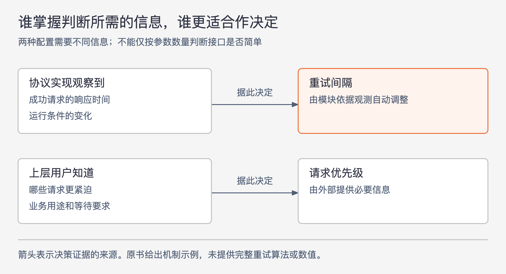

# 《软件设计的哲学》第8章｜降低复杂性 · 书镜8.2

有些复杂工作无法省去：跨行删除需要拼接文本，网络请求丢失后需要决定何时重试。本章讨论由谁承担它们。如果工作与模块的职责紧密相关，模块开发者多处理一次，往往能免去众多调用者各自处理的负担。

## 一、原书回顾：把相关的困难处理在模块内部

章首比较简单接口与简单实现。模块通常有许多使用者，而开发模块的人较少，因此作者更看重易用接口，即使它需要较复杂的实现。开发者若遇到难题就抛异常，或把未决定的策略变成配置，可能只是把工作交给每个调用者、每个安装环境的管理员。系统整体反而承担了更多重复理解和处理的成本。

这段讨论以与模块功能有关的复杂性为前提；原文并未要求所有错误都在内部吞掉，也未禁止必要配置。后面用案例补足判断条件。

### 8.1 示例：编辑器文本类

文本类负责读文件、修改内存中的文本并写回。有些学生选择面向整行的接口，提供读取、插入、删除一行的方法，内部实现很直接。但界面输入一个字符通常发生在行中间，复制或删除选区又常跨越多行的一部分。于是每一种界面操作都得自己处理拆分、拼接。

改用第 6 章的字符范围接口，界面只要说明插入位置或删除范围。文本类内部若仍按行存储，就由它完成拆行和合行，实现可能更复杂，但相同工作集中到一个地方，外部接口和多个使用者都更简单。作者据此强调，要比较整个系统的负担，不能只看这个类写起来多容易。

### 8.2 示例：配置参数

缓存大小、放弃前重试次数等参数，可以把选择权交给用户。支持者有合理理由：调用者可能更了解自己的用途和工作负载。例如，基础设施不知道某个请求比另一个更紧急，用户却知道，因此允许外部指定优先级有价值。

问题在于很多参数的正确值，用户同样难以确定，或者模块自己可以做得更好。原书用丢包后的重试间隔说明这一点：设置固定参数要求管理员先判断合适时长；协议实现则可以测量成功请求的响应时间，再采用其某个倍数作为重试间隔。后者还能随运行条件变化调整，而人工配置容易过时。原书没有给出具体倍数或完整算法，不应把这个例子当作可直接部署的网络实现。

图8-1｜依据 8.2 节重试间隔与请求优先级案例绘制。箭头表示可用于决定的证据来源。两个问题需要不同信息，因此适合由不同位置决定。

导出参数前，应先问用户是否能比模块确定更好的值。若确需外部控制，尽量提供合理默认值，使普通用途无需配置。作者倾向让模块完整解决自身问题，避免用大量选项掩盖未完成的设计；这一建议有前提，不能覆盖用户确实掌握独有信息的情形。

### 8.3 过犹不及

把所有功能放进一个类显然过度。作者给出三个适合把复杂性放入模块的条件：工作与类已有功能密切相关；能简化应用其他部分；能简化这个类的接口。目标是整个系统更容易理解和修改。

第 6 章把退格键行为塞进文本类，看上去也替高层做了工作，却不符合这些条件：界面本来就需要决定删除哪些字符，少写这一点代码的收益不大；文本类又因此理解了不属于文本存储的交互规则，造成信息泄露。相比之下，跨行拼接与文本修改直接相关，适合留在文本类内部。

### 8.4 结论

开发模块时，应寻找让自己多做一些、使使用者少做一些的机会，同时保持工作与模块职责一致。单个实现变长，并不足以否定这一改进。

## 二、主题讲解：把“替别人决定”拆成两个问题

### 先看调用者交来的信息是否已经足够

沿原书文本案例，假设一个选区从第 2 行中间到第 4 行中间。界面知道用户选中了哪里，因此提供起点和终点；文本模块掌握行的存储方式，因此最适合完成保留前缀、保留后缀、删除中间内容及拼接。这里不需要文本模块理解用户为何选中这一段。

如果改成让模块自行决定退格键删一个字符、一个词还是某个范围，它就必须了解界面规则。两种工作都能被移入文本类，却有不同后果：前者收拢重复的实现细节，后者把上层策略带进了底层。先问“谁知道用户想做什么”，再问“谁知道怎样正确完成已决定的操作”，分工就比较清楚。

### 再看默认值是有依据，还是没有决定好

原书重试间隔的例子表明，模块能获得实际响应时间，可能比人工预先猜一个固定值更合适。请求优先级却包含用途信息，不能仅从响应时间推断。让模块处理可观测的机制，让外部提供它无法知道的用途，是本章可以支持的分工。

本文假设一个服务既有基础设施重试间隔，也有用户愿意等待的最长时间。前者可参考运行测量；后者表达用户任务期限。两者虽然都用时间单位，不能因名字相近而统一成内部自动决定。这个例子是设计推论，未给出具体重试算法或数值建议。

### 比较改动后的总负担

可以跟踪一次具体变化：文本内部存储方式改变后，外部是否还得改拆行逻辑；运行条件改变后，管理员是否还要重新猜参数；增加一种界面操作后，文本类是否又要新增按钮专用方法。前两类变化若被合理限制在模块内，通常说明分工有收益；第三类若持续出现，则要检查信息泄露。

不必为了“内部解决”隐瞒失败。原书章首批评把困难全部甩给调用者，但当模块无法完成操作、调用者又需要采取不同措施时，失败行为仍应清楚。把能统一解决的部分集中起来，剩余选择交给有信息作决定的一方，才不会把简单接口变成含糊接口。

## 检验理解：取消配置就是改进了吗

一个组件取消了所有外部参数：重试间隔依据自己的测量调整，业务优先级也一律由它推断。另一个组件保留优先级，自动计算普通重试间隔，并对特殊需求提供清楚的覆盖方式。如何按本章判断？

核对思路：自动计算有可用信息支持的重试间隔，可能减少用户负担；业务优先级取决于上层用途，组件未必知道。不能仅凭参数数量减少判定设计变好。还要核对覆盖入口是否有真实用途、普通调用是否足够简单，以及内部决定是否符合模块职责。

## 来源、范围与阅读连接

依据 John Ousterhout《软件设计的哲学》第 8 章，PDF 物理页 100—103。已完整读取原文，四个原小节依次为编辑器文本类、配置参数、过犹不及、结论；小节起始页为 101、101、103、103。本章文本连续，无需凭缺失代码或原图还原结论。

图8-1依据原书两个配置案例重绘；第 2—4 行选区和用户最长等待时间是本文假设，用于区分实现细节与上层用途。原书重试示例只保留机制层次，不引入当前协议规范。后续第 9 章继续讨论功能应拆开还是合在一起。

<!-- source_sha256: c751f0fc575096584dcdb5a365ae558a71b32a6aa241d90d7bc248f21fbdbbf7 -->
