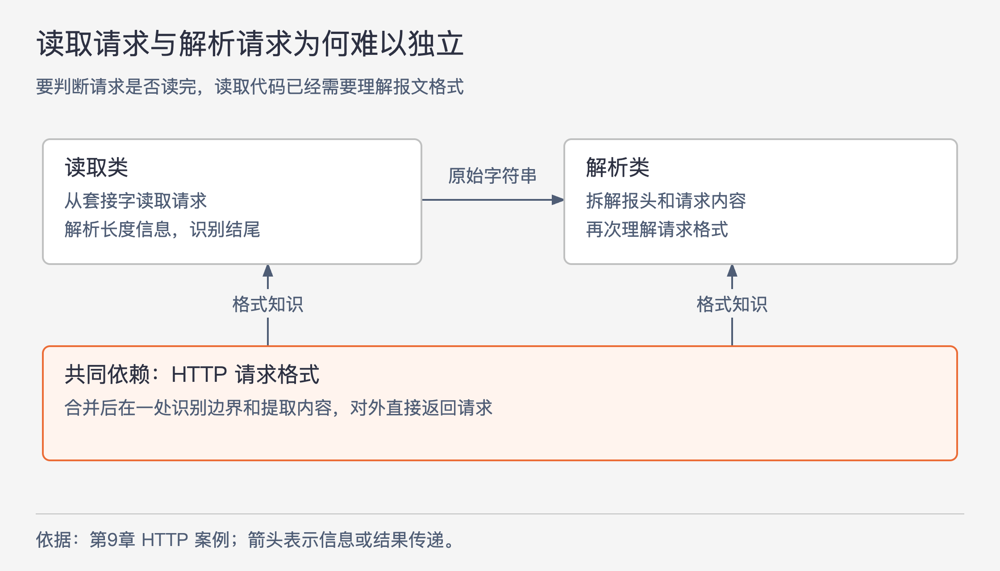
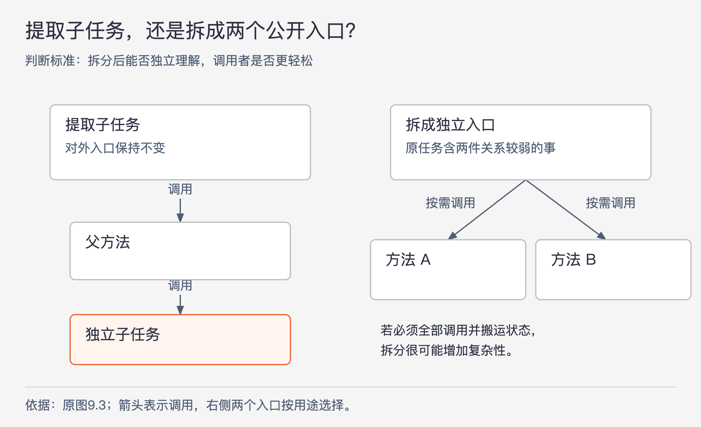

# 《软件设计的哲学》第9章｜合并好，还是分开好？ · 书镜8.2

前一章讨论怎样把复杂性留在模块内部。本章继续追问：模块的边界应该画在哪里？把一个类拆成几个类，或者把一个方法拆短，会减少眼前的代码量，却也会增加接口、对象和阅读时的跳转。作者要求比较拆分前后整个系统的复杂性。

## 一、原书回顾：依据代码之间的关系决定边界

章首先说明拆分的成本。组件越多，开发者越难找齐相关代码；接口和对象的数量增加，调用者就要管理更多东西；原先相邻的代码分散到不同文件后，依赖关系更难看见，还可能出现重复。真正独立的组件分开后能让人一次只关注一个问题；相互依赖的组件分开后，则可能让人反复翻找，甚至漏改。

作者给出四种相关迹象：共享某种信息；经常一起使用；能被一个清楚的高层概念涵盖；不看另一部分就难以理解这一部分。“一起使用”要双向看：磁盘块缓存需要哈希表，哈希表却有大量与块缓存无关的用途，因此不能据此把两者合并。子串搜索与大小写转换都属于字符串操作，流量控制与可靠传输都属于网络通信；这类概念联系值得考虑，但还要结合接口和实际使用方式判断。

### 9.1 如果共享信息，则合并

HTTP 服务器原先把读取请求和解析请求分给两个类。读取类从套接字收集字符，交给解析类拆成请求的各部分。这看似按步骤分工，但读取类必须知道何时读完一个请求。为了找出结尾，它得理解报头中的长度信息，已经做了不少解析工作。

图9-1｜读取边界也依赖报文格式。根据本章 HTTP 案例重画；箭头表示信息或结果的传递。图中展示的是作者讨论的分工问题，并非完整 HTTP 协议流程。

两个类都要理解请求格式，格式知识就散到了两处。合并以后，同一处代码既识别报文边界，又提取请求内容，原先重复的工作与中间传递可以一起消失。作者报告，这个学生项目的代码因此更短、更简单；结论依据是这个具体设计，不能外推为所有网络读取代码都应塞进解析器。

### 9.2 如果可以简化接口，则合并

在上面的设计中，调用者先接收原始请求字符串，再把它交给解析方法。合并后，调用者可以直接取得解析完成的请求，不再承担这一步交接。判断收益时，要看调用者少知道了什么、少做了什么。

作者还回到 Java I/O 的例子：如果文件输入默认包含缓冲，大多数调用者就不用额外选择并组装缓冲类。特殊用途仍可有禁用或替换缓冲的入口，但常规调用者不必先学会这些选择。这是作者提出的接口设计方案，重点在“把通常必需的组合做成默认行为”，不表示原书已经提供了一个改造后的库。

### 9.3 消除重复，则合并

本节的警示信号是“重复”：相同或近似的代码反复出现，值得检查是否缺少合适的抽象。提取公共方法是一条路，但收益取决于提取后的接口。较长的重复片段能被一个简单调用替代，通常很划算；只有一两行，或者需要传入大量局部变量时，新接口可能与原来的代码一样难懂。

另一条路是重组控制流，让相同工作只在一个位置发生。原书图9.1处理 DATA、GRANT、RESEND 等网络数据包。各分支发现包长不足时，都记录包含包类型、发送方和长度的同类日志，然后返回。图9.2把这些错误分支导向同一个 `packetTooShort` 位置，日志语句只保留一份。

这里需要分清正文举例的两个层次：作者先泛指多个错误出口的重复清理，实际代码图展示的是重复日志。原图用支持 `goto` 的语言集中错误路径；作者同时承认滥用跳转会使代码难读。可迁移的判断是“共同工作能否自然汇合”，不必照搬某个语言的语法，也不能为了去重把无关错误强塞进同一个处理分支。

### 9.4 区分通用代码和专用代码

通用机制应围绕它自己能够反复使用的能力组织。文本类负责插入、删除和表示文本；某个编辑器中“删除当前选择区域”的操作，则涉及界面的选择状态，适合放在用户界面代码里。把这项专用操作塞进文本类，会让文本类开始了解某一种界面的规则；未来界面行为变化，底层文本机制也可能被迫修改。

原书把这种情况称为“专用－通用混合”。这也是信息泄露：特定使用场景的知识进入了本应通用的实现。区分通用与专用，不等于把所有通用能力聚成一个工具箱；每个通用模块仍应有清楚的一种机制，避免混入其他不相关机制。

### 9.5 示例：插入光标和选择区域

编辑器中的光标表示新文本的插入位置，选择区域表示一段被选中的文本。光标一直存在，选择区域可以不存在；有选择区域时，光标位于其一端。拖动鼠标会同时调整它们，输入文本又会先删除选择区域，再在光标处插入。因此，一个学生团队把两者放进同一对象：两个位置，加上“是否有选择区域”和“光标位于哪一端”的布尔值。

问题在使用过程中显出来。上层输入逻辑仍需先操作选择区域，再单独取得光标位置，组合对象并未省去步骤。实现还多了一次间接推算：读取光标时，必须先检查布尔值，才能决定返回哪一个端点。相关性存在，却没有转化成更简单的接口或表示。

改进版让光标与选择区域分别表示，并引入通用的 `Position`，记录行号和行内字符位置。选择区域用两个 `Position`，光标用一个 `Position`；这个位置类型还能服务其他功能。最终甚至不需要光标类和选择区域类。此例提醒我们：合并两个相关事物，仍要证明合并后真的更容易使用；可复用的共同部分可能位于更低一层。

### 9.6 示例：单独的日志类

另一个项目在建立 RPC 连接失败时，不直接记录错误，而是调用 `NetworkErrorLogger.logRpcOpenError`。专用日志类还有发送失败、接收失败等方法，每个方法通常只包装一条日志语句，而且只在一处调用。

这些方法的文档需要解释请求、目的地址和异常，但实现本身几乎没有隐藏额外工作。阅读错误分支时，人们往往还要翻到日志方法，确认到底记了哪些内容；读日志方法时，又要找回调用现场，理解它为什么被调用。物理位置分开了，理解上却没有独立。

作者建议把日志语句放回检测到错误的位置，删除这一层接口。这里针对的是一次使用、内容专用、几乎只做转发的包装；不能据此否定具有独立职责的通用日志设施。

### 9.7 拆分和连接方法

作者反对仅凭行数拆方法。一个方法按顺序包含几个相对独立的代码块，读者可以逐块理解；如果代码块之间有复杂交互，把它们拆散甚至会增加来回查阅的成本。方法可以很长，但必须提供简单接口、完成一件完整的事，并让调用者不用了解内部步骤。这是深模块在方法层面的含义：实现做了很多工作，接口要求调用者掌握的内容很少。

图9-2｜两种拆分改变了不同的边界。根据原书图9.3及本节文字重画；实线箭头均表示调用。右侧是调用者可分别使用两个入口的情形，不表示每个调用者都必须执行两次。

较常见的有效方式是提取子任务：原方法成为父方法，调用一个能独立理解的子方法，对外接口保持不变。判断独立性要从两边看：阅读子方法不需要了解父方法；阅读父方法也不需要打开子方法实现。子方法相对通用、还可能被其他地方使用，是一个好迹象。若仍必须两头翻看才能理解，就出现了原书所说的“连体方法”。

另一种方式是把原方法拆成两个对调用者可见的独立方法。当旧接口混做几件关系不大的事时，这样拆分可能让每个入口更简单。理想情况下，多数调用者只需要其中一个；如果所有调用者都必须依次调用两个方法，并在两者之间搬运状态，就增加了调用者的工作。原书图9.3用浅方法的碎片提醒读者避免这种结果。

合并也可能有效：两个浅方法合成一个深方法，可以去掉中间状态、消除重复、减少依赖关系，或把分散的知识集中起来。两个方向都要用拆分后实际暴露的接口与阅读负担来衡量。

### 9.8 不同意见：《代码整洁之道》

本节明确讨论作者与 Robert Martin 的分歧。按本书引述，Martin 强调函数应非常短，控制结构内尽量只有一行函数调用，嵌套层级也应很少。Ousterhout 同意短函数通常更易读，但认为缩短到几十行以后，继续减少行数未必带来同等收益。

争议在于评价范围：若只看单个函数，一行调用很整齐；若完成理解必须打开多个相互依赖的小函数，整体可能更难读。Ousterhout 因而把深度放在长度之前：先形成可独立理解、接口简单的完整操作，再尽量让实现易读。这里保留的是本书作者对另一种主张的引述与批评，并未把两人的意见合并成同一条规则。

### 9.9 结论

合并或拆分应服务于降低复杂性。可比较的结果包括：信息是否更集中地隐藏在模块内，依赖关系是否更少，接口是否比其完成的工作简单。方法数和代码行数只能提供线索，不能单独决定边界。

## 二、主题讲解：用一次导入操作检验拆分有没有帮上忙

### 先看调用者完成一件事要知道多少

下面使用一个假设的 Java 后端例子：业务服务要导入一份固定格式的报价文件，取得可供业务校验的报价记录。初版提供 `readRows` 和 `parseQuotes`。业务服务先读取中间行对象，再交给解析器，且必须保证二者使用同一种字段分隔和转义规则。

如果读取器为了识别一条完整记录，已经需要理解引号中的换行；解析器为了拆字段，又独立处理相同引号规则，那么问题与 HTTP 案例相似。文件格式的知识分散在两处。即使两个类都短，改动格式时仍可能同时修改两处；这种一次改动迫使多处跟着改的现象，就是变更放大。

一个可比较的新方案是让 `readQuotes` 负责从输入中取得完整报价记录，内部统一识别记录边界和字段。业务服务只取得报价记录，不接触中间行对象。判断是否改善，要具体写出调用前提、返回结果和格式知识所在的位置。如果只是给旧的两步套个壳，内部仍保存两份不一致的格式规则，调用简单了，重复知识却还没有解决。

### 再找真正值得单独存在的能力

继续看导入器。如果它使用的字节输入能力还服务图片读取、压缩文件和配置文件，把这部分也吞进“报价导入器”就不合适。单向使用关系不足以证明应合并：导入器需要输入能力，输入能力并不总是需要报价规则。

同样，报价文件的语法解析可以集中，但“超过某个金额需要人工审核”属于业务规则。让通用文件解析器顺便执行这条规则，会把专用使用场景带入通用机制。一个可行的边界是：输入设施提供字节；报价格式模块把字节解释成记录；业务服务决定记录是否可接受。这里区分的依据是各部分必须知道什么，以及哪些知识会一起变化。

这个例子也解释了为何“消除重复”不能只看字符相似。两个业务各写了一段相似的金额比较，可能遵守不同审核政策，未来会独立变化。强行抽成一个带多种开关的方法，可能增加接口复杂性。只有确认两段代码表达同一条需要共同维护的规则，去重才有稳定收益。

### 最后用阅读和变更检查候选边界

假设导入方法较长，想提取“解析报价行”。先写出它的输入和输出，再试着只读它的说明回答：空字段怎样解释，错误怎样报告，结果是否依赖导入器之前修改的状态。如果答案必须去父方法里找，接口尚未把子任务讲完整；此时优先调整职责或保持相邻，不能用一个更动听的方法名掩盖依赖。

反过来，只读父方法时，应能把这一步当作已解释清楚的操作继续阅读。如果还得查看子方法才能知道它会不会顺便修改累计金额，那么隐藏的副作用仍在增加认知负担。

实际比较两个方案时，可以各走一次“普通文件”“引号内换行”“新增一个字段”的路径：调用者要增加哪些步骤，哪几处实现需要改，理解一处代码需要打开哪些其他实现。这样的推演不能证明设计永远最佳，但足以揭示一种常见错觉：局部代码变短，并不代表整个任务更简单。

## 自测：两个导出入口该不该合并

假设系统有“下载订单 CSV”和“生成每日财务报表”。它们都要查询订单，也都输出文本。有人建议合成 `exportOrders(mode, options)`，以消除重复；另有人主张保持两个公开入口。

核对思路：先看两者是否共享同一组字段定义、筛选规则和结果承诺，还是只有查询和文本编码这些通用能力相同。如果调用者原本只需其中一个任务，合并后却要学习模式参数与互斥选项，接口可能变复杂。更合理的候选可能是保留两个完整入口，提取真正共用且能独立理解的查询或编码能力。若业务含义完全相同、只是调用点不同，则合并公开入口也可能成立。答案取决于被共享的具体信息及调用者的负担。

## 来源、范围与阅读连接

依据 John Ousterhout《软件设计的哲学》第9章，PDF物理第104–119页；小节9.1–9.9，包含章首论证及“重复”“专用－通用混合”“连体方法”三个警示信号。实际查看了物理第108、109、110、111、116页图，核对网络包日志代码、原图9.3及“插入光标”小标题。两张配图为关系重画，报价导入与订单导出为本文假设案例。平台与库的例子保持原书语境，不作为当前版本行为说明。下一章把“接口承担多少工作”的问题推进到异常处理。

<!-- source_sha256: c751f0fc575096584dcdb5a365ae558a71b32a6aa241d90d7bc248f21fbdbbf7; content_lineage: fresh_from_source; source_unit: software-design/09 -->
