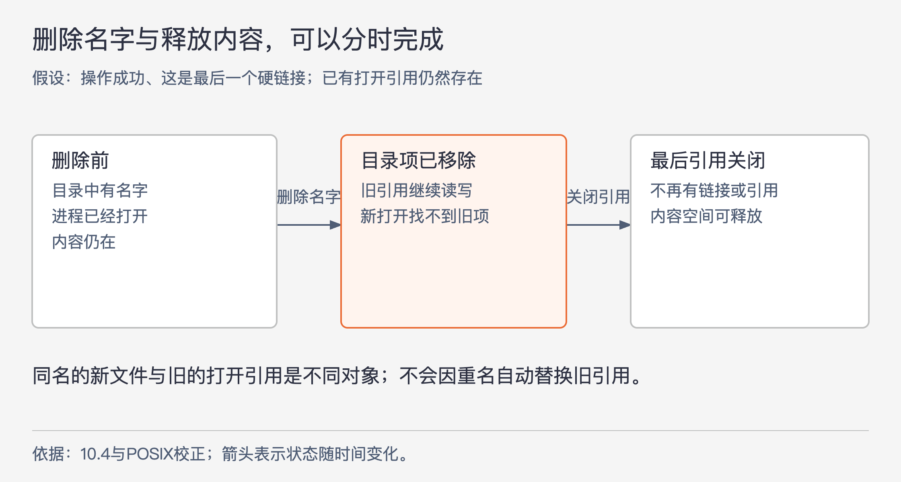
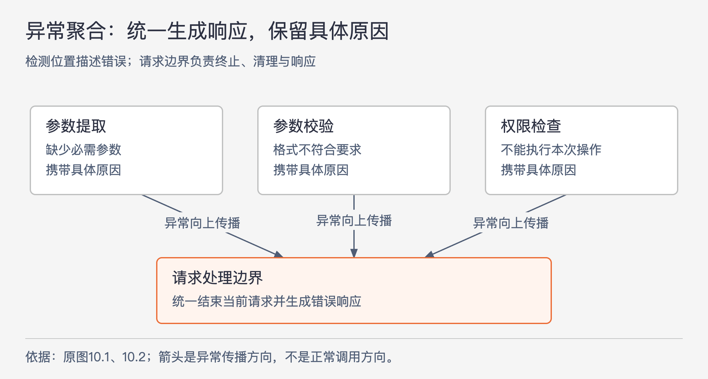

# 《软件设计的哲学》第10章｜避免处理异常 · 书镜8.2

一个接口除了说明成功时返回什么，还让调用者承担失败时的选择。前一章讨论正常功能怎样划分，本章把同样的问题用于错误处理：能否让更少的地方负责处理特殊情况，同时保留调用者作出正确决定所需的信息？章名中的“避免”指重新设计操作和处理位置，不能理解为把所有错误吞掉。

## 一、原书回顾：减少需要各自处理异常的地方

### 10.1 为何异常会增加复杂性

作者这里使用广义的“异常”：任何打断正常控制流程的不常见情况都算，包括抛出异常对象，也包括返回一个表示操作没有完成的特殊值。错误参数、无效配置、I/O 失败、资源不足、网络丢包、响应延迟和内部状态不一致，都可能产生这种额外路径。只把 `throw` 改成错误码，不会自动减少复杂性。

遇到异常后，程序通常要选择继续完成工作，或者中止操作并报告失败。继续可能需要重传或从副本恢复；中止也不只是返回，因为数据结构可能只初始化了一半，已经发生的修改需要撤销，状态需要重新一致。恢复动作还可能引出第二层问题：重传的包与延迟到达的原包重复，备用副本也可能不可用。异常处理若不断制造新的异常，最终仍要找到一个能收住处理过程的位置。

原书以从文件反序列化推文集合的 Java 代码说明阅读成本：正常工作只是逐条读取并加入集合，却配了文件不存在、类型找不到、提前到达文件结尾、I/O 和类型转换等多个捕获分支。将它们集中在一个 `try` 后面，不易看清每个异常产生在哪一行；拆成许多小 `try`，又会割裂主流程、重复处理。代码中的 EOF 分支还有特定前提：推文文件未必装满预期数量，所以提前结束在该例中可以接受。

异常代码也更难验证。某些失败不易在测试环境生成，低频分支长期未执行，等到真实失败时才暴露问题。作者引用 Ding Yuan 等人在2014年 OSDI 发表的分布式数据密集型系统故障研究，转述其中超过90%的灾难性故障与错误处理不当有关。这个比例保留为原书对特定研究的转述；本章不能据此推断所有软件的故障比例。

### 10.2 异常太多

过度防御会把所有可疑情况都拒绝掉，甚至把自然的使用方式变成错误。作者以自己设计的 Tcl `unset` 命令反省这一点：删除不存在的变量会报错，而清理代码往往不知道前面的操作创建了哪些临时变量，最方便的做法是尝试清理所有可能存在的变量。结果，调用者不得不把删除包在 `catch` 里，再忽略错误。

抛出异常也可能只是把棘手问题转交调用者。库作者自己都难以提出合理处理方式时，每个调用者未必更有能力。异常属于接口的一部分，还可能越过直接调用者向更高层传播，因此一个异常会扩大多层代码需要掌握的知识。作者把改进目标定为减少处理异常的位置数量，并依次给出四种技巧。

### 10.3 定义错误不存在

第一种技巧是重新定义操作，让某个特殊输入也具有自然、完整的结果。对 `unset`，如果承诺是“删除一个现存变量”，不存在就像失败；如果承诺改成“确保这个变量不再存在”，变量原本不存在时，目标已经达到，可以直接成功返回。

这种改动发生在操作含义上。调用者仍得到所需的最终状态，无须先查询或捕获一个没有用处的错误。它也不授权把所有删除失败都算成功：权限不足、存储故障等导致目标状态没有实现的情况，并没有被这条定义消除。

### 10.4 示例：Windows中的文件删除

作者用“文件仍被进程打开时，删除可能失败”的 Windows 使用经历作对照，讨论 UNIX 的另一种安排：先移除目录中的文件名，已有打开者仍能使用原文件，等最后的引用结束再释放内容。

图10-1｜文件名的消失与数据的释放可以发生在不同时间。根据原书10.4重画，并用 POSIX 的引用条件校正；假设删除的是最后一个硬链接，且操作本身成功。箭头表示先后发生的状态变化。

这种安排同时减少两边的特殊处理。删除者不用仅因文件正被使用就失败；原有使用者也不会仅因文件名被删除，突然遇到读写失效。若立即销毁内容并让已有句柄全部失效，只是把异常转给了另一批进程。

**原文校正：**PDF物理第126页确实写了“也无法创建同名的新文件”。这不是 OCR 造成的差异。POSIX 说明删除后原文件不再能通过该名字访问，并明确保留重新创建该名字的情况。因此，这里应区分旧文件和同名的新文件；创建新文件不会让旧的打开引用改指向它。数据释放还要求链接计数归零且不再有打开引用。[POSIX remove](https://pubs.opengroup.org/onlinepubs/007904975/functions/remove.html)、[POSIX unlink](https://pubs.opengroup.org/onlinepubs/9699919799/functions/unlink.html)

本例用于解释接口语义的选择，原书对 Windows 的概括不作为所有 Windows 版本、打开方式和共享选项的完整规则。

### 10.5 示例：Java的substring方法

作者认为，调用者有时只想取得给定区间与字符串实际范围重叠的字符。按本书描述，Java `substring` 对越界索引抛出异常，调用者就得先把索引限制在有效范围。原本一次调用变成了额外的条件处理。

他提出另一种 API 含义：返回索引不小于 `beginIndex` 且小于 `endIndex` 的现有字符。这样，区间超出字符串只会减少可返回的字符；区间没有覆盖任何字符，或开始大于结束，就得到空结果。它改变了可接受输入的定义，不能当作 Java 现有方法已经具有的行为。作者还以 Python 切片作类比，说明宽容的边界处理在接口设计中确有先例；这里不展开两种语言完整的索引语义。

有人担心不报错会漏掉程序缺陷。作者承认异常可能发现一部分错误，但要求同时计算新增复杂性带来的错误：调用者可能漏写检查，也可能把检查写错。作者选择让这个提取任务更容易使用；是否采用这种选择，仍取决于调用者究竟需要“取交集”还是“验证索引必须合法”。

### 10.6 异常屏蔽

第二种技巧是在较低层发现并处理问题，使上层继续使用正常接口。原书的 TCP 例子用底层重传说明：一次丢包不必让每个应用都实现一套重传逻辑。理解这个例子时，应把“一次可恢复的丢包被隐藏”与“网络永远能成功”分开。

NFS 的例子更有争议。作者描述文件服务器不可用时，底层持续重试，应用会挂起，恢复后继续运行；长时间未响应时还会提示用户。反对者认为应该及时报错。作者的回答是：如果应用没有其他恢复办法，向它报告失败往往只会让应用自己重试，或者退出，让上层继续失败。统一等待虽然会阻塞，但省去了重复恢复代码，并保留了原来的工作状态。

这是带有前提的设计立场：上层确实缺少更好的恢复选择，而且等待对该任务可以接受。作者还保留了退出选择：用户等得不耐烦时，可以手动中止应用程序。屏蔽增加底层实现工作，却减少调用者需要处理的情况，因此可以让模块更深；它不保证所有应用都该无限等待。

### 10.7 异常聚合

第三种技巧是让同一段代码处理多个异常。原书 Web 服务器按 URL 分派到不同服务方法，每个方法都调用 `getParameter` 读取请求参数。初版在每次读取旁边分别捕获 `NoSuchParameter`，每处却都只是生成错误响应。

图10-2｜把“描述具体错误”和“生成错误响应”放在各自合适的位置。根据原图10.1、10.2及10.7重画；箭头表示异常向处理边界传播，方向与正常调用方向相反。

改进版让异常越过服务方法，由顶层调度器统一捕获。图10.1中的多份处理代码因而合成图10.2中的一份。还能继续聚合：缺参数、参数语法不合法、用户无操作权限，都可能中止当前请求并产生错误响应。检测点知道具体问题，可以构造说明；顶层知道怎样生成响应，无须知道每一种参数如何检查。共享一种可识别的异常上层类型，并让异常携带必要说明，新错误就能接入同一处理机制。

这里的职责分配也体现信息隐藏：`getParameter` 了解参数提取及其失败原因，顶层了解响应格式。通用模式是，在请求循环的边界中止当前请求、清理状态，再处理下一请求。只使当前请求失败的异常，需要与整个系统已无法继续运行的异常区分。

异常屏蔽通常在底层库中更有效，异常聚合通常需要允许错误向上经过几层。两者的共同目的都是在能服务更多调用点的位置集中处理，而不是规定异常总该向上抛，或总该就地捕获。

RAMCloud 又展示了一种更强的聚合：系统已有服务器崩溃恢复机制，能利用其他服务器上的副本重建数据。若发现单个对象损坏，它也可以让所在服务器退出，沿同一机制恢复，省去一套专门的对象恢复逻辑。已有恢复代码被更频繁地运行，缺陷也更容易暴露。

代价同样明确：为一个对象恢复整台服务器，工作量更大。作者认为对象损坏罕见，因此在该系统中值得；经常发生的丢包显然不适合升级为服务器崩溃。这里依赖的是已有可靠副本、必需的崩溃恢复能力和错误发生频率，不能单独抽成“出了错就重启”。

### 10.8 就让它崩溃

第四种技巧用于难以恢复、很少发生且应用允许终止的错误：打印清楚的诊断，然后中止。作者用 C 内存分配说明重复处理的负担。若每处 `malloc` 都可能返回空指针，每个调用点就都要检查；漏检又可能在稍后解引用时崩溃，掩盖最初的内存问题。他提出 `ckalloc` 包装分配、检查和报错终止，让调用者统一使用。

作者还指出，内存不足的处理程序可能自己也要分配内存，从而继续失败。他对内存不足频率、I/O 失败或套接字创建失败是否值得恢复的判断，属于原书语境下的经验意见，不应读成所有现代服务都适用的可用性策略。

决定能否终止，要回到应用提供的价值。普通工具可能无法在磁盘故障后继续；复制存储系统却正是为恢复数据而存在，不能因为恢复复杂就放弃。内部数据结构已经不一致时，继续运行也未必有可靠意义。崩溃策略必须与应用的恢复责任一起判断。

### 10.9 过犹不及

前面几种技巧成立的共同条件是：被隐藏的信息在模块之外没有必要。一个学生团队把所有网络异常都捕获、丢弃，再像成功一样继续，导致上层不知道消息是否丢失、对端是否失效。应用缺少这些信息，就无法决定重试、报告失败或停止后续动作。

因此，屏蔽需要真的处理问题，或让操作定义自然涵盖该情况；仅让异常消失，却没有完成承诺，会制造更大的模糊性。调用者需要的信息即使增加接口复杂性，也必须公开。

### 10.10 结论

优先考察能否改变操作含义，去掉本来不必算错误的情况；对仍需处理的错误，寻找能够恢复的底层位置，或能统一终止当前任务的上层边界。某些无法合理恢复的失败可以明确终止。每一步都要保留调用者判断结果所需的信息。

## 二、主题讲解：从一次报表生成看异常应在哪里结束

### 先把成功条件写成可判断的结果

下面是一个假设案例：用户请求生成报表，系统读取输入、生成文件、交付下载地址，最后清理临时文件。先单看清理：若目标是“这些临时文件不再存在”，某个文件本来没有创建，就不需要报错。这个选择减少了失败途中清理的分支，却不改变成功条件。

再看输入文件：如果它是生成报表必需的依据，文件缺失时返回一份空报表就不满足承诺。清理和读取都遇到了“文件不存在”，处理却不同，因为调用者要求的最终结果不同。由错误名称直接决定“都忽略”或“都抛出”，会跳过真正的设计问题。

### 能恢复的地方承担恢复，不能恢复的地方保留失败

假设临时读取失败后，输入模块有一个经验证相同的备用副本，而且读备用副本仍能得到本次报表所需数据。恢复可以留在输入模块，报表生成器只看见完整输入。这才是异常屏蔽。

若读取一直失败，而用户只愿等待到一个明确期限，底层就不能无限等待。这个期限是本例新增的业务前提，它改变了原书 NFS 讨论中的取舍。超过期限后，系统需要暴露失败，让请求结束或让用户决定稍后再试。低层了解怎样恢复，并不意味着它可以替上层决定等多久。

还有一个容易误判的情况：向外部服务发出生成请求后失去响应。系统可能不知道对方是否已经执行。把它当作“肯定没执行”自动重发，可能造成重复工作。原书在重传引出重复包时已经提示这种次生问题；在本假设中，至少应保留“结果尚不确定”这一事实，再依据外部操作已有的重复处理约定决定下一步。

### 在请求边界聚合，仍要区分失败的影响范围

报表参数缺失、日期格式错误、无权访问输入，都可以使当前请求失败。每个检查点保留自己的具体原因；共同的请求边界负责结束当前请求、清理其状态并生成一致的错误响应。这样不用让每个校验器都懂响应格式。

这里“一个处理器”不等于“所有错误都给同一个结果”。用户可理解的原因、是否允许重试、哪些内容可公开，仍可能不同。该边界也不能把内部状态损坏误归为普通输入错误，再继续接受请求。原书要求区分请求失败和系统致命错误，目的就在于防止这种错误延续。

对报表系统可以用以下几项检查验证设计，而不以 `catch` 数量少作为完成证据：

- 清理一个从未创建的临时文件，目标状态是否已满足？
- 备用副本成功恢复后，报表内容是否仍完整、来源是否符合本次请求？
- 输入持续不可用时，调用者能否知道失败，并保留下一步选择？
- 不同请求错误是否走同一响应机制，同时保留各自原因？
- 请求中途失败时，清理是否完成，系统能否安全处理下一请求？

### “少处理”不能减少必要的责任

四种技巧各自减少不同的工作：重新定义语义去掉无意义分支；屏蔽避免每个调用者重复恢复；聚合复用共同失败处理；明确终止避免伪装成能够继续。它们共同依赖一个问题：处理之后，模块是否兑现了对外承诺，或明确告诉调用者承诺未兑现？只统计异常类型、日志数量和捕获分支，回答不了这个问题。

## 自测：删除已过期的下载链接

假设接口用于撤销一个下载链接。链接已过期、链接不存在、当前用户不是链接所有者、存储服务超时，这四种情况能否都算撤销成功？

核对思路：先定义结果。如果接口承诺“这个链接此后不能使用”，已过期或不存在可能已经满足目标，但还要考虑调用者是否需要审计信息。没有操作权限不能因方便而隐藏；存储超时也未必证明撤销完成。可以统一生成失败响应，却应保留权限与结果不确定的区别。这同时检验了定义错误不存在、异常聚合和不能过度屏蔽的边界。

## 来源、范围与阅读连接

依据 John Ousterhout《软件设计的哲学》第10章，PDF物理第120–137页，原小节10.1–10.10。实际查看第122、123、126、130、131、137页图，核对异常代码、研究脚注、UNIX文字疑点及原图10.1、10.2；第137页为空白。研究脚注为 Ding Yuan et al., “Simple Testing Can Prevent Most Critical Failures: An Analysis of Production Failures in Distributed Data-Intensive Systems”, OSDI 2014，本文未重算研究样本。文件删除校正的一手依据就近链接；其余平台例子保持原书语境。报表和下载链接为假设案例。下一章讨论如何用不同候选方案暴露这类设计取舍。

<!-- source_sha256: c751f0fc575096584dcdb5a365ae558a71b32a6aa241d90d7bc248f21fbdbbf7; content_lineage: fresh_from_source; source_unit: software-design/10 -->
