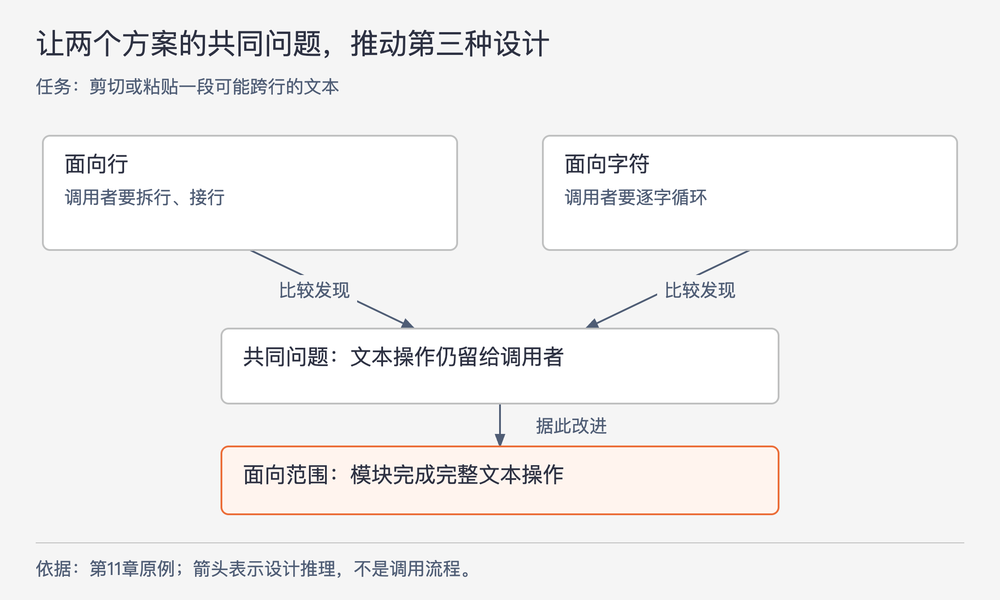

# 《软件设计的哲学》第11章｜设计两次 · 书镜8.2

前面几章给出了信息隐藏、深模块和异常处理等判断标准。本章讨论怎样把这些标准用到尚未写出的代码上：面对重要设计决定，先构造有实质差别的候选方案，再比较它们把工作留给了谁。

## 一、原书回顾：让备选方案暴露第一种设计的局限

原章没有编号小节。以下按原文的论述顺序回顾，不另造原书小节。

作者的起点是，软件设计足够困难，最先想到的办法未必最佳。他建议对重要决定考虑多个选项，称为“设计两次”。文本编辑器的文本类是贯穿案例。先考虑三个接口方向：整行插入、修改和删除；逐个字符插入和删除；对可能跨行的任意字符范围操作。此时只需勾画几个最重要的方法，不必实现所有细节。

候选之间应尽量不同。即使已经觉得某一个方案唯一合理，也值得提出第二个方案，检查它具体差在哪里。比较的价值来自看见取舍，不能为了凑数只换名称或参数排列。

对接口，作者首先比较上层是否容易使用。面向行的接口在处理部分行或跨行选择时，需要上层自己拆行、接行；面向字符的接口在插入一段文本时，需要上层逐字循环。两者都把部分文本操作留给了调用者。还可以比较接口本身是否简单、能否用于更多场景，以及实现效率：逐字符调用可能产生更多调用开销。这里没有给出基准测试，因此“可能更慢”保持为设计推测。

图11-1｜备选方案的共同缺点可以推动第三种设计。根据本章文本编辑器案例重画；箭头表示比较所得的推理，不表示运行调用。

比较后的选择可以是其中一个候选，也可以吸收多个方案的特征形成新设计。如果候选都别扭，要追问它们为何别扭。假如最初只有“行”和“字符”两个方案，共同问题就是调用者还得拼装文本操作。让接口更接近剪切、粘贴所处理的任意文本范围，就能得到第三种方向。这条推导比孤立地记住“范围接口好”更有用：真正被改善的是模块没有承担完整工作的那部分。

作者接着把原则推进到实现。文本类的接口选定后，内部仍可以比较行链表、固定大小字符块、间隙缓冲区等不同表示方式。接口设计首先关注上层易用性；实现设计更关注简单程度和性能。原文列举这些实现作为候选，没有在本章展开算法或宣布某一种普遍最佳。同样的比较还能用于界面功能选择和系统主要模块的划分。

作者认为，早期草拟几个方案的成本通常远小于实现全部代码的成本。他以较小的类为例，估计不到一两个小时的探索可能相对于几天或几周的实现很划算。这个时间是作者的经验估算，不能当作所有模块的工期要求；较大的问题会需要更多探索，潜在收益也更大。

最后，作者讨论一种可能阻碍比较的习惯：人们过去凭第一个快速答案就取得好结果，面对更难的问题时仍坚持这个办法。他把“尝试第二种设计”视为应对问题难度的正常工作，而非能力不足的证据。这是作者的观察和解释，不是对某类人的心理诊断。反复提出、比较、修正候选，还会训练判断力，使人逐渐更容易识别不好的边界。

## 二、主题讲解：让两种接口完成同一个真实任务

### 先固定任务，才知道方案有没有可比性

下面是一项假设需求：后端需要按用户选定的时间区间导出交易记录。时间区间可能从某天中午开始，到另一天下午结束。此例只讨论导出接口如何表达这个区间，不引入真实交易、支付执行或完整报表平台。

初步方案 A 按日导出，提供“导出某一天”；方案 B 按单条记录导出，调用者先查询，再逐条写入。它们都能拼出最终文件，却把不同工作交给调用者。比较前先固定成功条件：结果只包含指定区间内的记录，调用者得到一份完整导出结果，开始和结束边界有明确含义。如果不同方案各自偷偷放宽这些要求，就无法公平比较。

接着让同一个跨日区间走过两个方案。A 要由上层拆成多个日期，再处理首尾两天的部分数据；B 要由上层组织查询、循环和结果汇总。两种方案暴露的是同一个问题：调用者仍需理解如何把片段组成这次导出。

### 从重复承担的工作推导新接口

于是可以提出方案 C：“导出指定时间范围”。接口直接接受起点和终点，内部负责找到相关记录并生成完整结果。它为什么可能更好，要落在具体变化上：调用者不必知道怎样跨日拆分，也不用自己组织逐条输出；范围的首尾语义能在同一处定义。

这并不意味着内部必须一次性读取全部数据。接口说明调用者能要求什么，实现说明内部怎样做到；C 内部仍可按日、按块或按其他方式处理。若把“范围接口”误认成“一次全部装进内存”，就会把接口选择和实现选择混在一起，过早否定一个原本可行的方案。

反过来，也要为 A 提出有力条件：如果业务只允许固定的整日报表，已有结果正好按日保存，任意区间根本不属于需求，那么 A 可能更简单。第二个候选的价值，是帮助我们发现决定优劣的前提，而不是让“更通用”永远赢。

### 对不同层次用不同证据

比较接口时，可以写三段最小调用示意，观察调用者分别需要维护哪些中间变量、执行哪些循环、处理哪些边界。它们无须成为可部署代码，但必须能说明任务如何完成。若连调用示意都写不顺，接口很可能仍把太多工作交给了上层。

比较内部实现时，再检查数据规模、常见区间和资源限制。能从代码步骤直接推导的问题，可以先做推演；涉及性能的关键差异，才需要小规模实测。一次未测量的猜测可以用于指出风险，不能写成“方案C已经更快”。本章给的是探索方式，没有替读者提供这些环境事实。

如果两个候选都不能很好地完成任务，应记录它们的共同障碍，再提出新方案。不要把比较做成必须从最初两项里选一个的投票，也不要为证明第一案正确而给第二案安排不合理条件。

### 比较结束时留下能被复查的理由

一份有用的设计记录可以很短，但应交代四件事：必须完成的任务；候选的实质差别；同一情形下各自增加的调用工作或实现成本；最终选择依赖的条件。对这个导出例子，可以记下：“请求允许任意时间范围，因此采用范围入口；内部处理方式仍待结合数据规模选择；若需求收紧为固定整日文件，重新比较按日接口。”

这类记录既防止把当时的取舍误当永久规则，也让后来的人知道应在什么变化下重开讨论。设计两次可以提高发现问题的机会；它不保证穷尽所有方案，也不意味着把每个候选完整实现一遍。

## 自测：第二次设计只是换了名字吗

假设第一个方案叫 `exportRange(start, end)`，第二个方案叫 `downloadTransactions(from, to)`，参数含义、调用步骤、状态和结果完全相同。与此同时，有人提出一个只能导出固定整日快照的方案。

核对思路：前两个名字可能在可读性上有优劣，但还不是两种有实质差别的导出设计。整日快照改变了允许的请求与内部复用方式，值得比较，却必须先承认它不能原样满足任意区间需求。如果业务愿意改变这一前提，比较才可能改变结论。用原文的办法，要找的是不同选择怎样影响使用者，不能靠方案名称凑出“设计两次”。

## 来源、范围与阅读连接

依据 John Ousterhout《软件设计的哲学》第11章，PDF物理第138–141页，原章无编号小节。四页均已查看页图，核对三种文本接口、内部实现候选、时间估算与结尾论述；本章没有原书配图，图11-1为原章推理重画。时间范围导出为本文假设案例，未引入性能实测或项目经历。下一章开始讨论注释如何帮助表达和检查这些设计决定。

<!-- source_sha256: c751f0fc575096584dcdb5a365ae558a71b32a6aa241d90d7bc248f21fbdbbf7; content_lineage: fresh_from_source; source_unit: software-design/11 -->
