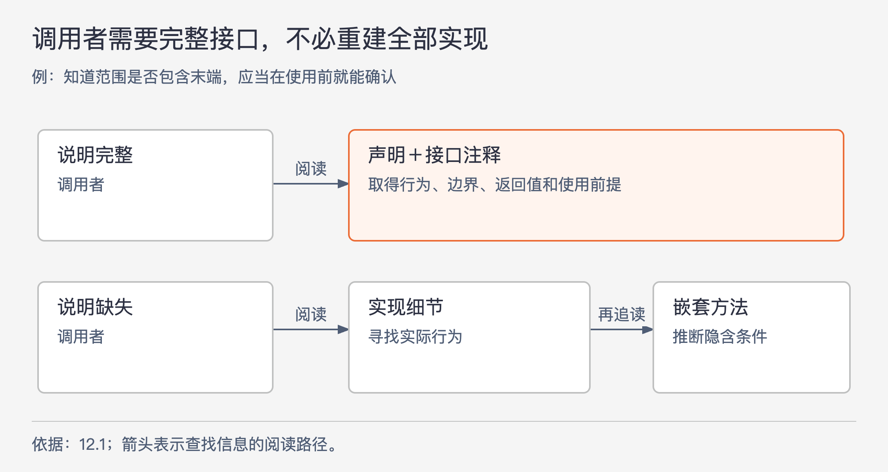

# 《软件设计的哲学》第12章｜为什么要写注释？4个借口 · 书镜8.2

前一章要求比较设计方案，但接口的名称和类型往往不足以表达它们真正的差别。本章解释注释为什么属于设计本身：调用者需要知道结果的含义、使用前提和限制，维护者还需要知道某些决定为什么存在。这些信息不一定能从代码中直接看见。

## 一、原书回顾：注释怎样帮助读者忽略实现细节

章首先提出三项期待：好的注释能改善软件质量，写好注释有可学习的方法，注释也可以成为设计中的有趣工作。作者承认现实中有大量没有文档或文档平庸的代码，然后逐一回应四种不写注释的理由。后续章节才展开怎么写、如何命名和何时写，本章主要说明其必要性。

### 12.1 好的代码自己就是文档

好的名称和清楚的代码能减少解释需求，但不能自动说明全部接口含义。例如，方法签名可以写出参数 `start`、`end` 和返回类型，却没有回答：结束位置是否包含在结果中，开始大于结束时怎样处理。方法适合在什么条件下调用、设计为什么选这个办法，也常常没有体现在声明里。

图12-1｜注释补全调用者所需的信息，使实现细节可以留在模块内部。根据12.1重画；箭头表示阅读时获取信息的路径，不表示程序调用。

一种反对意见是，让使用者直接读实现最准确。作者指出，这样做可能得到答案，却费时，而且让全部实现细节进入使用者的理解范围。若为方便这种阅读而把方法不断拆短，调用者还可能需要沿调用链阅读更多浅方法，整体负担未必下降。

抽象是一个便于使用的简化视图：保留必要信息，省去可以安全忽略的细节。如果必须读完整个实现才敢调用，简化视图就没有承担工作。注释可以补全声明缺少的行为约定，让调用者知道怎样使用而不必重建内部算法。自然语言不如程序执行规则精确，却能更直观地解释意图与概念；作者因此把注释视为抽象的重要组成部分。

### 12.2 我没有时间写注释

如果总把文档排在新功能之后，时间压力会使它一直被推迟。作者用第3章的投资心态回应：前期花时间让系统容易理解，后面维护和改动时才能少付成本。

他做了一个粗略估算：假设输入代码占总开发时间不超过10%，再假设输入注释与输入代码一样费时，新增注释的时间也不会超过原开发时间的约10%。这里的两个比例都是作者的假设与估计，不是对所有团队的测量；它用来反驳“文字很多，所以必然耗费大部分工期”的直觉。

更直接的收益来自接口注释。若在设计时就尝试把类和方法说明白，可能当场发现接口不合理，减少之后修改代码的代价。第15章会进一步讲这种工作方式。本节的主张因此不只依赖未来回报，也包含当前设计过程中的帮助。

### 12.3 注释会过时，会产生误导

作者承认注释会陈旧，但认为这可以管理，不应成为整体放弃文档的理由。他建议避免相同信息散布多处，使说明尽量靠近相应代码，并在代码评审中检查同步修改。大的行为改变往往本就需要较多实现工作，同步更新说明是其中的一部分。

“维护注释的工作量通常不大”是作者的经验判断。它有条件：说明组织得当，且代码变更时确实把文档纳入检查。该观点不能保证任何一份注释天然可靠；读者发现代码与说明冲突时，仍要核查。

### 12.4 我见过的注释都没有价值

作者认为这是四种理由中最有依据的一种，因为很多注释只复述旁边的代码，确实不增加信息。他接受对坏注释的批评，但没有从中推出所有注释都无价值。后面的写法要解决的，正是如何补上读者真正需要、却不能轻易从代码看出的内容。

这也给本章的观点加上质量条件：增加注释数量并不能自动降低复杂性。重复一句方法名，或者描述明显的赋值动作，不会让读者多理解设计。

### 12.5 写好注释的好处

好注释保存设计者脑中尚未进入代码的信息，范围可以很低层，例如某段奇怪代码是为绕过硬件行为；也可以很高层，例如一个类为什么存在。不记录这些信息，后来修改的人就要重新调查或猜测，原作者过几周再回来也可能忘记。

作者把这种收益放回第2章的复杂性概念中。变更放大指一次改动牵动很多地方；认知负担指开发者必须积累很多信息才能工作；不知道未知指开发者甚至不清楚还有哪些代码和条件需要注意。好文档主要帮助后两项：给出必需信息，使无关实现可以暂时忽略；指出系统结构与依赖，使开发者知道应该到哪里继续看。

复杂性的主要原因是依赖关系和模糊性。文档可以澄清依赖、填补缺失含义，减少模糊性；但把依赖写清楚，不等于依赖本身消失。需要改动许多位置的问题，仍可能需要调整设计解决。

### 12.6 不同观点：注释就是失败

本节再次讨论与 Robert Martin 的分歧。按本书引述，Martin 把注释视为代码未能表达意图时的补救，并主张尽可能通过代码表达。Ousterhout 同意清楚的设计可以减少解释内部实现的注释，但反对把所有注释都理解成失败。

分歧与第9章相连：把代码块提取为一个方法，再用很长的方法名替代说明，可能产生浅方法与难懂的名称。原书举出的名字是 `isLeastRelevantMultipleOfNextLargerPrimeFactor`。这些词描述了质因数相关判断，但读者仍要知道“相关”如何判定、这个判断在什么情形下使用。每个调用点都要重复这个长名称，却未必得到一段好注释能提供的理解。名称按PDF第148页连接排版换行后的两部分，未把行末连字符当作标识符内容。

作者认为代码与注释适合表达不同的信息。接口说明的价值之一，恰好是让使用者不必阅读实现。即使某些信息勉强能被编码成名字或结构，也要比较这种表达是否更容易理解。本节保留了真实分歧，没有把“尽量减少注释”与“用注释定义抽象”揉成一条无条件规则。

## 二、主题讲解：读代码能找到答案，为什么还需要说明

### 一行声明可以允许多种合理解释

下面使用一个假设的查询方法：`findOrders(start, end)` 返回一段时间内的订单。只看名字与类型，你可能猜它包括开始时刻，却不确定结束时刻是否包括在内。如果上一页查询截至12点，下一页从12点开始，边界定义不清就可能重复或漏掉恰好12点的记录。

代码里也许能看到 `time < end`。但对每一个调用者，要求他们找到最终比较语句、确认没有其他转换、再猜这是否为稳定承诺，都会增加阅读成本。接口注释直接说明“开始包含、结束不包含”，可以把这项必要信息放在每个使用者自然会查看的位置。比较语句保证程序按条件执行，说明告诉人们应当依赖什么行为。

### 再区分可见结果和内部办法

继续看这个方法。调用者可能需要知道结果排序、空结果含义、是否只读、是否会阻塞等；具体需要哪些项目，要依据这个接口实际提供的行为。调用者一般不必知道内部使用哪张临时表、循环分几轮，除非这些安排已经形成可观察的限制。

假设注释写成“创建查询对象，设置两个参数，调用数据库，再把结果装入列表”，它虽然比名称长，却没有回答边界、排序和结果含义。读者仍得查看实现。更好的说明先给完整行为，再补足必须遵守的细节；内部维护者需要的步骤解释放在实现附近。

这就是“减少认知负担”的具体含义：少读不相关的内部细节，并完整得到需要的信息。它不要求注释越短越好；少写了必要前提，读者只是暂时没有意识到还缺信息，反而增加了不知道未知。

### 好注释也可能暴露接口本身需要修改

若说明必须写“查询前先设置当前租户，调用后把线程中的状态清空，某个返回值还取决于上一次调用”，你可能已经发现一个设计问题。首先要确认这些依赖是否必要；能够从接口消除的，就修改设计；确实保留的，再完整写明。

这样，注释既帮助当前调用，也会促使设计者检查模块有没有把太多状态管理交给使用者。第15章讨论的“先编写注释”，正利用了这种效果。只删除注释或把方法名拉长，不会让那些使用前提自行消失。

### 用一次变更判断文档有没有价值

假设后来支持用户选择时区。维护者应该能从接口说明看到起止参数究竟表示绝对时刻还是某地的日历时间，再定位转换代码。若说明还指出边界处理规则的归属，就能减少漏看的位置。文档在这里降低了模糊性，但如果转换逻辑已经复制在五处，仍然需要改五处；注释不能代替去除重复知识。

维护时也不必把每个实现调整都重写成接口变化。换了一种内部查询方法，只要公开行为保持不变，接口说明可以不动；结束边界含义改变，即使代码只改一个字符，说明和调用者检查都需要同步。更新成本与行为影响有关，不能只看代码改了多少行。

## 自测：两条注释哪条值得留下

假设 `close()` 的第一条注释是“关闭资源”，第二条注释是“释放本对象拥有的资源；调用后对象不能再用于读取；重复调用无额外效果”。如果第二条确实符合实现，它补充了哪些声明没有表达的信息？是否能因此取消测试？

核对思路：第二条说明所有权、对象后续状态与重复调用行为，可以帮助使用者正确安排生命周期。测试仍需检查实现是否兑现这些行为；注释负责说明应当依赖什么，不能证明实现正确。第一条如果只是复述方法名，就没有提供同等价值。

## 来源、范围与阅读连接

依据 John Ousterhout《软件设计的哲学》第12章，PDF物理第142–149页，原小节12.1–12.6及章首引入。实际查看第144、145、148页图，核对范围边界例子、10%估算前提及与 Martin 的分歧。图12-1为论证关系重画；订单查询和资源关闭均为假设例子。成本估算与注释维护难度保留作者归属，未当作实测结果。第13章继续讨论注释具体应该写什么。

<!-- source_sha256: c751f0fc575096584dcdb5a365ae558a71b32a6aa241d90d7bc248f21fbdbbf7; content_lineage: fresh_from_source; source_unit: software-design/12 -->
