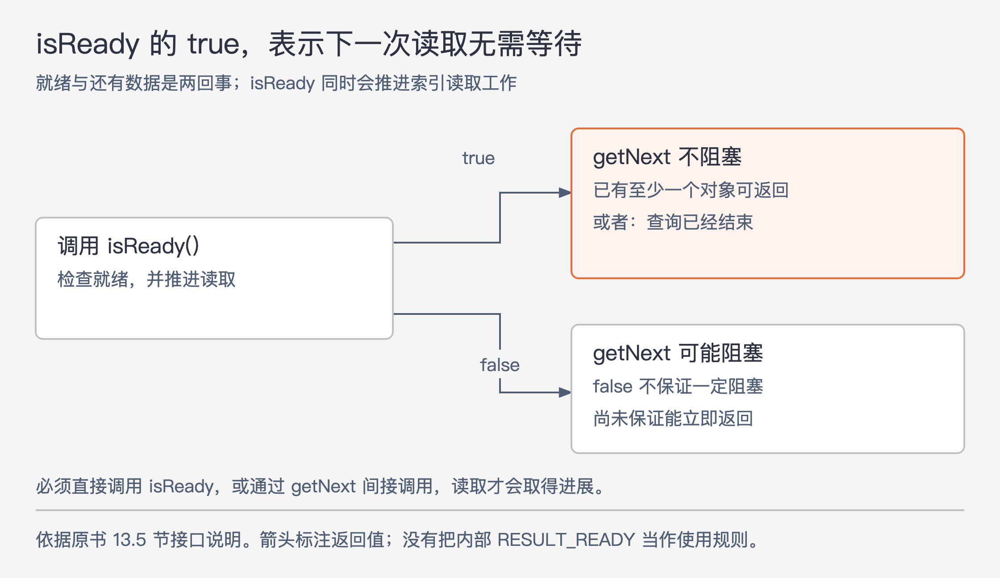
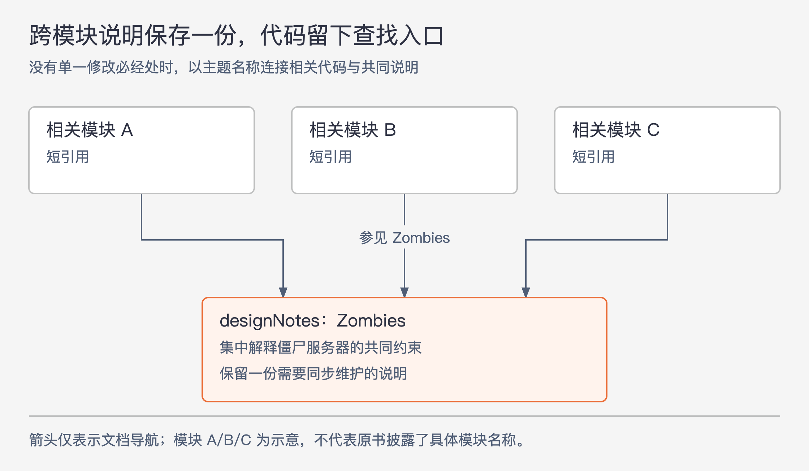

# 《软件设计的哲学》第13章｜注释应描述代码中不明显的内容 · 书镜8.2

声明和语句能展示程序怎样计算，却常常没有说明单位、范围端点、调用顺序、设计理由，以及使用者可以依赖的整体行为。本章要求把这些信息留下来，让后来的人无需遍读实现，就能正确使用和修改模块。

## 一、原书回顾：补充含义、意图和使用条件

章首列举几种代码不容易说明的信息：一对索引是否包含端点，某段处理为何存在，以及“先调用 a 再调用 b”的规则。尤其是抽象：逐行代码细节太多，难以直接呈现一个简单承诺，例如“调用后网络流量受每秒 maxBandwidth 字节限制”。作者希望使用者通过可见声明及注释理解模块，不必为此进入内部实现。

这里的“不明显”以第一次阅读的人为参照，也以注释旁边的代码为参照。某个事实即使能从整个程序推导出来，仍可能值得在声明旁明确写下。

### 13.1 选择约定

先确定注释内容与格式。原书建议已有 Javadoc、Doxygen、godoc 等工具时遵守其约定；没有现成约定，就借用相近语言或项目的做法。统一形式帮助读者定位信息，也减少“到底该写什么”导致的拖延。

原书分四类。接口级注释放在类、数据结构、函数或方法声明前，说明整体抽象、行为、参数、返回值、副作用、异常和前提；成员级注释说明字段含义；实现级注释位于方法内部，帮助理解代码；跨模块注释记录多个模块共同遵守的决定。

作者把前两类看得最重，建议为类、类变量和方法都写注释。极少数声明已经足够明确，例如某些 getter、setter，确实可能没有额外信息；不过他认为通常不值得为省略注释反复争论。方法内部的注释常可省去，跨模块注释则较少见、难写，但需要时很重要。这是作者的写作建议，不能混成“每行代码都必须注释”。

### 13.2 不要重复代码

作者先展示逐行解释取指针副本、判断副本、返回对象的代码。旁注几乎都只是把语句念一遍，只有“被当前线程锁定”暗示了一点代码之外的含义。给创建水平、垂直滚动条的语句写“添加滚动条”，同样没有增加信息；给三个光标变量赋初值写“初始化光标相关值”，则错过了说明这些变量分别表示什么的机会。

另一类重复把名称拆成句子：`getNormalizedResourceNames` 的注释只说获得规范化资源名称，`downCastParameter` 只说把参数转换为某种类型，`textHorizontalPadding` 只说水平填充。读者仍不知道“规范化”的规则、返回数组元素的含义、转换的具体意义，或填充使用什么单位、在哪一侧生效。

改写填充注释时，作者补上“每行文字左右两侧留下的空白，以像素计”。它说明了单位和两侧范围，也解释了 padding 的含义。新增价值来自具体信息，并非单纯换几个同义词。

“警示信号：注释重复了代码”的检查方法是：一个不了解这段程序的人，只看旁边的名称和语句，能否写出同样的注释？若可以，就该寻找尚未说明的含义，或在确实没有信息可补时省去这条注释。

### 13.3 低层注释增加精确度

名称和类型通常无法完整表达变量含义。低层注释补充更精确的细节，例如单位、边界是否包含、空值代表什么、谁负责释放或关闭资源，以及始终成立的不变量。“列表至少有一个元素”这样的条件，会改变后续代码可以作出的假设。

原书第一个变量例子是缓冲区 `offset`。写“当前偏移”仍不知道“当前”指哪个阶段；改成“缓冲区中第一个尚未返回给客户端的对象的位置”，便明确了处理进度。

第二个例子用 `TreeMap<Integer, Integer>` 统计行长。最初的 `lineWidths` 没说哪个数是键、哪个数是值，也分不清像素宽度与字符数量。改成 `numLinesWithLength` 后，注释进一步说明：键是包括换行符在内的字符数，值是恰有该长度的行数；没有对应条目，表示没有这种长度的行。名称负责提示，注释补足表示方式和缺项含义。

第三个例子是 `receivedValidHeartbeat`。旧注释逐段说接收线程何时置 true、定时任务何时置 false，仍迫使读者拼出状态意义。改为“自上次选举计时器重置以来，已经收到心跳时为 true；用于 Receiver 与 PeriodicTasks 线程通信”，便直接给出变量表示的事实。读者可以由含义推回如何更新。

因此，描述变量时应先说它代表什么，再考虑是否还需说明操作过程。并发例子在这里用于比较注释，并未提供完整的共识协议或线程同步方案。

### 13.4 高层注释增强直观性

高层注释帮助读者看出多个细节共同完成什么。原书查找可复用 RPC 的循环，旧注释逐个解释 `LOADING` 状态、会话和位置比较，内容接近条件表达式，却没有交代目标。

改写后，注释只需先说明：尝试把当前键的哈希值追加到发往目标服务器、尚未发送的已有 RPC 中。读者由此能理解为什么遍历所有活动 RPC、为什么匹配会话、为什么检查可追加的状态，以及为什么限制每个 RPC 的哈希数量。原书明确指出，`maxPos` 测试仍未被这句注释解释；高层描述没有自动填满每个细节，却为检查代码是否完成目标提供了依据。

第二个案例的关键注释在解析文本中缺失，页图保留了完整内容：有些键哈希没能在这次请求中查到，可能因为数据不在该服务器、服务器崩溃，或响应空间不足；随后把未处理的哈希标记出来，使它们能够重新分配给新的 RPC。第一句解释为什么来到这段代码，第二句解释它要做什么。循环中的计数、位置回退和未分配标记有了共同目的。

作者建议从“这段代码想完成什么、哪个想法可以解释这些语句”来组织高层注释。能从细节退出来，才可能给出清楚的抽象；把 if 条件译成自然语言，还没有完成这一步。尤其是很少进入的分支，说明它何时会发生，常比重述分支内部语句更有帮助。

### 13.5 接口文档

接口文档说明使用类或方法所必需的信息，实现文档说明内部如何做到。把两者分开，使用者才不会被内部细节干扰。若接口必须解释实现的大部分内容才能用，注释已经暴露出模块可能过浅的问题。

**类文档先说明整体抽象和实例含义。** 原书 Http 类的文档说明：应用可接收 HTTP 请求、处理并返回响应；每个实例对应一个接收请求的套接字；当前实现单线程、一次处理一个请求。最后这项限制会影响使用方式，因此属于接口需要说明的内容，而非可以随意隐藏的内部事实。

**方法文档兼顾整体行为和精确条件。** 开头用一两句话说明调用者观察到的行为，随后说明参数、返回值、限制和参数之间的依赖。影响后续系统行为、但不属于返回值的结果是副作用，例如往内部结构添加以后可读取的值，或写入文件。异常也要说明。若要求先调用某方法，或二分查找要求列表已经排序，应尽量减少这类前提，但保留的都必须记录。

**Buffer::copy 展示了完整而不泄露实现的说明。** 它把缓冲区的一段字节复制到外部位置：`offset` 是第一个待复制字节的索引，`length` 是请求复制的字节数，`dest` 必须至少容纳 `length` 字节。返回值是实际复制数；请求范围超过缓冲区末尾时可以少于 `length`，完全不重叠时返回 0。这个接口把部分越界定义为正常结果，调用者可以理解边缘情况，却无需知道内部如何查找数据。目标容量要求仍然存在，不能把“部分复制”读成对所有不合法输入都安全。

**IndexLookup 用于练习接口与实现的取舍。** 原书分布式存储中的表包含对象，表的索引按指定字段查找对象，例如名字或年龄。一个查询实例指定表、索引及键范围；应用反复调用 `getNext` 取对象，全部取完后得到 NULL。若年龄是索引字段，可以用 21 和 65 说明查询范围，但端点与比较规则仍需由正式接口定义。

其实现先联系相关索引服务器收集对象信息，再联系存储对象的服务器取得值；表和索引还可能分布在不同服务器上。实现很复杂，使用者却只想完成一次范围查询。原书在此提出五个问题：消息格式、比较函数、服务器索引结构、请求并行性、服务器崩溃处理，哪些属于接口？答案保留在 13.9 节。

类文档的第一版把重点放在特定 RPC 名称、并行 RPC 数量、每个 RPC 的哈希数量上限和私有活动缓冲区大小，还告诉 C++ 用户包含头文件、创建对象时提供“所有必要信息”。前一组属于维护者需要的实现细节，后一组没有提供实质帮助。

改写后，先说明“客户端用索引执行范围查询，每个实例表示一次查询”，再用简短流程串起 `getNext` 和 `getKey`、`getKeyLength`、`getValue`、`getValueLength`。这段协作示例虽与各方法文档有少量重复，但对深类的使用方式可能有帮助。类级说明不必再次列出 `getNext` 返回 NULL 的所有细节，具体含义放在方法文档；在该例中自动恢复的服务器崩溃对应用不可见，也无需让类文档展开恢复机制。

原书将这种情况列为“警示信号：实现文档污染了接口”。`isReady` 的第一版正是如此：解释内部 `RESULT_READY` 状态、DCFT 模块、规则执行次序和 `getNext` 的循环实现，却没有把调用者最关心的就绪含义说清。

图13-1｜依据 13.5 节修订后的 isReady 文档绘制。true 保证下一次 getNext 不阻塞；false 只表示可能阻塞。是否还有对象，需要与是否已经结束分开判断。

改写的文档说明了两件事。其一，`isReady` 为 true 表示下一次 `getNext` 可以立即返回，原因可能是已有至少一个对象，也可能是查询已经结束；false 表示可能阻塞。其二，`isReady` 本身推动索引读取工作，必须直接调用它，或通过 `getNext` 间接调用，查询才会取得进展。只把它理解成“查看某个标志”的纯查询，会遗漏重要的可见行为。

### 13.6 实现注释：做什么和为什么，而不是怎么做

短方法往往只完成一件已经由接口说明的事，读者结合代码即可理解，不必再写内部旁白。较长方法可以在主要代码块前说明这一阶段的目标，例如“扫描活动 RPC，检查哪些已经完成”。较复杂循环则可说明每次迭代处理一个请求、更新对应对象并追加一条响应，帮助读者把局部操作理解为完整步骤。

令人费解的缺陷修复还应解释必要性。若问题已在缺陷报告中详细记录，注释可以说明简短原因并指向报告，避免复制整段历史。原书以 RAM-436 和旧版设备驱动崩溃作为示例，只说明这种记录方法，并未在本章展开缺陷经过。

局部变量是否需要注释，也取决于阅读跨度。声明和全部用途就在几行内，好名称通常已经足够；变量在很长的方法中多处使用，关键含义可能值得在声明处说明。即使写注释，也应说明所代表的东西，避免罗列赋值操作。

### 13.7 跨模块设计决策

理想的信息隐藏不能消除所有跨模块决定。协议会同时影响发送方和接收方，类似依赖往往细微，记录之后还必须让修改者找得到。

RAMCloud 的 Status 枚举是一个有自然入口的例子：新增状态必然要改枚举，因此作者在列表末尾放了联动说明。原书列出的七项不能缩成“记得同步其他文件”：

1. 调整 `STATUS_MAX_VALUE`，使它等于最大已定义状态值，并保持最后声明；它主要用于测试。
2. 在 `Status.cc` 的 `messages`、`symbols` 两张表中增加条目。
3. 在 `ClientException.h` 增加新的异常类。
4. 在 `ClientException::throwException` 增加状态到相应异常子类的映射分支。
5. 在 Java 绑定的 `ClientException.java` 增加异常静态类。
6. 在该 Java 文件中增加对应状态的异常抛出分支。
7. 在 `Status.java` 的枚举中加入对应项，并使位置与状态码相符。

这份说明靠近修改必经位置，新增状态时更容易被看到。它记录的是原书项目的联动关系，不是要求读者照搬这些文件结构。

另一个案例是僵尸服务器：集群认为某服务器已失效、把其数据交由其他服务器恢复管理，但旧服务器实际上还在运行。原书摘录保留了两种不同风险与发生条件。替代服务器接管后，旧服务器不能继续读服务，否则可能返回未包含新写入的旧数据；替代服务器开始重放恢复日志后，旧服务器不能再接受写入，否则这些写入可能未进入替代服务器，随后丢失。读与写的限制时点不同，不能统一成含糊的“切换时注意一致性”。

相关代码散在多个模块，没有一个像枚举声明那样的必经入口。到处复制文档容易不同步，只留一处又难发现。作者尝试在 `designNotes` 中按主题保存一份完整说明，再在有关代码中写“参见 designNotes 中的 Zombies”。

图13-2｜依据 13.7 节 designNotes 做法绘制。箭头仅表示文档导航，不表示函数调用。中央内容保存一次，各处通过主题名称找到它。

这一做法减少重复并改善可发现性，但文档离代码较远，修改代码时仍可能忘记更新。作者将它写成正在尝试的办法，没有宣称已解决跨模块文档维护。原书的 Zombies 摘录在介绍“两种处理技术”前后截断，本章没有给出其完整实现，因此这里保留两类风险和文档组织方法，不补造恢复协议。

### 13.8 结论

好的代码与注释共同让结构、行为及修改条件清楚可见。判断“明显”的人是首次阅读者。审阅者说不清楚时，应找出其困惑，用更清楚的代码或注释解决；作者认为自己早就知道，并不能证明文字已经说明白。

### 13.9 13.5节问题解答

原书对 IndexLookup 的五项判断依次如下。

| 信息 | 是否放入接口文档 | 原书理由与限制 |
| --- | --- | --- |
| 向索引和对象服务器发送的消息格式 | 否 | 属于类内部通信实现，应隐藏。 |
| 范围比较使用整数、浮点数还是字符串等规则 | 是 | 决定什么对象会落入查询范围，使用者必须知道。 |
| 服务器保存索引的数据结构 | 否 | 应封装在服务器端，连 IndexLookup 的实现也不必知道。 |
| 是否同时向不同服务器发请求 | 可能 | 若特殊技术影响用户关心的性能，可以提供高层性能信息。 |
| 服务器崩溃的处理机制 | 本例不需要 | 本例自动恢复，应用看不到崩溃；若失败对应用可见，就应说明可见表现，仍不必解释恢复内部细节。 |

第四项的“可能”和第五项的条件很重要。接口与实现的边界由使用者需要什么来确定，不能把所有与实现有关的事实一律删除。

## 二、主题讲解：让读者不用猜，仍能判断下一步

### 先把“它是什么”说到足够精确

下面构造一个分批读取记录的假设案例。类有一个 `offset`，旁边写“当前偏移”。这句话没有告诉读者，它是已返回记录数、下一条待返回记录的位置，还是已从服务器取回的位置。即使赋值代码写得很清楚，不同阶段的关系仍可能需要跨文件推断。

先选定含义：假设它表示“下一条尚未返回给调用者的记录位置”，并明确位置从哪里计数。随后核对每次返回记录后如何更新。如果同一字段有时表示已经取回、有时表示已经交付，问题已超出措辞：可能需要分成两个状态。精确注释会迫使实现者确认自己究竟在记录什么。

### 然后写出使用者可以依赖的行为

沿这个读取器，`isReady` 这个名字只让人想到“准备好了”，没有说明准备好了什么。原书的区分很实用：能立即返回，并不必然意味着还有数据；结束结果也可以立即返回。若调用者把 true 当成“必有下一条”，就会误判末尾。

因此先写“下一次读取会不会阻塞”，再写如何判断结束，并说明检查就绪是否推进后台工作。实现者可以更换内部队列、网络请求或状态名，只要仍满足这些可见行为。反过来，只介绍内部 `READY` 状态而不说明使用结果，调用者就必须跟随实现细节，抽象也随之变浅。

### 实现注释给出理解与检查的依据

假设读取器把发往同一服务器的记录请求合并发送。循环可能检查地址、请求阶段和容量。逐项复述这些检查，没有说明它们为什么在一起；“把当前记录加入发往目标服务器、尚未发出的批次”则让读者能检验每个条件是否服务同一目标。

高层意图也不能替代剩余说明。如果还存在一个为了保序的条件，而上面的句子不能解释它，就要在必要位置说明原因，正如原书承认 `maxPos` 尚未得到解释。好的高层注释为细节提供入口，并不允许删掉改变正确性判断的细节。

### 最后把跨模块约定放到修改者会经过的地方

若读取器要增加一个返回状态，而状态同时映射到错误消息和异常，最需要提醒的位置通常是状态声明附近。若共同规则没有单一入口，就保留一份主题说明，让相关实现各有短引用。前者利用必经位置，后者建立可发现路径，两者都要随真实联动关系更新。

可以安排一次具体阅读检查：让未写这段代码的人仅看声明和注释，解释范围端点、空值、资源归属、失败行为和先决条件；再让维护者指出改一项跨模块规则要到哪里。答不出来的部分，就是应该补充或重新设计的地方。这个检查有明确对象，比统计注释比例更接近本章目标。

## 检验理解：下面哪些信息必须留下

假设一个方法向调用者提供下一批记录。现有文档详细介绍内部请求队列，却没说明返回空集合表示结束还是暂时无数据，也没说明调用是否推进读取。应该怎样改？如果它会在故障时抛出调用者必须处理的异常，能否为了隐藏内部机制删去？

核对思路：先说明调用者能观察到的批次、结束条件、阻塞与推进行为，把队列组织移到实现说明；空集合的含义不能靠读者猜。故障可见时必须保留其表现和调用者要做的事，内部如何恢复则可隐藏。还要检查文档所写是否真实成立，不能仅为简洁许诺实现没有提供的行为。

## 来源、范围与阅读连接

依据 John Ousterhout《软件设计的哲学》第 13 章，PDF 物理页 150—175。已完整读取章内文本，并实际查看第 160、161、163、169、172、173、175 页，恢复 13.4 第二段 RPC 注释，核对 Buffer 参数、isReady 的两种 true 情形、Status 的七项联动和末尾原节标题。13.9 的标题按页图恢复为“13.5节问题解答”，不是新增问题章节。

第 160 页缺失注释明确列出数据不在服务器、服务器崩溃、响应空间不足三种起因及重新分配目标；本文按页图补回。Zombies 的完整处理技术不在本章摘录中，未擅自补充。原书案例保留其历史项目归属；分批读取器、额外阅读检查为本文假设和讲解，不宣称真实测试结果。图13-1、图13-2均来自本章关系重绘。

下一章讨论名称怎样先传达最重要的含义，减少读者追查注释的次数；第 15 章再把注释用于编码前的设计检查。

<!-- source_sha256: c751f0fc575096584dcdb5a365ae558a71b32a6aa241d90d7bc248f21fbdbbf7 -->
