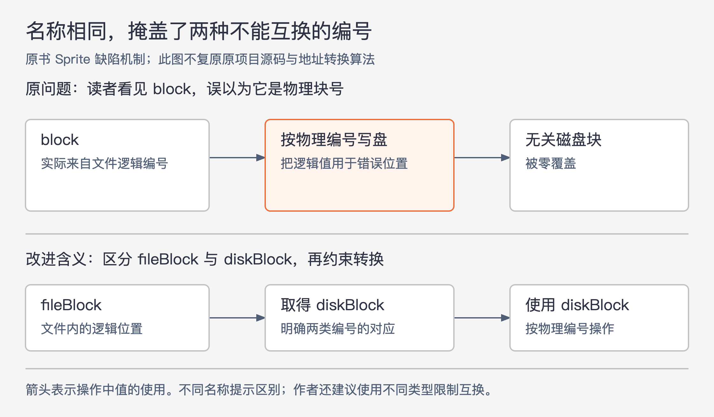

# 《软件设计的哲学》第14章｜选择名称 · 书镜8.2

名称会在读者打开文档之前，先让他对对象形成一个猜测。猜对了，理解代码就省一步；猜错了，错误可能顺着这个猜测进入实现。本章要求选择足够精确、使用一致的名称，也保留短名称和省略冗词的适用条件。

## 一、原书回顾：让读者的第一猜测接近真实含义

章首把名称看作一种文档，也接回“复杂性是增量的”：一个普通名字似乎影响不大，成千上万个名字积累起来，就会影响理解、维护和发现错误。作者因此主张把命名当成设计工作，而非写代码时随手填空。

### 14.1 示例：糟糕的名称会导致缺陷

作者回忆，20 世纪 80 年代末至 90 年代初，他和研究生开发 Sprite 分布式操作系统时遇到间歇性数据损坏：文件没有被用户修改，一个数据块却偶尔变成全零。几名学生追查无果，作者后来花了六个月才定位并修复。这里的时长是作者对该项目的叙述，不是一般调试工作的统计。

根因是 `block` 被用于两种含义：文件内部的逻辑块编号，以及磁盘上的物理块编号。一处代码把实际保存逻辑编号的变量，交给了需要物理编号的位置，导致无关磁盘块被零覆盖。

图14-1｜依据 Sprite 案例的错误机制重绘。箭头表示值在操作过程中的使用；下方仅说明需要区分含义，不复原原系统的地址转换算法。

多名开发者曾读过相关代码，但看到 `block` 用在物理编号的位置，就自然把它当成物理编号。直到证据把问题缩小到具体语句，作者才追查它真正来自哪里。使用 `fileBlock` 和 `diskBlock` 能让这种混用更容易被看见；作者进一步建议用不同类型表达二者，使它们不能被直接互换。

`block` 与两种对象都“差不多相关”，恰恰不足以保证正确。命名应保留会改变合法用法的区别。作者也提到自己不愿留下未解缺陷的强烈态度；这解释他继续追查的经历，不作为要求开发者采用同样工作心态的原则。

### 14.2 塑造形象

好名称应让读者知道实体大致是什么，以及哪些相近含义不适用。作者建议把名称从声明和代码中单独拿出来，问陌生读者能否猜出它指什么，还有没有更清楚的表达。

名称能承载的信息有限，两三个词以上容易变得笨重。它也是一种抽象：选择最重要的性质，省去次要细节。因此命名不追求完整句子，也不追求最短字符串，而是让有限的词表达最有用的区别。

### 14.3 名称应精确

原书 `IndexletManager::getCount()` 返回管理的 indexlet 数量，但在调用处只见 `getCount`，读者不知道数的是什么。这里的 indexlet 是本例被管理对象的名称，本章不要求读者掌握其内部实现。作者建议用 `numActiveIndexlets` 这样的名称，把计数对象说出来，并提出“警示信号：含糊的名称”：一个名字若能指许多不同东西，就很难防止误用。

几个学生案例分别补足不同信息。文本位置用 `x`、`y`，容易让人想到屏幕像素坐标；`charIndex`、`lineIndex` 更能指向文件字符和行的位置。布尔值 `blinkStatus` 既没说谁在闪烁，也没说明 true 的含义；`cursorVisible` 让读者先知道它是否可见，闪烁这一用途可以留给注释。作者因此建议布尔名称采用能够判断真假的表达。

`VOTED_FOR_SENTINEL_VALUE` 只说明它是特殊值，`NOT_YET_VOTED` 才说明特殊状态是“本轮尚未投票”。一个没有返回值的方法使用 `result`，又会让人以为它准备被返回；可按实际内容改为 `mergedLine`、`totalChars` 等。若变量确实是返回结果，`result` 可以合理使用，因为方法文档能进一步限定含义。

作者还用 Linux 的 `struct socket` 与 `struct sock` 批评近似到难分辨的名称。原书把二者叙述为带有嵌入、类似基类与派生结构的关系，因而提出 `sock_base`、`inet_sock` 一类更能区分角色的名字。此处保留作者用例与建议，不据此断言某一 Linux 版本的结构布局；书中没有给出足以核验布局的版本和源码定位。

精确也有范围。只有几行、全部用途一眼可见的循环，`i`、`j` 通常已经够用；若循环太长或变量含义不易看出，应增加说明性。另一个相反问题是过度具体：`delete(Range selection)` 暗示只能删除当前选区，但该方法其实可删除任意文本范围，因此参数应叫 `range`。

若一个变量很难用简短、准确的名字描述，可能是定义本身混合了多个东西，应考虑拆开或重新组织。原书把这称为“警示信号：难以取名”。继续堆词未必能解决设计不清的问题。

### 14.4 一致地使用名称

一致名称让读者把一次学到的含义用于其他位置，例如始终用 `fileBlock` 表示文件内块索引。原书给出三项要求：指定含义始终使用同一通用名称；这个名称不用来表示其他含义；规定的含义要足够窄，保证各处变量有相同的行为。Sprite 把两种行为不同的编号都归入 `block`，正是第三项失败。

同一类对象同时出现多个时，可以保留共同名称，再加角色前缀，例如复制操作中的 `srcFileBlock`、`dstFileBlock`。短循环变量也应稳定使用，如外层 `i`、内层 `j`。目的在于让读者形成的假设可靠，而非追求每个变量都独一无二。

### 14.5 避免多余的词

每个词都要提供信息。`fileObject` 中的 object、变量名里泛泛的 field 等后缀，常常只增加长度和换行。原书也回顾在名字中编码类型的做法：如 `filePtr`，以及用 `arru8NumberList` 表达无符号 8 位整数数组的匈牙利命名示例。作者曾采用类型前缀，后来认为在容易查看类型声明的开发环境中，这类重复通常不值得。

上下文也能提供信息。File 类里的 `fileBlock`，如果读者已明确它是文件的块，file 可能冗余，可以叫 `block`；但若该类同时包含不同种类的块，区别仍需保留。这个限定把本节与 Sprite 案例连在一起：删词不能删掉防止误用所需的区分。

### 14.6 不同意见：Go风格指南

作者保留了不同意见。Andrew Gerrand 的演讲认为过长名称会掩盖代码作用，并比较 `RuneCount` 的两个版本：短版使用 `b`、`i`、`n`，长版使用 `buffer`、`index`、`count`。两版都遍历字节缓冲区，简单情况前进一个字节，否则按解码得到的大小前进；每处理一个 rune（本例中被逐个解码计数的字符）增加计数，最后返回计数。改变的是名称，算法相同。

Gerrand 更喜欢短版，Ousterhout 不认为长版更难读，尤其觉得 `count` 比 `n` 更直接。他也承认，如果一个系统始终用 `n` 表示计数，熟悉此约定的人可能没有困难。作者批评的是同一简称被用于许多含义，例如 `ch` 同时表示字符或通道、`d` 表示数据或差异或距离；这种歧义可能重现 `block` 的问题。这些都是书中争论的立场，不代表本文调查过今天整个 Go 社区。

双方共同认可一条判断：声明与使用相距越远，名称越需要提供充分信息。短名若使实际读者容易理解，就可以采用；长名若被读者指出笨重，也应考虑缩短。原文建议通过网络搜索查看短名争议，那是书中阅读建议，本稿没有把它当作需要执行的检索任务。

### 14.7 结论

精心选择名称，使读者第一次看到实体时就较容易猜对用途。作者把这看作长期投资：开始时找好名字可能费力，练习后会更熟练，理解与修改代码也更轻松。这是经验性的学习建议，不是每次命名都能避免缺陷的保证。

## 二、主题讲解：先决定要区分什么，再决定名字多长

### 让同一数字的不同含义显出来

下面是本文假设的文件导入流程。`position` 有时表示原文件行号，有时表示解析后列表中的下标。遇到被过滤的空行后，两者不再相同。如果日志需要报告原文件第几行，却拿列表下标去显示，即使两者都是整数，也会给出错误位置。

先说明两个含义：`sourceLineNumber` 用于定位原始文件，`recordIndex` 用于访问解析结果。名字中的区别直接对应合法用法，不能因为它们都是“位置”就统一叫 `position`。若系统反复把两者传来传去，还可以像作者建议的那样，用不同类型限制互换。名称给读者提示，类型提供进一步约束，两者的作用不同。

### 简短与一致，要在明确的范围内成立

在几行内遍历记录时，用 `i` 可以由整个循环补足含义；一旦要把值传到错误报告方法，读者未必看得到原循环，就需要 `sourceLineNumber` 这样的名字。相同对象在日志、校验和异常里沿用相同名称，才不会每到一处都重新猜测。

如果同时有源文件与目标文件的行号，可以加源、目标等角色信息。若类的上下文已经唯一限定它是源文件行号，部分前缀也可能省略，但要检查省略之后是否会与列表下标混淆。命名长度随失去的上下文补偿，而非按统一字符上限决定。

### 好名称仍需要注释补足边界

`sourceLineNumber` 提示了计数对象，却未必说明从 0 还是 1 起算、表头是否计入、空行是否计入。第 13 章的精确注释负责这些规则。若为容纳它们，把名字延长成一整句话，调用处会变得很难读。

如果发现“有时包含表头，有时不包含”，首先要检查是否混用了不同含义。可以统一规则，也可以分开表示，之后再给名称与注释。名字找不准时，它是在提醒定义尚未稳定；单纯替换英语单词不会使行为自动一致。

## 检验理解：删掉前缀会不会更清楚

在 File 类中同时存在逻辑文件块号和物理磁盘块号，开发者认为 `fileBlock` 的 file 重复类名，准备把所有相关变量统一改叫 `block`。这符合 14.5 节吗？

核对思路：该节允许省略前缀的前提，是类内没有需要区分的多种块。当前两类编号有不同用法，统一名称会重现 14.1 节的混淆。先保留含义差别，再检查是否还有不承担区别作用的冗词。

再看一个只有三行的循环：若 `i` 的全部用途清楚可见，不必为了精确原则强行起长名；若它被交给含义不同的接口，则应重新检查作用范围、命名和类型。

## 来源、范围与阅读连接

依据 John Ousterhout《软件设计的哲学》第 14 章，PDF 物理页 176—187。完整读取解析文本，并实际查看第 177、181、182、184、185、186 页，核对 Sprite 的六个月叙述、范围删除声明、14.6 标题及 RuneCount 的两版变量名。解析缺失的声明恢复为 `void delete(Range selection) {...}`，正文讨论其参数名而不补造实现。

Linux 结构关系仅按原书命名批评保留作者归属，本章未给出可核验版本，不把它作为当前内核布局资料。图14-1重绘原书错误机制，导入行号案例为本文假设。未引用外部材料。第 15 章将继续用“能否把含义说明白”检查早期设计。

<!-- source_sha256: c751f0fc575096584dcdb5a365ae558a71b32a6aa241d90d7bc248f21fbdbbf7 -->
