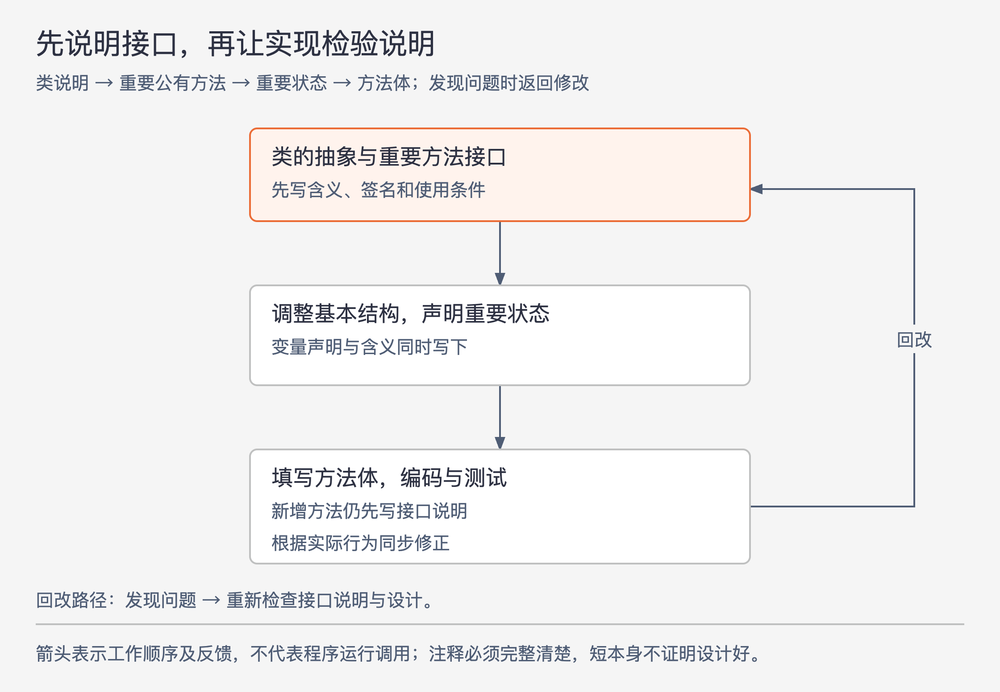

# 《软件设计的哲学》第15章｜先编写注释 · 书镜8.2

原章副题是“将注释作为设计过程的一部分”。第 13、14 章分别讨论注释与名称应提供什么信息，本章把时间提前：在方法实现尚未写出时，先说明接口要承诺什么，再用编码和测试检验这些说明。

## 一、原书回顾：在实现之前检查能否说清接口

作者反对把文档完全留到编码和单元测试之后，认为这样容易漏掉设计时尚清楚、后来却难以回忆的理由。他建议在设计和编码过程中持续编写，而不是等整个系统完成后集中补课。

### 15.1 拖延的注释是糟糕的注释

开发者常说代码还在变，晚写可以少改文档。作者还猜测，有人把注释看成苦差事，因此一再推迟；这是他对动机的推测，不能当作每个人拖延的真实原因。

实际风险有两条。一条是任务积累：再等几周似乎更稳定，等到代码很多，集中补注释更困难，修缺陷和下一项功能又更容易排在前面，最终可能一直没写。另一条是信息丢失：即使回头补，设计过程已不那么清晰，人也急于进入下一任务，于是盯着代码重述可见语句，反而漏掉代码里看不出的取舍与理由。

作者用较强烈的措辞表达对这种做法的担忧。本章要保留的机制，是积压和设计记忆消退如何影响文档质量，不是对开发者心理状态作普遍判断。

### 15.2 先编写注释

作者的顺序从类的接口说明开始，再写最重要公有方法的接口注释与签名，暂时把方法体留空。反复调整这些说明，直到基本结构清楚，再声明并注释重要实例变量，最后填入方法体和必要的实现注释。

图15-1｜依据 15.2—15.3 节绘制。箭头表示设计工作的推进与回改。先写接口说明仍然允许反复修订，不是一次冻结所有细节。

实现中发现新方法，就在写方法体前说明其接口；发现新实例变量，就在声明时同时说明含义。这样代码完成时，注释也随之完成，不额外形成一批待补文档。

本节给出的第一个收益是注释质量：关键设计问题还在思考中，容易记录；尚未写实现时，又较容易专注调用者所见的抽象，避免把内部细节带进接口说明。编码与测试继续发现、修正说明的问题，因此“先写”只是顺序选择，注释仍随开发改进。

### 15.3 注释是一种设计工具

第二个收益是更早审查抽象。若一个方法在还没有实现时，就需要很长、很复杂的说明才能用，可能已经暴露出过多调用条件。若变量要靠一大段说明才能说清，也可能混合了本应分开的含义。

作者把注释比作复杂性矿坑里的“金丝雀”：它是早期警报。完整而简短的接口说明，通常意味着调用者需要掌握的东西较少；如果接口说明必须讲遍实现的主要特性，方法可能是浅的。比较说明与实现，可以帮助评价深度。

“警示信号：难以描述”要求的是**简单而完整**。省掉异常、先决条件或特殊状态，当然可以让文字变短，却不能据此证明接口简单。只有先把使用所需信息写清，注释复杂度才有诊断价值。出现警报后应检查设计，不能把删文档当作消除复杂性的办法。

### 15.4 早期注释是有趣的注释

第三个收益是作者的工作体验。新类早期设计本来就是他觉得有趣的阶段；注释用来记录、比较和检验抽象，他会寻找能以较少文字完整表达的设计。写注释由此参与了作决定，而不只是给已经结束的工作补材料。

这一感受与作者提倡的战略性编程相连：重视长期设计质量，注释就成为形成设计的方法。它不是对所有人都同样有效的情绪保证，结尾仍邀请读者亲自尝试并比较体验。

### 15.5 早期注释是否昂贵？

作者重新检查“晚写少返工”的理由，并给出粗略估算：输入及修改代码和注释的时间，不太可能超过总开发时间的 10%；即使代码行的一半是注释，他估计注释输入时间也不超过总开发时间的 5%。晚写只可能省去其中一部分修改时间，并不能省掉全部文档工作。

这是一组用于说明量级的估算，原书没有给出测量样本。由“一半行数”推到“一半输入时间”也包含粗略近似，不能据此给团队设定效率指标。作者随后提出另一侧的成本：先写说明可能使抽象较早稳定，减少后来因接口变化而重写实现的工作。因此他得出“总体可能更快”，没有给出普遍适用的速度保证。

### 15.6 结论

作者建议尝试足够长的时间，适应这一顺序，再比较注释质量、设计质量和开发乐趣，并检视自己的经验是否与他一致及原因。判断重点是它是否改善实际工作，不是是否按固定模板写够文字。

## 二、主题讲解：用一段尚未实现的接口说明发现问题

### 先把调用者会遇到的结果写出来

以下是本文假设的批量文本替换模块。最初想提供一个 `replace` 方法，说明写成“替换匹配内容并返回结果”。这几乎没有给出比名称更多的信息。开始写实现之前，可以先确定匹配是否区分大小写、一次替换所有匹配还是一处、结果是否包含替换次数，以及调用是否改变原内容。

这些问题不是为了强行给接口加选项。它们要求把现有需求中的行为决定下来：有的可以固定为一种规则，有的确实需要调用者提供。若两种完全不同的用途挤在一个方法中，说明越写越难懂，就应比较拆分用途或缩小接口，而不是继续添加标志参数。

### 让实现去检验说明中的承诺

假设初步说明承诺“替换全部匹配；没有匹配时内容不变；返回替换次数”。写代码时发现，“新文本本身再次包含待查字符串”可能造成反复处理，原说明还没说清匹配基于哪一版文本。

这时应返回接口说明，确认当前需求究竟要求按原文本一次定位，还是允许递归替换，再选择实现。假设本例选定前者，就要使算法和测试都检验这一规则。这里展示的是作者所说的回改：较早写下的承诺可以被修正，但修正要明确，不能让实现悄悄改变接口含义。

### 注释很长时，分清哪一种原因

如果说明里充满内部数组布局、循环过程，就应把实现信息移到内部，接口可能并没有那么复杂。如果说明必须列出许多调用顺序和彼此关联的参数，则应检查是否把本可由模块处理的工作交给了调用者。还有些长度来自确实必要的失败条件和业务限制，这些不能因追求短文档而删除。

因此先核对说明是否完整、准确、属于接口，再把“难以描述”当作设计信号。重写一句文案与简化一个接口是两种不同工作；二者可能同时需要，却不能互相替代。

### 用一次有限尝试看它是否有帮助

可以在一个新类上按原书顺序工作：先写整体抽象和几个重要接口；记录写说明时发现的含糊决定；再编码、测试，并同步修正。完成后看哪些修改发生在实现前，哪些承诺仍然需要读代码才能弄懂。若要比较成本，也应记录自己的实际投入，不能直接拿书中的 10% 或 5% 代替测量。

这一尝试不需要先写完未来所有功能，也不表示注释可以代替测试。正文说明行为，代码实现行为，测试检查具体情形，三者需要互相核对。

## 检验理解：更短的注释为什么反而更差

一个方法有五种必须由调用者区分的失败结果，编写者为了让接口说明更短，只写“失败时返回 false”，认为它已经成为深模块。另一个实现把能统一处理的失败放入内部，仍把需要调用者采取不同动作的结果明确暴露。如何判断？

核对思路：先查文档是否如实说明行为。只删失败信息，会让调用者失去正确使用的依据，也使注释失去衡量接口复杂性的资格；真正减少外部需要处理的情形，才可能使接口更简单。还要检查剩余结果是否足以支持调用者决策，不能用一个笼统返回值掩盖不同后果。

## 来源、范围与阅读连接

依据 John Ousterhout《软件设计的哲学》第 15 章，PDF 物理页 188—193。完整读取原文，并实际查看第 189—192 页，核对注释先行的步骤、完整清晰的前提，以及 10% 和 5% 的原始估算关系。

第 190 页一句“在方法正文主体写上接口注释”存在语句残缺；同页后文明确要求在方法主体之前编写，本文据同页上下文说明先后顺序，不补造其他流程。批量替换案例与有限尝试为本文假设及操作化讲解；未声称已有实测效果。图15-1重绘原书流程。后续第 16 章讨论修改已有代码时，怎样继续维护设计与注释。

<!-- source_sha256: c751f0fc575096584dcdb5a365ae558a71b32a6aa241d90d7bc248f21fbdbbf7 -->
