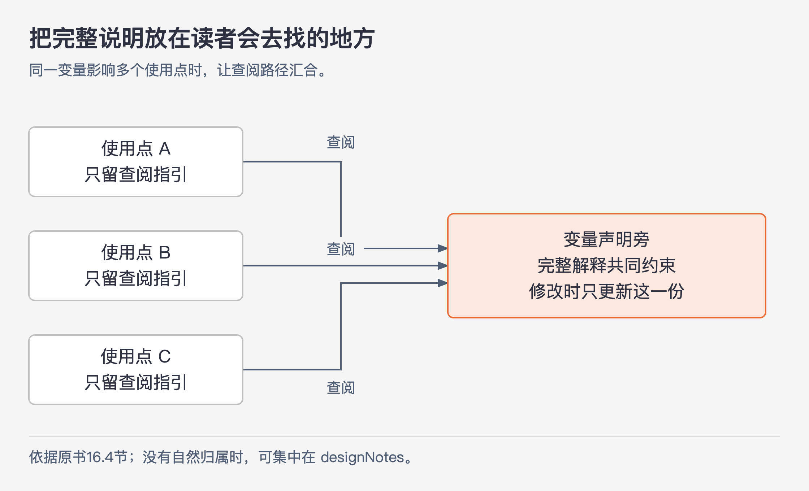
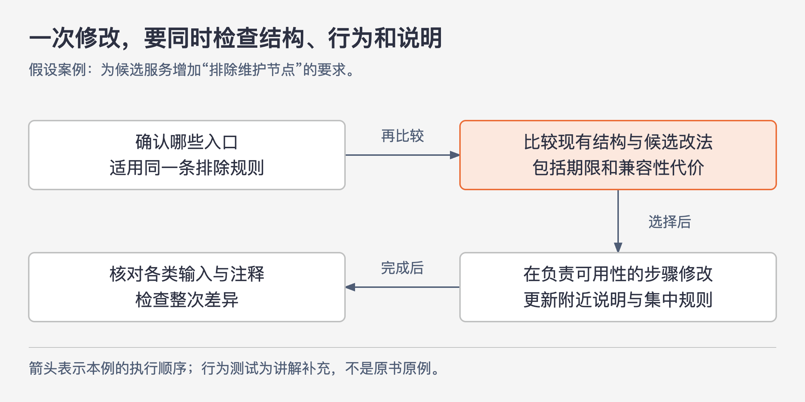

# 《软件设计的哲学》第16章｜修改现有代码 · 书镜8.2

软件的设计会在一次次修改中定型。最初的方案再整洁，后续若总在原处补一个判断、再记一个例外，维护者最终面对的仍会是难懂的系统。本章把前面关于设计与注释的要求带到日常修改中：既要重新判断现有结构是否合适，也要让解释代码的文字继续可信。

## 一、原书回顾：在演进中维持设计与注释

### 16.1 持续使用战略性编程

作者先回到战略性编程与战术性编程的区别。战术性编程以尽快完成眼前功能为主，即使为此增加特殊情况和依赖关系；战略性编程会把系统能否持续保持良好设计放在优先位置。这个区别同样适用于修缺陷和加功能，并非只在创建新模块时才成立。

面对旧代码，人很容易问“怎样改得最少”。常见理由是对旧实现没有把握，怕改动越大越容易出错。作者批评的是把“最少改动”固定成设计标准：每次补丁单看都不大，积累起来却可能让多个规则互相牵制，系统的结构越来越偏离它现在承担的工作。

作者提出一个更高的目标：假如从一开始就知道这次新增的需求，今天还会选择这样的结构吗？如果不会，就应该考虑重构，使修改后的系统接近重新设计时会采用的结构。即使本次需求没有强制要求重构，也可以寻找能够顺手改善的设计缺陷。这延续了第3章的投资心态：眼前多花的设计时间，有望由今后的理解和修改成本降低来补偿。

这一建议有现实边界。作者明确比较了“正确重构要3个月”和“临时修复只要两个小时”的情况：赶截止日期时可能只能先修复；若重构会造成不兼容并影响多个团队，也可能不切实际。但两种极端之间仍值得寻找折中，例如几天能完成、结构已经接近理想方案的改法。确实需要延期的清理，应争取在截止日期后安排时间；组织也应给清理和重构留出一小部分工作量。作者没有给出所有项目通用的投入比例。

### 16.2 维护注释：让注释靠近代码

过时注释的损害会扩散。一条注释错误，读者会误解相关代码；错误多了，读者会开始怀疑所有注释。作者因此先处理一个很实际的问题：修改代码的人能不能顺便看到必须更新的说明？

接口级注释最好靠近方法主体。对于声明与实现分开的 C、C++，作者倾向于把这类注释放在实现附近，而不是仅放在另一个头文件中。他知道头文件方便调用者查接口的理由，但指出 Doxygen、Javadoc 和 IDE 可以把注释提取出来给调用者阅读。因而在作者讨论的工具条件下，源文件中注释的放置应优先照顾维护者。这是一项带有工具前提的建议，不能只剩“头文件不许写注释”。

方法内部的说明也要按范围摆放。假设方法先找可行候选项，再评分，最后选出最佳候选项并移除它：顶部可以用短注释交代这三个阶段；每阶段如何工作、有什么细节，则放在该阶段第一行代码上方。把所有细节集中在方法顶部，会让修改第二阶段的人离相关说明很远。这里有一条相互配合的规则：注释离代码越远，内容越应该概括；描述具体行为的文字则应尽量贴近那个行为。

### 16.3 注释属于代码，而非提交日志

提交日志能解释“当时改了什么”，但维护者阅读现有代码时通常不会逐条搜索历史。如果一个修复针对很微妙的问题，而理由只保存在提交日志里，后来的维护者可能会把那段看似多余的代码删除，重新引入缺陷。

作者的判断方法是：未来理解或修改这段代码的人是否仍需要这条信息？如果需要，就把它写进代码附近。提交日志可以保留副本，便于回顾历史；维护所需的理由不能只依赖人想到去查日志。这里强调的是读者找得到信息，并不否定版本历史的价值。

### 16.4 维护注释：避免重复

注释靠近代码之后，还要减少必须同步修改的副本。一个设计决定若被抄在四处，修改者就得记住四个位置；漏改一处，那里仍会呈现一段看起来合理的旧解释。

作者建议为一个决定找一个最明显的位置。如果某个变量有容易令人误解的行为，而且许多地方都受影响，变量声明旁就是很自然的说明位置。没有这样的地方时，可以使用第13章提到的 `designNotes` 文件，或挑一个最合适的位置；其余位置只写简短指引。

图16-1｜说明可以被多处找到，完整内容只维护一份。依据16.4节重绘；箭头表示查阅指引，不表示代码调用。

引用也会失效，但它与重复文字的失效方式不同：找不到引用目标，读者会立刻知道有问题，可以借助版本历史追查；读到一份已经过时但仍通顺的副本，读者往往意识不到错误。因此，引用把问题变得更容易察觉，而不是保证文档永不失效。

同样，不要在调用前重复解释被调用方法内部做了什么，应让读者找到该方法的接口级注释。已经由外部文档说明的知识也不必重新抄写：实现 HTTP 的类可以引用协议资料；实现命令的方法可以指向用户手册。原书的简短示例只是说明该方法实现 Foo 命令，细节参阅用户手册。方法本身特有的实现理由仍要在合适的位置记录，不能把外链当成省略一切说明的借口。

### 16.5 维护注释：检查差异

在提交前扫描本次所有修改，把代码变更与文档逐项对应，是防止漏改说明的一次补查。检查行为、参数含义或约束变化时，也要看附近注释有没有一起变化。作者还指出，这一步常能顺带发现残留调试代码和未处理的待办标记。它的价值在于看整次修改，而不只盯最后编辑过的几行。

### 16.6 更高层次的注释更容易维护

复述每一步实现的注释，会随着小幅代码调整频繁失效；说明目的、整体策略或行为约束的注释，通常只有相应行为变化时才需要改。因而最有用的注释往往也比较容易维护。

这里的“更高层次”不等于含糊。第13章所要求的精确细节仍然必要。比如边界是否包含、允许什么输入，不能用“合理处理数据”替代。作者主张减少随实现偶然变化的描述，同时保留调用者或维护者必须准确知道的信息。

## 二、主题讲解：给旧系统加一个规则，怎样同时照顾下一次修改

下面用一个**假设的 Java 后端例子**连贯说明本章的方法，不代表作者做过的项目。现有候选服务按“筛选可用节点—评分—选出一个节点”工作。新增需求要求排除处于维护状态的节点。三个入口各写一段 `if`，看起来很快；把规则纳入已有的筛选步骤，则可能需要多读一些代码。

### 先判断规则应该在哪里成立

判断两种方案之前，先查清三个入口是否都应该排除维护节点。如果答案是肯定的，三个分支保存的是同一条规则。以后维护状态增加一种取值，修改者必须找到三个位置，容易造成变更放大；若某处没有说明这条规则与其他入口相同，还会出现模糊性。

把规则放进已经负责“节点可用性”的筛选步骤，可以让三个入口继续依赖同一判断。重要的设计改善是：下一次修改这条规则时，范围变得清楚。不能只用新增行数衡量它。反过来，如果某个入口专门用于管理员诊断，允许查看维护节点，把所有入口强塞进同一筛选也会错误。先辨明业务要求是否相同，再决定是否集中。

图16-2｜把一次需求修改走完整。依据16.1—16.6节整理的讲解流程；箭头表示检查与修改的顺序，测试是本例的验证补充。

这条路径不会自动得出“大改更好”。假设公共接口已经被多个团队使用，修改返回内容会破坏兼容性，那么可考虑先在内部筛选步骤改实现、保持外部接口；如果仍不能安全完成，就说明暂时采用哪种局部修复、留下什么重复以及何时评估清理。战略性思考要求比较方案和后果，并不要求无视已知约束。

### 给每一种说明安排会被看到的位置

继续沿用候选服务。筛选方法的接口说明可以写清“返回符合业务可用条件的节点；维护状态的节点不在结果中”。这告诉调用者得到什么。筛选实现旁可以解释“维护状态排除在评分之前，以免占用候选名额”，前提是本例确实存在名额限制；它回答维护者为什么不能随意交换步骤。

若维护状态的定义由一个集中规则负责，就在那里完整说明各状态含义，其他位置引用它。方法顶部只概述筛选、评分和选择的整体策略，不复制各状态说明。这样，读者从总体读到局部时能不断找到需要的解释，修改规则时又不必搜索许多全文副本。

提交日志则记录这次变更的起因、迁移过程或讨论背景。凡是未来重构时必须继续遵守的理由，要留在代码或明确关联的设计说明中。不能要求每个维护者先知道历史上有一次修复，才有机会发现这条约束。

### 把“还正确吗”与“还说得对吗”一起检查

完成实现后，本例可以用三种输入核对行为：普通可用节点、维护节点，以及没有任何可用节点。再看接口注释是否解释了对应结果。测试能发现行为不符，却通常不能发现一段中文注释已经过时；差异检查正好补上这个缺口。

检查注释时，尝试改变一个实现细节。如果把评分循环换成另一种等价写法，接口说明也必须大改，说明它可能混入了过多实现细节。如果排除条件已经变了，注释仍然完全不用更新，则要检查它是否过于空泛。好的说明既能承受无关的实现调整，也会对真正的行为变化作出反应。

## 用一个新情形检验理解

另一个团队新增“预览模式”，允许看到维护节点，但不能把这些节点真正分配出去。有人建议给原筛选方法增加一个布尔参数，并在三个调用点复制整段规则说明。

先判断预览与分配是否要求同一种结果。若预览只是展示全部节点及其状态，它可以有不同的接口，避免把“可展示”和“可分配”混成同一含义。是否共用底层状态读取，要看共享的是哪些实际知识。完整规则应保留在负责该判断的位置，调用点说明自己的用途即可。选择参数还是独立方法，需要比较调用时是否明显、实现是否重复，以及兼容代价，不能仅凭“一致”或“改得少”决定。

## 来源、范围与阅读连接

本章依据 John Ousterhout《软件设计的哲学》中文源文第16章，PDF物理页194—201，正文到第200页（书内页169—175）。已回看第197、199、200页，确认三阶段注释、Foo命令手册引用示例及最后两个小节。候选服务、维护状态和验证输入均为本文假设案例；未引入外部工程数据。

第15章把注释带入最初的设计过程，本章继续讨论修改时怎样维持设计与说明；第17章进一步讨论多人长期修改时的一致性。

<!-- source_sha256: c751f0fc575096584dcdb5a365ae558a71b32a6aa241d90d7bc248f21fbdbbf7 -->
