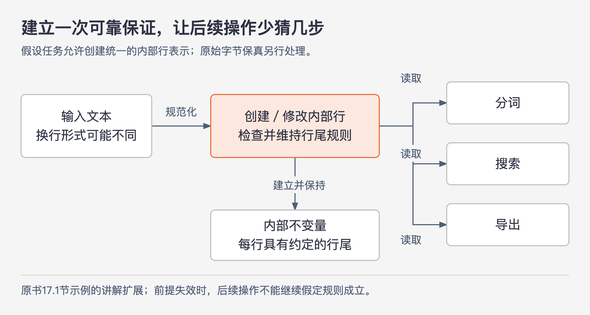

# 《软件设计的哲学》第17章｜一致性 · 书镜8.2

维护者读到熟悉的名字或结构，往往会沿用以前形成的判断。如果这种判断在新位置仍然成立，理解会很快；若代码只是外表相似，判断反而会把人带向错误。本章讨论怎样让这种经验迁移变得可靠，以及多人长期开发时怎样维持它。

## 一、原书回顾：让学过的规则在别处仍然成立

### 17.1 一致性的例子

作者对一致性的定义包含两面：相似的事情采用相似做法，不同的事情采用不同做法。前者使开发者能利用已学过的规则，减少逐处分析的时间；后者避免熟悉的外表诱导出错误假设。他用“认知杠杆”描述这种收益：在一个地方学会的东西，能帮助理解其他地方。

一致性不只关乎缩进，作者列出五个层面的例子。

**名称**让相同含义在不同位置可以被认出来，也延续第14章关于命名的讨论。**编码风格**则规定编译器不强制的结构，比如缩进、大括号位置、声明顺序、命名、注释方式，以及对某些危险语言特性的限制。它使读者少花时间适应排版，也能减少部分错误。

**接口**把多个实现应该提供的功能统一起来。读者理解了一个实现所遵循的接口，再读另一个实现，就已经知道它需要提供什么。**设计模式**使常见问题有可识别的解决方法。作者以模型—视图—控制器（MVC）为例：任务确实适合已有模式时，开发过程有可借鉴的经验，阅读者也更容易识别结构。模式是否适合，仍须判断，第19章还会讨论。

**不变量**是变量或结构中始终成立的性质。例如，文本行的数据结构规定每一行都以换行符结束。后续代码便不用反复考虑“这一行究竟有没有换行符”。它减少的是需要处理的特殊情况，因此也让推理更简单。规定必须由实现维持，不能只把愿望写成一条注释。

### 17.2 确保一致性

建立约定之后，还要让参与者知道并遵守它。多人长期开发时，一个小组未必知道另一个小组的习惯，新成员也可能无意中创建另一套规则。作者依次讨论文档、强制执行、入乡随俗，以及改变既有约定的门槛。

**文档先解决“规则在哪里”。** 把总体约定写进开发者容易看到的文档，例如项目 Wiki 的显眼位置；新成员应该阅读，老成员也要定期回看。编码风格指南可以参考已有组织的指南，不必一切从头创造。局部约定则应留在相关代码附近，例如数据结构的不变量。没有记录的约定，很难要求别人稳定遵守。

**强制执行解决“人会忘记”。** 对可以机械判断的规则，作者倾向于用工具检查，并在违规时阻止提交；低层语法和格式规则尤其适合。书中有一个具体经历：项目成员分别使用 UNIX 和 Windows，编辑器有时会把整份文件的行结束符转换成所在系统习惯的形式。开发者明明只改了几行，差异却显示每一行都被修改，真正的变化被淹没。

团队先规定源文件只保留换行符，但每个新成员、每种工具都可能重新带来问题。后来他们用一个提交前运行的短脚本检查修改过的文件，发现回车符就中止提交；脚本也可以手动运行，把回车加换行的序列改为单独换行。这才把约定变成可以立即发现并修复的条件，同时帮助新成员学习规则。这里记录的是作者项目的做法，并非声称所有文件类型都应该不加区分地删除回车。

代码评审承担另一部分工作：检查难以自动化的约定，并在具体修改中教会开发者怎样遵守。工具与评审配合，使规则不必完全依靠记忆。

**入乡随俗要求先看周围。** 进入一个新文件时，检查公有与私有成员的顺序、方法排列方式、驼峰或下划线命名等。遇到设计选择，也先查项目里是否已经有类似情况；确实相似，就采用已有方式。这样能避免同一个问题在项目里逐渐出现多套解法。

**改变既有约定需要足够理由。** 作者并不把“我觉得新方法更好”视为充分依据，因为维持一致的收益，往往大于两种合理写法之间的小差别。他提出两个问题：有没有制定旧约定时尚不知道的重要新信息？新方法是否好得足以值得统一更新全部旧用法？组织认可两者时，可以实施升级，让旧约定退出。升级后还要让其他人知道新规则，避免他们又引入旧写法。作者对这种调整持谨慎态度，认为反复重新争论约定经常浪费开发时间。

### 17.3 过犹不及

过分追求形式统一，会破坏一致性原本要提供的可靠判断。若两个变量其实代表不同的东西，却为了整齐使用同一个名字，读者就会把本不相同的含义当成相同。把设计模式强加到不适合的任务上，也会增加复杂性。

因此，是否一致要看名称、结构与实际含义是否对应。看到某个熟悉形式时，读者应当能够相信它仍然代表熟悉的事情。区别本身也需要通过不同名称或结构被表达出来。

### 17.4 结论

作者把一致性归入投资心态。制定约定、写检查器、查找已有示例、在评审中解释规则，都要花额外时间；预期回报则是以后读代码时能更快、更准确地理解行为，从而减少错误。回报来自规则确实被共同遵守，而不是仅仅拥有一份规范文档。

## 二、主题讲解：怎样让后来的人可以放心沿用判断

下面用一个**假设的文本导入模块**继续讲解。模块接收来自不同系统的文本，内部按“行”进行处理。开发者希望分词、搜索、导出等操作不用到处判断换行形式。

### 先决定内部允许哪些情况

一种做法是让各操作自行适应输入：搜索时判断行尾有没有换行，导出时判断是回车加换行还是单独换行，拼接时再检查一次。每段代码都有自己的特殊情况，读者必须分别学习。

另一种做法是规定：这个模块的内部行表示都使用统一结束形式。输入进入该表示时完成必要的检查和转换，创建或修改行的其他入口也维持该规则。后续操作就可以依赖它。这个始终成立的性质就是不变量。

图17-1｜不变量把特殊情况集中在建立内部表示的位置。依据17.1节文本行示例扩展的假设案例；箭头表示数据进入与被使用的方向。

图中省掉的分支不是凭空消失了：有人在输入位置承担了工作，内部读者才得以少考虑情况。如果还存在一个“直接构造行”的入口绕开检查，不变量就不能成立。文档、实现与测试要指向同一范围：哪些对象遵守规则，从何时开始保证，哪些操作可以改变它。

这里有一个必须先确认的边界：导入任务是否要求逐字节保留原文件？如果要求原样还原，直接把原始数据覆盖成统一换行会丢信息。可以保留原始字节，另建立用于处理的行表示；也可以选择不做这种转换。哪种方案合适，取决于实际任务，不能为了统一形式改掉功能要求。

### 不同检查负责不同错误

假设团队决定采用上述内部表示。数据结构的说明应记录行尾约束，构造和修改操作应当维持它。测试可以验证多种输入经过转换后的结果，以及后续操作不会破坏约束。这些属于行为检查。

源码文件的行结束符则是另一件事：它影响代码差异是否可读，可以用提交前检查防止混用。这与业务导入的数据不是同一种对象。不能看到两者都提到换行，就让代码格式工具去改用户文件。

对于名字是否表达准确、另一个接口是否其实处理了不同含义，机械检查通常帮不了全部忙，还要依靠评审。要求所有问题都由自动检查处理，会产生很脆弱的规则；只靠口头提醒，则会重复遇到原书中的行结束符问题。

### 改约定时，比较完整迁移的代价

现在有人认为内部行最好不包含换行符。这可能是另一种合理表示，但局部改一个类，其他操作仍按旧方式处理，系统就会同时存在两种假设。

评估时应该追问新信息是什么：例如确实发现多数内部操作都必须去掉行尾，而旧表示造成持续的重复处理。接着估计全部创建和读取位置的迁移工作，并明确新旧数据的过渡办法。如果收益只是个人觉得更顺手，沿用原约定往往更合算。如果约束已经变化，则要围绕新证据讨论，而不把一致性当成永远不准调整的理由。

完成迁移还包括更新说明、检查和示例。否则新成员照着旧例子写代码，很快会让两种方式重新并存。稳定的约定需要被维护，而不是宣布一次就能长期生效。

## 用一个新情形检验理解

一个方法返回“所有导入行”，另一个方法返回“可导出的行”，后者排除了含未解决错误的行。为了统一，团队想把两个结果都命名为 `lines`，并让调用者自己判断其中是否包含错误行。

判断时先看这两个结果是否提供相同保证。它们的差别会影响调用者能否直接导出，因此应该在接口或名称中显露，例如明确表示原始导入结果和已确认可导出的结果。可共享的读取步骤仍可复用，但不能靠相同名字掩盖保证不同。一致性让相似形式支持可靠推断；此处不说明差别，会反过来诱发误判。

## 来源、范围与阅读连接

本章依据 John Ousterhout《软件设计的哲学》第17章，PDF物理页202—207，正文到第206页（书内页177—181）。已查看第202、206页，核对章首对一致性的双向定义及“过犹不及”的边界。UNIX与Windows源码行结束符问题属于作者项目经历；文本导入、内部行表示的验证与迁移讨论均为本文假设案例。

第16章讨论修改时怎样维持结构与说明，第17章把注意力扩展到共同约定；第18章继续问：除了一致性，哪些设计还能让代码行为一眼可知？

<!-- source_sha256: c751f0fc575096584dcdb5a365ae558a71b32a6aa241d90d7bc248f21fbdbbf7 -->
