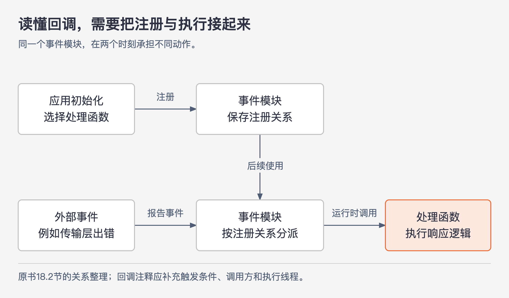

# 《软件设计的哲学》第18章｜代码应显而易见 · 书镜8.2

代码读起来顺不顺，要看读者能否迅速形成正确判断。作者把“第一次猜测通常就是对的”作为显而易见的表现：读者不必来回寻找隐藏信息，才能弄懂眼前几行。本章接续命名与一致性，进一步说明怎样让结构可见、哪些做法会遮住信息，以及什么时候应当补上注释。

## 一、原书回顾：把理解代码所需的信息交到读者手中

### 18.1 让代码更显而易见

本章从第2章的模糊性出发：系统中的重要信息没有明显呈现给读者，就会增加理解和修改的困难。代码是否明显，不能由作者独自决定。写代码的人已经知道背景，容易把自己脑中的信息误当成代码已经表达出来。代码评审因此很有价值：若阅读者提出困惑，就应查明他缺了什么信息，而不是用“这很简单”结束讨论。

前两种办法来自前面章节。精确、有意义的名称让人直接知道对象或动作的含义；一致性则让人安全沿用以前学过的模式。名字含糊，就得通读实现才能反推含义；形式相同而行为不同，则会让经验失效。

作者接着用三个层次展示**留白如何显露结构**。第一层是参数文档：原例介绍 `numThreads` 和 `handler`。前者控制管理连接的线程数，说明中还讨论了预计同时连接数和短时间大量消息；后者是接收消息的回调，并指向消息处理接口的说明。这些只是示例类的约定。把两段文字紧密挤在一起时，读者不易辨认参数数目和边界；让参数名独占起始行、说明缩进，并把两组分开后，结构便能直接看见。改变的是呈现方式，参数要求本身没有变化。

第二层是方法内部的代码块。原书 `Buffer::allocAux` 先把请求长度向上调整到8字节的倍数，以满足对齐；然后尝试使用已有的可用空间。这里从高地址一端向下分配，是因为低地址一端可能已用于变长块，高端仍能保证对齐。若第一处空间不够，再检查最后一个块末尾的额外空间；两处都不够才申请新的空间。作者用空行分开这些步骤，并把解释下一步骤的注释放在空行之后。读者因此能先辨认处理阶段，再进入指针与长度计算，不必把整段代码当成一团符号读。

第三层是语句内部。原书以同一个 `for` 条件展示，加入适当空格后，初始化、继续条件和递减操作之间的关系更容易识别：

```cpp
for (int pass = 1; pass >= 0 && !empty; pass--) {
```

这个片段用于展示留白，不是完整循环实现。当结构、名称仍无法表达必要信息时，作者建议使用注释补足。注释该写什么，要从读者会在哪里困惑出发，而不是照着代码再叙述一遍。

### 18.2 让代码不显而易见的因素

作者讨论的几个做法并非都应该禁用。例如，事件驱动在某些场景中很有价值；使用它时，要意识到阅读者会多出哪些困难。

### 事件驱动编程：找到调用处，也未必知道会运行谁

事件驱动程序响应网络包到达、鼠标按下等外部事件。应用先向事件模块注册处理函数，事件发生后由模块间接调用函数。阅读者若沿普通的显式调用关系寻找入口，可能找不到；即使找到事件模块的调用代码，实际执行哪个函数也取决于运行时登记的处理程序。



图18-1｜事件处理的入口藏在注册信息里。依据18.2节整理；上排表示注册时的动作，下排表示事件发生后的运行调用，图中分派器是对事件模块的概括称呼。

这使“什么时候会执行”“在哪个线程执行”等事实不容易从函数体里看到。原书的 `Transport::RpcNotifier::failed()` 注释就补了这些信息：当传输层错误使 RPC 无法完成时，由传输层在分派线程中调用该方法。它交代触发条件、调用方和执行线程；读者无需从许多间接调用中独自重建这些背景。

原书此处插入“警示信号：不显而易见的代码”：如果快速阅读仍无法理解含义或行为，应怀疑有重要信息没有呈现给阅读者。这是在提示调查缺口，不是给代码行数或语法形式设硬指标。

### 通用容器：拿到两个值，却不知道各自代表什么

`Pair` 或 `std::pair` 能让编写者快速打包多个值。原例返回 `new Pair<Integer, Boolean>(currentTerm, false)`；调用者却只能通过 `getKey()` 和 `getValue()` 访问。两个通用名称没有解释业务含义，特别是布尔值究竟否定了什么，单看返回语句无从确认。

作者建议为这类结果定义专用的类或结构，为每个组成部分取有意义的名字，并在声明处写必要说明。多花一点编写时间，能减少以后每位阅读者的猜测。原例没有完整给出布尔值的语义，本文也不替作者补一个成功、投票或错误含义；这里需要理解的正是这种缺口。

### 声明类型与实际类型不同：必要的实现特性藏在别处

原书用 `List<Message>` 字段实际赋值为 `ArrayList<Message>` 的情况说明另一种信息距离：只看到声明的人未必知道具体实现，而具体实现的性能或线程安全属性可能影响使用。作者因此建议使声明与分配类型相匹配。

这一建议应保留作者归属。中文页图把 `List` 写成 `ArrayList` 的“超类”；准确区分应为接口与实现类。作者要指出的是必要特性不应被遮住，不能据此推导为所有变量都应暴露具体实现。若调用者只需要接口所承诺的行为，隐藏实现本来就有价值；如果正确使用确实依赖某个实现特性，就应明确表达这个要求。这一适用性说明是本文对原例的分析。

### 不符合阅读者期望：构造之后程序仍在运行

原例的 `main` 创建一个 `RaftClient` 就结束。读者可能据此以为程序也会结束；实际上，构造函数创建了继续运行的其他线程。因此，作者建议在构造函数的接口注释中记录该行为，也在 `main` 末尾加一句简短提醒，让读者知道工作将由其他线程继续执行。

本例讨论的是未被代码表面表达出来的行为。主线程返回不能被简单等同于整个进程退出；作者是在描述读者可能产生的预期，并用具体反例提醒维护者。完整说明放在构造函数处，入口留简短提醒，也与第16章“完整文档集中、在容易误解处给指引”的做法相容。

### 18.3 结论

作者最后从信息角度归纳：不明显的代码通常缺少阅读者需要的重要信息。`RaftClient` 没有显露线程继续工作的事实，`Pair` 没有让返回分量的含义直接可见。减少这类困难有三条路径。

首先，用抽象、消除特殊情况等设计方法，减少阅读者必须知道的东西。其次，遵守约定、符合合理期望，使读者能利用已经掌握的知识。最后，用明确名称和必要注释，把仍需知道的信息呈现出来。顺序有意义：先检查能否让问题变简单，再考虑怎样把保留下来的复杂部分解释清楚。

## 二、主题讲解：别人看错这几行，究竟缺了什么

下面是一个**假设的报表导出服务**。调用方传入查询条件后，会得到两个值：任务编号和“是否已完成”。导出可能稍后由工作线程完成。我们沿这个例子检查数据含义与执行过程怎样变得明显。

### 返回值的名字要承载它自己的含义

假设接口返回一个数字和一个布尔值，用通用容器装起来。写接口的人知道数字是任务编号，布尔值代表“已完成”；但调用方看到 `getValue()` 时，可能把它理解成“提交成功”。这两种判断会导致不同操作：提交成功只能显示已受理，完成之后才可能读取文件。

专用结果类型可以把两者称为 `taskId` 与 `completed`，并说明 `completed` 为否时任务仍可能正常等待或执行。名称承担普通含义，说明补足容易混淆的条件。这里不必为了体现面向对象而制造复杂类层次；一个含义清楚的数据结果就够了。

如果实际服务还可能失败，那么“未完成”与“已失败”也不能一直挤进同一个布尔值。是否需要增加状态，要由已确认的行为决定。本例先揭示一个判断原则：一个字段看似简单，但如果读者必须另记多套解释，它并没有减少复杂性。

### 找出控制过程里没有写出来的那一步

继续读调用处。若代码只写“创建导出对象”，对象却在构造过程中启动线程、注册回调并接收任务，阅读者就很难看出何时开始工作。可以比较另一种设计：构造负责建立对象，明确的启动动作负责开始处理。是否值得这样拆分，要看项目原有约定和接口代价；不能为了改名反而增加许多无用步骤。

如果框架规定必须通过回调通知结果，间接调用可能无法消除。此时要在回调说明中写清触发时机、执行线程，以及回调收到的对象表示哪个阶段的结果。只写“处理导出回调”仍然没有补足信息，因为读者原本就能看出这是个处理函数。

运行方式没有必要在每个调用点重复一整遍。把完整说明留在负责运行或回调约定的位置，在入口容易误读的地方给一句提示即可。这样既照顾眼前的阅读者，也减少以后要同步修改的文字。

### 用读者的第一次判断验证改进

把接口和调用片段交给一位没参与实现的同事，让他回答三个具体问题：调用返回时文件一定存在吗？哪个字段能判断是否完成？完成通知在什么条件、什么线程中到达？先听他仅凭代码和附近说明作答，再指出事实。

如果他把“受理”读成“完成”，就检查结果含义；如果不知道谁触发回调，就检查运行信息；如果每次都要打开许多实现类，才知道返回值是什么，可能应该缩小接口要求他理解的范围。不能把所有困惑都归因于读者不认真，也不能一律靠增加注释解决。

## 用一个新情形检验理解

有人把 `completed` 改成 `status`，但仍保留布尔类型，认为名字更通用了。另有人建议在每一处调用后复制十行线程说明。

两种修改都没有直接解决缺口。`status` 比“是否完成”更难判断真假含义；多处复制则增加文档失效的风险。先确认服务实际有哪些结果，再给结果明确名称；把线程约定放在接口与回调说明处，必要入口给简短提醒。验收时仍看读者能否正确判断文件是否就绪、之后由谁继续工作，而不是只数新增了多少文字。

## 来源、范围与阅读连接

本章依据 John Ousterhout《软件设计的哲学》第18章，PDF物理页208—215（书内页183—190）。已实际查看第209—215页，核对参数文档排版、`Buffer::allocAux`、循环语句、失败回调、`Pair`、类型声明与线程示例。

源书章末将 `currentTerm` 对应的返回值解释成“当前数据项的编号”，与前文标识符的具体含义对应不明；本文保留标识符并聚焦命名缺口，不据此定义算法概念。源书未指定 `Pair` 的具体库。报表导出案例、接口适用性分析及读者检查方法为讲解补充，不是作者项目事实。

第17章说明怎样复用一致的规则，本章补充如何处理剩余的信息缺口；第19章将用复杂性这把尺度审视常见开发方法。

<!-- source_sha256: c751f0fc575096584dcdb5a365ae558a71b32a6aa241d90d7bc248f21fbdbbf7 -->
