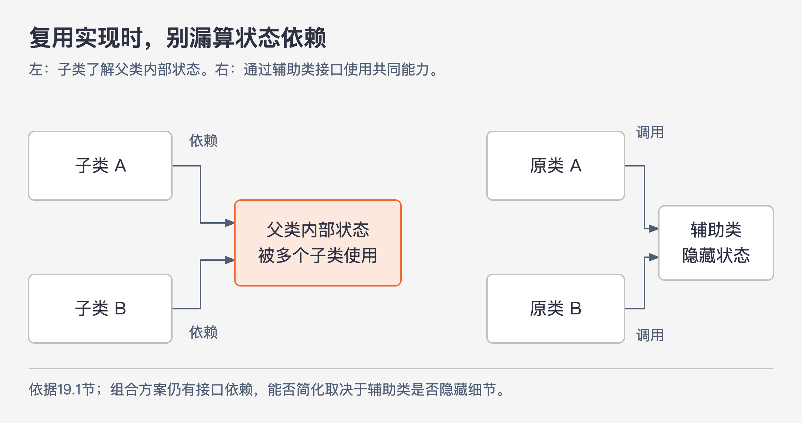
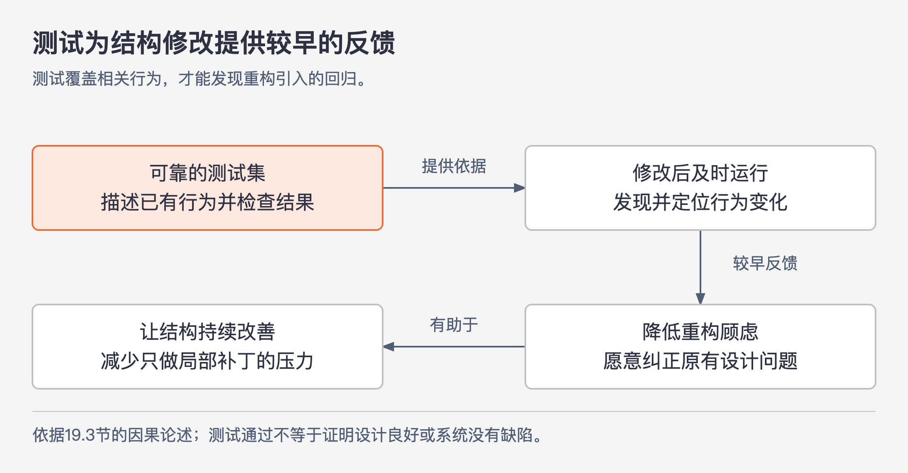

# 《软件设计的哲学》第19章｜软件发展趋势 · 书镜8.2

面向对象、敏捷、测试和设计模式都能改变开发方式，但采用它们并不自动降低复杂性。本章用前面建立的尺度逐项评价这些方法：它减少了哪些重复或理解负担，又引入了哪些依赖关系？这些评价带有作者明确的立场，尤其是对测试驱动开发的批评，应连同他的理由与例外一起阅读。

## 一、原书回顾：用复杂性检验流行方法

### 19.1 面向对象编程和继承

类、私有方法和私有变量为信息隐藏提供了语言机制。类外代码不能直接访问私有成员，因而不能直接依赖这些成员的具体表示。但一个类若接口复杂、功能很浅，或仍把内部状态暴露出去，就不会仅凭使用面向对象语法变得易懂。

作者把继承分成两种。**接口继承**只规定需要提供的方法，由不同实现完成。例如，同一个 I/O 接口可以分别用于磁盘文件和网络套接字。使用者学习一套接口，就能把知识用于多种实现。作者把这种关系理解成接口变深：同样的接口负担覆盖更多用途。前提是接口抓住了实现之间真正共有的特征，并隐藏差异，而不是把各种差异全变成调用者必须选择的选项。

**实现继承**还会提供默认实现，子类可以使用或覆盖它。它的好处很具体：原本散落于多个子类的同一方法，可以只保留一份，避免规则变化时逐份修改，减少变更放大。

代价则来自父子类之间的依赖。如果多个子类直接使用父类的实例变量，父类就无法自由改变这些数据的表示；修改父类的人必须检查子类，覆盖方法的人也可能必须读懂父类内部过程。最坏时，修改任何一个类都需要理解整个继承体系。这是信息泄露：本应局限于某个实现的知识，变成了其他类正确工作所必须知道的东西。

图19-1｜复用代码时，还要看依赖了什么。依据19.1节关系重绘；左侧箭头表示对子类可见状态的依赖，右侧表示通过辅助类接口调用共享功能。两侧不是性能比较。

因此，作者建议先考虑组合：把共享功能放在一个辅助类中，原来的类各自使用它。如果仍须采用实现继承，就尽量分开父类与子类管理的状态。例如，某些变量完全由父类方法维护，子类只能只读访问，或通过父类提供的方法使用。目的不是消灭所有继承关系，而是减少子类对父类内部表示的了解。

### 19.2 敏捷开发

原书把敏捷描述为一组关于轻量、灵活、增量开发的方法，主要涉及团队组织、进度、测试和客户互动。作者赞同其中的迭代思想：一开始很难预见整个复杂系统，每轮加入新工作、接收反馈，再重构已有抽象，更可能形成合适设计。每轮仍包含设计、测试和客户意见。

他的保留意见在于迭代的关注点。若每轮只追求交付一个特性，开发者可能不断先做最专用的机制，把设计推到以后。每一步都可运行，却逐渐积累特殊情况。这与投资心态冲突。

作者提出“开发的增量应该是抽象”的主张，并附上两个限制。尚没有功能需要某个抽象时，不必提前创建；一旦已经需要，就花时间把它的核心功能设计得完整、清楚，并具有适度通用性。这里的通用性是让同一种工作得到统一处理，并不要求预先构建未来所有功能。它回应的是当前功能驱动下的碎片化设计。

### 19.3 单元测试

原书先区分两种测试。单元测试规模小、目标集中，可以独立运行，不必搭建整个生产环境，开发者在新增或修改代码时维护它们，并结合覆盖率工具检查未触达的代码。系统测试则验证各部分能否协同，往往要在近似生产条件下运行应用；书中也提到它有时被称为集成测试。这是原书的概括用法，不能据此把所有测试分类和组织分工一概固定。

作者最关心测试对设计的间接作用。缺少可靠测试时，重构后是否引入缺陷很难快速判断；人因此避免结构性修改，只敢在局部补丁，设计问题就更容易累积。好的测试集能较早暴露回归，让开发者更有信心重构。作者尤其看重单元测试触达局部代码的能力，认为它们比系统测试更有机会覆盖细节并发现缺陷；这是作者的经验判断，不是对任意测试套件的保证。

图19-2｜测试怎样间接帮助设计。依据19.3节整理；箭头表示作者提出的影响关系。测试能发现什么，取决于实际覆盖的行为与检查内容。

作者用 Tcl 的经历支撑这一判断。团队为了性能，用字节码编译器替换解释器，变化几乎涉及核心引擎的每一部分。已有单元测试在新引擎上发现了许多缺陷；按作者报告，字节码编译器 alpha 版本发布后只出现了一个缺陷。这个案例说明高质量测试可以帮助承担较大的结构变更，不能推出“只要测试通过，发布后就不会有问题”。

### 19.4 测试驱动开发

作者把测试驱动开发（TDD）描述成先写预期行为的测试，再逐个补足使测试通过的实现。他强烈支持单元测试，却不喜欢这种开发组织方式：担心开发者总围绕下一个专用用例做最小补丁，没有明显的时间去整体设计抽象，最终形成一组彼此拼接的特殊处理。他把这种风险归入战术性编程。

作者希望在确定需要一个抽象之后，整体设计它，至少覆盖一套合理完整的核心功能，让各部分相互配合。这并不等于提前设计整个系统。应当注意，本节呈现的是作者对 TDD 的批评；原书没有在此比较不同团队、不同实践方式的效果，本文也不把批评升级成“TDD必然制造坏设计”的普遍结论。

作者明确认可一个先写测试的场合：修复缺陷。先写会因原缺陷而失败的测试，再修复，并观察同一测试转为通过。若修完才写测试，测试可能从来没有触发过缺陷，绿色结果便不能说明修复是否有效。这里保留“修复前确实失败”非常重要，它给了测试本身能够检出问题的证据。

### 19.5 设计模式

设计模式是应对某类问题的常见方法，如迭代器或观察器，原书提到其由 Gamma、Helm、Johnson 和 Vlissides 合著的《设计模式》广泛传播。适合时采用已有方案，能够利用别人积累的设计经验，通常比毫无必要地重新发明更合算。

最大的风险是过度使用。并非每个问题都适合现成模式；若直接的定制做法更简洁，硬套模式会增加理解负担。模式是一种候选解法，是否有价值要由当前问题和结果结构决定，不能以用了多少模式作为设计质量指标。

### 19.6 取值方法和设值方法

`getFoo` 返回字段值，`setFoo` 修改字段值。与直接公开字段相比，它们留出了增加行为的空间：设置时可以更新相关值、通知监听者或约束输入，以后添加这些行为也不必更换方法签名。作者承认，必须暴露一个值时，这样做可能有意义。

但他继续追问：这个实现数据是否应该对外暴露？若类把所有内部变量逐一包装成取值、设值方法，外部依然要了解类的表示方式，接口却增加了许多通常只有一行的浅方法。`private` 修饰符并没有自动实现信息隐藏。

作者因此建议尽量避免暴露内部实现数据，也反对机械地给每个字段生成访问方法。本节的判断对象是类的实现细节暴露，并未逐一讨论所有数据传输、框架绑定等场合。把它写成所有数据对象都禁止访问方法，会超出本章证据。

### 19.7 结论

遇到新的开发范式或方法时，作者要求回到同一个问题：它有没有帮助降低大型系统的复杂性？名称流行、形式规范，不能代替对依赖关系、接口负担和修改范围的检查。某个机制能在一种情形中改善设计，也可能在另一种情形中被用得过多。

## 二、主题讲解：在一个导出模块里逐项检验方法

下面使用**假设的 Java 报表导出模块**。它需要生成两种格式的报告，并允许日后修改共同的字段选择规则。我们用这一个任务判断几种方法的实际价值，不为它扩展未经要求的框架。

### 先区分共同任务与共享实现

两种格式都需要接收报告数据、写出结果，可以有一个对调用者含义稳定的导出接口。接口内不要求调用者决定具体编码细节，调用者只需理解一次“导出什么、得到什么、怎样报告失败”。这是接口复用带来的收益。

字段选择规则若完全相同，也值得集中实现。但直接放进父类并把可变列表暴露给两个子类，会让子类开始依赖这个列表的顺序和修改时机。日后父类调整列表表示，两个子类都可能受影响。

另一种方案是由一个辅助类按规则给出所需字段，两个导出实现通过明确接口调用它。共享代码仍在一处，内部列表怎样构造却不必暴露。组合并不会自动消除依赖；收益来自辅助类的接口隐藏了什么。如果辅助类只返回可随意修改的内部列表，同一个问题还在。

### 让迭代带来完整的一小段能力

第一个版本只需要一种格式，也不必立刻实现所有格式插件。可是，既然已经需要字段选择，就可以把现有的字段选择规则集中做好，明确空结果与无效选择如何处理。以后第二种格式出现时，先检查它是否真能使用同一规则。

这对应作者的折中：需求出现之前不提前创造抽象，需求出现之后也不故意把同一种工作切碎到多个特性分支。开发仍按小步推进，只是每步都关心这段能力的结构能否独立理解。

### 测试让更换内部结构有依据，设计仍需单独比较

假设两个导出实现已经重复了字段选择逻辑，准备将其合并。测试应检查调用者实际依赖的行为，例如相同输入会选择哪些字段、字段顺序是否保留、无效选择怎样返回。重构后这些行为仍可检查，内部用不用某个父类则不应被无理由固定下来。

若发现一条具体缺陷，比如重复字段会被意外输出两遍，先证明新增测试在修复前会失败，再作修复。与此同时仍要检查修改是否在所有应适用的入口集中生效。测试回答“这个行为是否符合期望”，设计比较回答“以后修改这条规则要理解和改动多少地方”。两者有联系，不能互相替代。

是否采用某种测试编写顺序，不足以直接判定设计好坏。沿着本章的担忧，应该检查团队有没有真正留出比较接口、整理共同规则、删除特殊补丁的时间。这是由作者论证得到的应用判断，并非本章提供了关于所有 TDD 实践的实验结果。

### 用调用者需求决定公开哪些信息

导出模块若公开了内部缓冲区、编码器和临时字段列表的一整套取值、设值方法，调用者可能必须按特定顺序设置它们，才能得到正确报告。类虽然包了许多方法，仍把组装知识交给外部。

可以尝试让接口直接表达已确认的导出请求和结果，把缓冲区等细节保留在内部。若调用者确实需要选择格式或读取进度，这些就是应该明确提供的能力。判断不在于方法名是否以 `get` 开头，而在于它表达了必要信息，还是暴露了本应由实现自行处理的细节。

## 用一个新情形检验理解

团队提出一个公共父类：每个格式继承它，覆盖五个钩子方法，还要通过六个设值方法准备父类状态。测试已全部通过。另一个方案只有导出接口、字段选择辅助类和两个格式实现。

应当比较：使用一种格式必须知道多少步骤？改共同规则要检查哪些类？子类有没有依赖父类内部状态？测试覆盖的是对外行为还是固定了钩子调用顺序？如果父类方案确实减少重复，又清楚隐藏状态，它可能合理；若只是把准备步骤和覆盖约定交给子类记忆，测试通过也不会消除认知负担。原书支持的是这种具体比较，不能单凭“继承”或“组合”给答案。

## 来源、范围与阅读连接

本章依据 John Ousterhout《软件设计的哲学》第19章，PDF物理页216—223（书内页191—198）。已查看第217、220、221、223页，核对两种继承的取舍、Tcl报告数字、TDD批评及缺陷测试例外、访问方法论证。Tcl经历与软件方法的历史描述均按原书归属；报表导出模块是本文假设案例。

本文保留作者对敏捷、TDD与访问方法的判断，没有把它们改写成所有工程场景的定律，也没有据此修改个人或团队编码规范。下一章将处理另一个常见取舍：追求运行速度时，简洁设计是否仍然适用？

<!-- source_sha256: c751f0fc575096584dcdb5a365ae558a71b32a6aa241d90d7bc248f21fbdbbf7 -->
