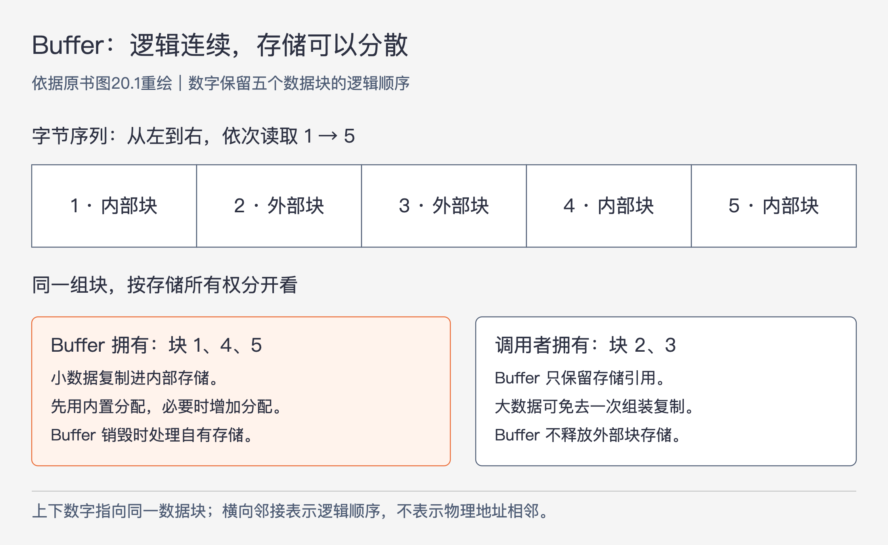
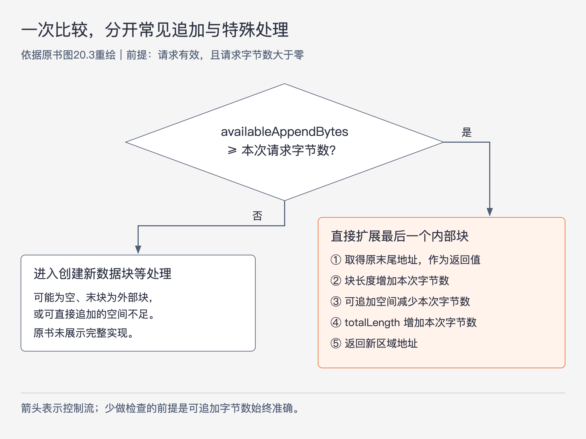

# 《软件设计的哲学》第20章｜性能设计 · 书镜8.2

前面各章一直在问怎样让软件更容易理解和修改。性能要求又增加了一项约束：设计清楚的程序，还得在规定时间内完成工作。本章讨论如何把性能纳入设计，同时控制复杂性。作者先说明平时该关注哪些成本，再讲怎样根据度量选择优化目标，最后用 RAMCloud 的 Buffer 重构展示：减少多余工作，有时能同时改善速度与结构。

## 一、原书回顾：从自然高效的选择走到关键路径重构

### 20.1 如何考虑性能

作者反对两个极端。逐条语句追求最快，会拖慢开发，并加入未必有效的复杂性；完全不考虑性能，又可能让低效做法遍布系统。原书以系统比所需速度慢 5～10 倍来提醒后一种风险：问题散布得太广时，修正任何一个地方都看不出明显改善。这里是作者的经验性警告，并非所有系统都会出现的固定比例。

日常设计应掌握基本成本，优先选择同样清楚、却少做昂贵操作的方案。原书列出四类值得注意的操作，下面保留其写作语境中的量级，不能把它们直接当作当前机器的测试结果。

| 操作 | 原书列出的量级或成本 | 为什么值得关注 |
| --- | --- | --- |
| 网络通信 | 数据中心内一次往返约 10～50 μs，相当于数万条指令；广域网往返约 10～100 ms | 一次通信可能比许多本地计算更贵 |
| 二级存储 I/O | 磁盘约 5～10 ms，相当于数百万条指令；闪存约 10～100 μs；原书当时新出现的非易失性存储器可能约 1 μs，仍相当于约 2000 条指令 | 存储介质不同，数量级也不同 |
| 动态内存分配 | C 的 `malloc`、C++ 或 Java 的 `new`，连同各自的释放或回收过程，都可能带来开销 | 需要考虑对象从创建到回收的成本，而不只看创建语句 |
| 高速缓存未命中 | 从 DRAM 取数据到处理器高速缓存，可能耗费相当于几百条指令的时间 | 程序等待数据的成本可能与计算成本同样重要 |

这些成本最好用微基准测试来建立认识。微基准测试是专门度量一个操作的小程序。RAMCloud 团队花了几天搭建框架，之后添加一个测试通常只需 5～10 分钟，逐渐积累了几十个测试，用来比较已有库和自己新写的类。作者强调的是让测量变得便宜，从而能反复使用。

原书给出两个“自然高效”的选择。第一，存储大量按键查找的对象时，哈希表和有序映射都容易使用；在作者描述的比较中，哈希表快 5～10 倍。因此，不需要排序属性时，应优先考虑哈希表；需要排序时，不能只凭这个速度比较把有序映射换掉。第二，在 C 或 C++ 中创建结构数组，可以先分配一个指针数组，再逐个分配结构，也可以直接把结构放进一个连续数组。后一种只需为全部结构分配一个大块，省去了逐个分配。这个例子限定在原书所说的语言和存储方式，不能照搬成 Java 对象数组的内存布局结论。

如果提速必须增加复杂性，就要看增加了多少、会影响谁。少量复杂性若能留在实现内部，可能值得接受，但许多“小增加”仍会累积。大量实现复杂性或更难使用的接口，通常应等到性能确实成为问题再引入。已有明确证据表明某项性能决定系统能否成立时，则应尽早处理。

RAMCloud 的目标之一是让客户机经数据中心网络访问存储时获得尽可能低的延迟。团队根据之前的度量，知道内核网络通信无法满足要求，因此选择特殊网络硬件，绕过内核，直接与网络接口控制器收发数据包。这个选择增加了复杂性，却解决了一个决定性的约束；其余很多设计因而可以保持简单。作者没有据此要求一般系统都绕过内核。

本节最后把性能接回全书的设计原则：若能通过定义消除特殊情况或错误条件，相应检查就不再需要执行；深模块——本章原文也称“深类”——能让一次方法调用完成较多工作，浅模块之间反复跨层则可能增加开销。这是结构可能影响成本的解释，实际效果仍须度量。

### 20.2 修改前（后）的度量

即使遵循上述原则，系统仍可能太慢。这时不能直接按直觉改代码；作者特别提醒，经验丰富的程序员也会猜错性能问题的位置。

修改前的度量有两个不同目的。一个是定位：顶层耗时只能说明系统慢，还要继续向内查，找到消耗大量时间、并且有改进思路的少数具体位置。另一个是建立基线：保存现有行为，修改后用它判断是否真的变快。只做定位，没有前后可比的基线，就难以判断新复杂性换来了什么。

修改后若没有可度量的性能改善，应撤销改动；原书保留了一个例外：改动本身让系统更简单，可以因为设计收益而留下。反过来，若修改使系统更复杂，就需要足够明确的提速来说明代价值得。不能以“理论上应该更快”代替测量结果。

### 20.3 围绕关键路径进行设计

本节的前提是已经找到了足以拖慢整体系统的代码。先寻找能改变工作方式的根本性修改，例如增加合适的缓存、改变算法或数据结构，或像 RAMCloud 那样换掉昂贵的网络通信方式。若能从根本上减少工作，就按正常设计原则实现。

只有找不到合适的根本性修改时，才进入本章着重讨论的局部重构。作者所说的关键路径，是最常见情况下完成任务必须执行的那段代码。思考它时，先暂时放下已有类、方法和变量：假如重新设计，常见情况究竟只需做哪些操作？哪些数据必须保留？能否把多个状态合成一个更直接的表达？把这段最少工作写在一起，形成“理想代码”。

理想代码是设计目标，可能与现有结构冲突，也可能不能直接采用。接下来要找到一个既接近它、又有清楚抽象的实现。为了保留通用哈希表等有价值的抽象，增加一次方法调用也可以接受。作者的经验是，通常能同时得到简洁结构和接近理想的路径；这不是对所有程序的证明。

特殊情况尤其容易让常见路径越来越长。为了方便统一处理各种情况，每新增一种情况，就可能在正常操作中插入一次检查或调用。重构时应争取用入口处的一次测试区分常见情况，其余情况进入另外的分支，后续不再让常见情况反复付出检查成本。特殊情况仍要正确处理，只是在本节假定的负载下，它们可以更偏重实现清楚，而不必和常见路径一样精简。

### 20.4 示例：RAMCloud的Buffer类

### Buffer 已经减少了一类昂贵工作

Buffer 管理可变长度的字节序列，常用于远程过程调用的请求和响应。对使用者而言，数据按一个线性字节数组排列；内部存储却可以分成多个不连续的数据块。这样，组装消息时不必为了得到一块连续内存，把所有数据再复制一次。

图20-1｜逻辑连续与存储所有权可以分开。依据原书图20.1重绘；上方数字表示字节序列的块顺序，下方列出块的存储归属，不表示物理地址相邻，也不表示方法调用。

Buffer 通过追加数据块构建。内部块由 Buffer 拥有，调用者给出的数据会复制进其内部存储；外部块的存储由调用者拥有，Buffer 只保留引用，适合避免复制大块数据。每个 Buffer 自带一小块内置分配空间，空间用完时再创建额外分配；Buffer 销毁时需要释放它拥有的存储，不能把外部块当成自己的存储释放。图中保留原例的五块顺序：内部、外部、外部、内部、内部。

这里还要区分“数据块”和“分配”：前者是逻辑序列中的一段数据，后者是实际获得的一片存储空间。一片分配可以容纳数据块；两者不必一一对应。这个区别解释了后文为什么会出现“分配新空间，再决定是否合并到最后一个块”的操作。

原书用一个响应消息说明这项根本性改进：简短消息头复制到内部块，大型对象内容放在外部块中，由它指向存储系统里已有的对象。组装响应时就能避免复制大型对象。小消息头的复制仍然存在，因其成本很低，使用内部块更方便。

### 使用频率上升，使小操作值得优化

初版 Buffer 采用不连续块之后，没有继续细调实现。后来它被用于越来越多的地方，每次远程过程调用至少创建四个 Buffer，改进该类已能影响整体性能。团队于是选择最常见的操作作为关键路径：为少量新数据分配内部空间，典型用途就是构建请求或响应的消息头。

最简单的情况已经具备可扩展的最后一个内部块，而且它后面的分配空间足够容纳新数据。理想操作应当只是确认这个条件，然后扩大最后一个块，返回刚增加区域的地址。

### 初版为什么绕远了

原书图20.2的调用顺序是 `Buffer::alloc` → `Buffer::allocateAppend` → `Buffer::Allocation::allocateAppend`。最内层负责从一个已有分配中取空间；中间层在必要时新建分配；外层再决定是否把得到的空间并入最后一个数据块。

这条路径要判断六项条件：

1. 当前是否存在分配；
2. 该分配是否有足够空间；
3. 分配方法的返回值是否为空，相当于又检查一次上一步是否成功；
4. 最后一个数据块是否存在；
5. 最后一个数据块是否为内部块；
6. 刚取得的空间是否恰好紧邻最后一个数据块。

最后三项发生在外层：旧设计先分配空间，之后才检查它能否并入末块。于是，本来想做的“直接扩展末块”，变成了“先取得空间，再发现它可以扩展末块”。空间不足时，中间层会新建分配；无法合并时，外层会追加新数据块。原书代码还对新分配后的结果使用断言，这不属于作者统计的常见路径六项条件。

另一个问题是抽象太浅。除了调用 `alloc`，常见路径还要经过两个方法。三个方法都接收大小并返回空间地址，抽象几乎没变；中间方法接近直通方法，主要增加“必要时创建分配”这一步，却又让调用者处理一次结果。阅读者必须跨几个位置才能理解一次追加如何完成。

### 新版把可直接追加的条件存成一个值

团队围绕几个常见路径重新设计 Buffer，既考虑追加，也考虑获取总长度。重构去掉浅层，形成较深的内部抽象，减少了特殊情况检查。原书报告类的代码从 1886 行减至 1476 行，并概括为减少约 20%。

追加路径新增字段 `availableAppendBytes`，表示最后一个数据块之后、可以直接用于扩展该内部块的空闲字节数。没有数据块、最后一个块为外部块、末尾没有可用空间时，该值为零。于是，对一个有效的正长度请求，只需比较这个值是否足够大，就能同时排除这些情况。

图20-2｜新版追加路径的执行顺序。依据原书图20.3重绘；箭头表示控制流。图只讨论有效且长度大于零的请求，原书片段没有展示完整的输入约束和特殊情况实现。

在可直接追加时，新版在一个方法中完成这些动作：取最后一个块，按“数据起点＋当前长度”算出新区域的地址；增加块长度；减去 `availableAppendBytes` 中已经使用的字节数；增加 `totalLength`；返回新区域地址。没有再次分配空间，也不必事后检查新空间与末块是否相邻。条件不成立时，则进入创建新数据块等处理；原书用省略号略去了这部分代码。

`totalLength` 的更新是特意保留的取舍。若每次追加都不更新总长度，可以少做一步，但查询总长度时就要遍历所有数据块重新计算。大型 Buffer 的块很多，而读取总长度也是常见操作，作者因而选择让追加多承担一点成本，换取长度随时可用。局部路径不能以拖慢另一条常见路径为代价来追求最短。

原书给出两项前后测量：

| 测量操作 | 旧版 | 新版 |
| --- | --- | --- |
| 使用内部存储追加一个 1 字节字符串 | 8.8 ns | 4.75 ns |
| 创建 Buffer、在内部存储追加一小块内容、销毁 Buffer | 24 ns | 12 ns |

作者把性能收益概括为约快一倍。表中保留实际报告值，避免把第一项也写成精确减半。这些数字属于书中 Buffer 实验，不能据此推断整个 RAMCloud 或其他语言中的同类代码也会获得同样倍数的提升；本章没有给出完整实验环境供复现。

### 20.5 结论

Buffer 重构展示了简洁设计与高性能可以兼容：减少浅层和多余判断后，常见操作更快，整个类的代码也更少。复杂代码经常慢在无关或重复的工作上，清楚的设计有时已足以满足速度要求。确实需要继续优化时，应找到最有影响的关键路径，让它尽可能简单。本章提供的是这一做法的机制和案例，不是“代码越短就一定越快”的保证。

## 二、主题讲解：把不必反复做的工作移出常见路径

### 先看整条请求，再看一个操作

以下沿用原书的消息组装问题，加入明确的假设来推演。假设一个后端服务每次都要返回一段小消息头和一段已在内存中的大内容。直觉实现会创建一块新数组，把消息头和大内容都复制进去，再交给后续发送代码。

如果测量发现大量时间花在复制大内容上，先调整分配辅助方法的几次判断，解决不了主要成本。更有希望的方案是允许消息由多块存储共同表示：复制小消息头，引用已有内容。这与原书 Buffer 的最初设计相同，先改变“必须做哪些工作”，再谈每一步怎样做得快。

这种方案也有前提。后续处理必须能使用分块表示，否则到了下一步又把数据拼成一个大数组，复制只是换了位置。引用外部数据期间，那片数据必须保持有效，也不能被任意改成别的内容。这些是从所有权设计推得的使用条件，原书本章没有完整展开其生命周期协议。若调用方承担不起这些条件，复制也可能是更合适的设计。

### 确认已经避开大成本，才压缩剩下的反复工作

假设分块表示已经满足上述条件，而新的度量显示，大量小消息的内部追加开始占据显著时间。此时才轮到原书后半段的优化：直接审视一次追加到底需要哪些操作。

这里要区分“调用次数多”和“值得优化”。有的方法虽然常被调用，总耗时仍很小；有的操作只发生一次，却决定了整条请求时间。作者选择 Buffer，依据是它的使用频率和对系统整体性能的影响。你也需要能把局部测量接回整体目标，不能因为看见六个条件就决定重写。

对确认过的追加路径，先写出理想动作：知道末块之后还能追加多少字节；够用时，直接扩大它。这一步暂时忽略现有层次，是为了看出哪些层次让程序重复推导同一件事。随后再恢复必要的抽象，保留稳定接口，使这些内部调整不要求每个调用者跟着改变。

### 一个字段为什么能替代几个检查

`availableAppendBytes` 的作用依赖于它始终表示同一件事。它不能只是“最近一次算出来的空闲空间”；它必须在每次改变末块和存储状态后，仍准确表示可以直接追加的字节数。这种跨操作始终成立的规则叫不变量。

例如，假设末块为内部块，后面还有 32 字节可用，接着追加 8 字节。比较通过后，块长和总长度都增加 8，可追加空间变为 24。下一次追加便可直接用 24 判断，不必再次查看块类型、遍历分配结构、重新确认地址相邻。

如果随后追加了一个外部块，它成为逻辑末块，那么即使某片旧的内部存储仍有空位，可直接扩展“当前末块”的空间也应当按规则变为零。否则，旧值会错误地授权快路径写入不该写的位置。这个情形是根据字段含义构造的推演，原书没有提供该操作的完整实现。

因此，新设计节省的是每次追加时重新确认条件的工作；对应代价是维护这个字段。若相关状态可以被许多对象随意修改，就很难保证它准确。把末块、可追加空间和更新操作收在同一模块内部，才能让“少检查”有可信依据。这个关系也说明，不能机械地给每个判断增加一个缓存字段。

### 常见路径更短，仍须让其他行为成立

先保留正确行为，再判断速度收益。对这一假设 Buffer，至少要检查空 Buffer、末块为外部块、空间刚好用完和空间不足时是否走到合适分支；每次追加后，数据顺序和总长度也应一致。原书省略了特殊情况代码，阅读片段不足以证明一个新实现完整正确。

随后在相同工作负载下比较修改前后，既看目标追加操作，也看创建和销毁、获取长度以及整条请求。如果最快的小操作改善了，而常见的大消息请求反而明显变慢，就要重新检查取舍。`totalLength` 的保留已经示范了这种思考：为另一项常见操作保留少量维护成本，可能比把当前方法削到最短更划算。

这也限定了“特殊情况可以慢一点”。如果新负载里空间不足变得常见，或者一次少见分支仍会突破系统必须满足的耗时上限，它就不能继续按“不重要”处理。哪些路径重要，要随负载和要求重新判断。

### 什么时候应当停下

一次优化可以留下四条简短记录：哪个整体指标未达标；哪段工作已被测量为主要成本；新设计消除了什么工作、增加了什么状态；修改后目标指标和相关操作分别怎样变化。这些记录能让后来的维护者判断，复杂性为何存在，适用条件是否仍然成立。

若速度已满足要求，继续以更复杂的接口交换细小收益，通常缺少理由；若修改没有可测量的收益，就按作者的规则撤销，除非它本身确实让设计更简单。Buffer 案例也不能导出“少分方法”这一统一规范：值得消除的是没有增加理解价值、还反复传递同一抽象的浅层。能隐藏复杂工作、让调用者更容易使用的模块，仍可能是应当保留的设计。

## 检验理解：更快的追加是否已经值得保留

假设你重构一个分块消息对象：小消息追加测试变快了；大量外部块组成的消息在查询长度时明显变慢，因为你删掉了总长度字段。另一个改动把“有足够空间”记成布尔值，但追加 8 字节后又收到追加 40 字节的请求。你会直接保留这两个改动吗？

核对思路：第一项还缺常见工作负载和整体指标的比较。若查询长度很常见，删去维护字段可能转移并放大成本，原书正是为此保留 `totalLength`。第二项丢失了请求大小与剩余容量的关系；“上次够用”不能推出“这次也够用”。需要保留准确的可追加字节数，或提供其他同样能正确判定的设计，并核对每个状态变化都会更新它。

再换一个条件：该消息对象每天只用于一次离线任务，耗时已经远低于要求。此时，即使局部可以变快，也不必复制 RAMCloud 的优化投入。系统约束决定优化价值，代码形状相似还不够。

## 来源、范围与阅读连接

原书为《软件设计的哲学》第20章，PDF 物理页224～235，对应书内页199～210。已核对本章全部页图，尤其是图20.1、图20.2及续页、图20.3及续页。第一部分按20.1～20.5原顺序回顾；第二部分的后端消息推演、32字节例子、生命周期和验证条件属于讲解，不是作者报告的实验。

性能量级和收益均保留原书归属，本轮没有提供当前硬件基准或完整 Buffer 代码实现。图20.3没有展示零长度请求的完整约束，本文不据此推断其行为。下一章接着讨论：在很多设计因素中，如何确定哪些东西值得被突出，哪些可以留在模块内部。

<!-- source_sha256: c751f0fc575096584dcdb5a365ae558a71b32a6aa241d90d7bc248f21fbdbbf7 -->
