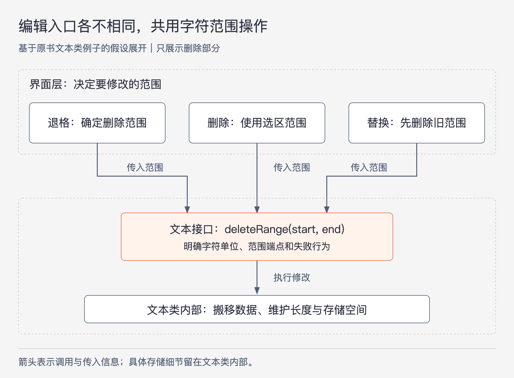

# 《软件设计的哲学》第21章｜确定什么是重要的 · 书镜8.2

第20章把设计重心放到影响性能的关键路径。本章把问题推广到整个系统：哪些事情应该决定接口和结构，哪些事情可以留在实现内部？作者认为，优秀设计需要主动做出这种区分，让使用者看得见必须知道的内容，少受其他细节干扰。

## 一、原书回顾：识别重要内容，控制它的影响范围

章首用三个熟悉的设计活动引出主张。设计抽象时，接口应反映模块用户需要知道的东西，其余细节隐藏在实现中；命名时，应挑出最能传达变量含义的几个词；优化 Buffer 时，应突出干净、清楚的常见路径，减少不必要的方法调用和特殊情况检查。这三个问题都要求先判断什么值得得到注意。

### 21.1 如何确定什么是重要的？

有些重要性来自系统外部，例如必须达到的性能要求。但外部要求通常只告诉设计者目标，仍需判断哪些内部选择最有助于实现目标。更多时候，这个判断直接由设计者做出。

作者建议寻找“杠杆”：解决一个问题，能够同时解决许多其他问题；或者掌握一条信息，就容易理解很多行为。这里的杠杆指一个选择带来的广泛解释力或解决能力。

原书回到文本存储接口的例子。专门的退格方法只解决退格这一种操作，而插入和删除字符范围的通用接口可以支撑多种编辑行为。在文本类这一层，是否由退格键触发并不重要，需要删除哪段文本才重要。把接口围绕文本变化来设计，便不必为每一种触发方式增加一个方法。不变量也有类似作用：一旦知道某个变量或结构始终遵守什么规则，就能推断它在许多情形下的行为，无须逐个记住实现分支。

多个候选方案会帮助判断。命名时，可以先列出与变量有关的词，再选出信息最多的几个来组成名字；这也是“设计两次”的一种应用。只有一个候选时，容易把眼前方案中最显眼的东西误当成最重要的东西。

经验不足时，重要性未必一开始就能看清。作者建议先提出一个假设，以它为基础构建系统，再观察效果。判断对了，要回想哪些线索支持了它；判断错了，也要追问错在何处，早先是否已有可识别的信号。练习的结果应进入下一次选择，而不只是给这次结果打分。作者提供的是学习判断的方法，没有保证第一次假设就会成功。

### 21.2 尽量减少重要的东西

本节先减少使用者必须做的选择：例如降低构造对象时必填参数的数量，或者为常见用法提供默认值。这样，使用者不用在每次调用时重新决定同一件事。

对确实重要的信息，还要减少必须了解它的位置。某个实现细节留在模块内，外面的代码就可以不关心；一个异常如果能完全在底层处理，上层就不必接着处理；一个配置值如果能根据系统行为自动计算，管理员便不必手动选择。

这些例子都保留了明确前提：底层必须确实能够处理异常，自动计算也必须能够得到合适的值。信息仍可能对内部实现很重要，只是其影响范围变小了。“减少重要的东西”不要求系统少做必要工作，而是让更少的人和代码位置必须了解这些工作。

### 21.3 如何强调重要的东西

确定重要内容之后，作者给出三种强调办法。

第一是突出，把内容放到容易看见的位置，例如接口文档、名称或常用方法的参数。第二是重复，让关键概念在相关位置反复出现。第三是中心性，让重要概念决定周围结构。操作系统的设备驱动程序接口是作者给出的例子：许多驱动程序都依赖它，因此它处于一个能影响大量代码的中心位置。

作者也反过来提醒：一个概念越显眼、出现得越频繁、越能决定系统结构，它在这个设计中就越重要。设计者把什么放进必填参数、让什么成为共同依赖，实际上就在分配重要性。相应地，不重要的细节应尽量隐藏，少在各处反复出现，也少左右整体结构。

### 21.4 错误

第一种错误是把太多事情当成重要的。与大多数调用者无关的参数会使接口杂乱，让每个人承担额外的认知负担。作者回顾 Java I/O 的例子：接口要求使用者意识到缓冲与非缓冲的区别，而按作者讨论的常见用法，开发者通常想要缓冲，不希望每次都额外声明。把这种通常不需要选择的差别推给所有人，会形成较浅的类。这里保留作者对该接口的评价，不把它扩写成所有 I/O 场景都不需要控制缓冲的结论。

第二种错误是漏认重要内容。结果可能是必要信息被隐藏，也可能是常用功能根本没有提供，开发者只好反复重做。前一种尤其容易让人连“还有什么必须知道”都察觉不到，这就是“不知道未知”；后一种则让本可共享的工作散落到各处。减少接口内容需要同时防止这两种后果。

### 21.5 更广泛的思考

作者把这个判断方法延伸到技术写作：先选出几个关键概念，让文档围绕它们展开，讲细节时说明细节与整体概念的关系。这样，读者有持续的理解线索，不必把每一段都当作独立信息记忆。

作者也提出一项个人生活建议：确定几件自己最看重的事情，尽量把精力花在这些事情上。这里是价值取向上的建议，本章没有为人生选择提供普遍排序。最后，作者用“品味”（good taste）称呼区分重要与不重要的能力，并把它视为优秀软件设计师的一项能力。前文的候选比较、提出假设和回顾结果，说明这种能力可以通过实践逐渐改善。

## 二、主题讲解：让每一层只承担它必须知道的事

### 用一次删除操作，检查接口围绕什么组织

下面沿原书的文本类例子展开一个假设设计，接口名称、区间约定和新情形均用于讲解。

假设一个文本编辑器要支持退格、删除选中内容和替换一段内容。第一版可以让文本类提供 `backspace`、`deleteSelection`、`replaceSelection`，再为每个方法传入按键或界面选择状态。这套接口看起来贴近界面功能，却让文本存储层也必须理解这些操作是如何被触发的。

另一个候选让界面层确定要修改的字符范围，文本类提供插入和删除范围的能力。下面先画出其中的删除部分。

图21-1｜同一个字符范围接口支撑不同操作。基于原书文本类例子展开的假设设计；箭头表示调用及传入范围，框线区分界面动作与文本存储职责，不表示按键事件直接穿透到内部数组。

退格由界面层把光标附近需要删除的字符换成范围，删除选中内容由界面层把选区换成范围，替换则先删除相应范围再插入新内容。文本类接到的是字符变化，不必知道鼠标、键盘或菜单。

这个方案为何有“杠杆”？当增加一种能够确定字符范围的编辑入口时，原来的删除能力仍可使用。读者也只需学会一次“范围删除怎样工作”，就能理解多种界面行为。接口的通用程度停在具体的文本变化上：若把它改成 `execute(type, data)`，让调用者自己解释类型和数据格式，接口虽然看起来更通用，却未必更容易使用。

### 减少需要知道的内容，不能隐藏使用条件

采用范围接口后，下一步需要明确范围本身。假设本文约定 `deleteRange(start, end)` 删除从 `start` 开始、到 `end` 之前的字符，并要求 `0 ≤ start ≤ end ≤ 当前长度`。这个约定必须出现在接口说明中，否则不同调用者可能删掉不同的内容。

底层用哪种数组、怎样搬移剩余字符、是否保留空闲容量，可以留给实现。调用者不知道这些细节，仍能正确删除。但调用者若不知道坐标单位或区间端点含义，就无法可靠指定要删除的字符。决定信息是否该隐藏的一个实用问题是：少了这条信息，调用者还能否正确判断操作结果？

这也区分了信息隐藏和遗漏。把数组扩容策略留在内部，是让调用者不必操心实现；把区间约定省略，则把必要知识藏了起来。有人可能根本想不到还有“终点是否包含”这个问题，直到删除结果出错才发现。这时产生的就是本章所说的“不知道未知”。

### 不变量让一个说明支撑多次判断

再假设文本类始终保证：保存的长度等于当前字符数量，并且所有修改完成后都恢复这个规则。这个不变量使调用者能够使用长度来检查范围，也使维护者能判断插入、删除是否正确更新了状态。

若每个调用者都要在修改前重新数一遍字符、自己维护长度，文本类没有集中承担这项工作；一次修复也可能要求改动很多位置。把规则和维护责任留在文本类内，便减少了必须理解内部结构的地方。对外仍需说明长度的含义，对内则需真正保证它准确。

这和“把异常放到底层处理”有同样的限制。假设空区间删除约定为不改变文本，模块可统一处理，所有调用者便不必各自加一次判断。但若范围指向了已经过期的文本版本，底层在不了解使用意图时，不能随意猜测用户现在想删哪段。此时需要让相应调用者知道失败，或者另行设计能表达版本要求的接口。集中处理有用，前提是处理者拥有足够的信息和权限。

### 默认值与突出显示，需要一起设计

减少选择可以从一个具体参数开始。假设内部数组增长时采用某种容量策略，而所有正常调用者都只想得到正确文本。让每次删除都传 `capacityPolicy`，会迫使不相关的调用者了解一个实现细节。文本类可以自行选择常见策略；只有证据表明确有不同调用者需要控制它，才考虑是否提供适当入口。

与此同时，`start`、`end` 以及它们的单位仍然必须清楚地出现。默认值不能替代真正属于调用者的决定；错误地猜测删除范围，会改变行为。减小参数表时，要逐一分清哪个值可以由模块负责，哪个值必须由使用者提供。

强调也不等于把所有内容写成醒目的警告。在这个例子里，范围约定应出现在接口文档；涉及该约定的方法应使用一致的名称；文本操作应围绕范围变化组织。这样，名称、文档与结构共同指向一条规则。作者所说的“重复”，在这里体现为同一概念反复可辨认，不需要把内部算法复制到每个调用点。

### 用新需求检验最初的判断

一开始可以记录假设：“编辑器的多种入口都能转成字符范围变化，因此范围操作应处于文本接口中心。”接着用已有的退格、选区删除和替换来试，再加一个新情形，例如删除搜索结果所覆盖的文本。如果无需把搜索界面的状态传入文本存储层，这个设计得到了新的支持。

假设另一个需求要求“一组修改要么一起生效，要么都不生效”。仅有独立的插入和删除方法可能无法表达这项要求；调用者会自行拼装恢复逻辑。此时重复出现的补救代码说明，一项对这些使用者重要的能力可能尚未进入接口。这不意味着范围接口整体失败，而是原先的重要性判断还没有覆盖这一要求。

回顾时应分别问：哪些调用者因为新接口少理解了一件事？哪些调用者仍在反复补相同功能？哪些信息藏起来后反而让结果难以判断？这些具体观察，比“接口更优雅”更有助于下一次设计。技术写作也可以这样检查：读者能否用开头的几个概念解释后续细节，还是必须不断记新词。

## 检验理解：该删的是参数，还是该补的是说明

假设一个文本接口有两个问题：调用者每次都必须传入相同的内部扩容策略；删除范围的终点是否包含，却只能靠阅读实现才能确定。有人建议“把两个细节都隐藏起来，接口就简单了”。你会怎样修改？

核对思路：扩容策略若确实不需要由调用者控制，可以由模块决定，从而减少必填参数。终点含义决定调用结果，必须通过接口说明或更清楚的表达来突出。两者都被称为“细节”，并不代表应该得到同样处理。

再看一个新情形：多个调用者都自己保存旧文本，在失败时逐项恢复，以实现一组修改全部生效或全部撤销。这里应重新判断共同需要的修改能力是否缺失，而不是把重复恢复代码视为每个调用者自己的小事。如果只有一个特殊调用者需要这种行为，则还要比较把能力放进通用接口的代价，不能仅因看见一个案例就扩大所有人的接口。

## 来源、范围与阅读连接

原书为《软件设计的哲学》第21章，PDF物理页236～239，对应书内页211～214；本章四页正文和标题均已回看页图。原书回顾保留21.1～21.5及章首三个连接例子。原书未提供本章新图，图21-1及主题讲解中的接口签名、区间规则、版本变化和整组修改要求均为假设展开。

本章把性能、接口、命名和文档放在同一项判断下：决定什么应被使用者看见，以及谁有责任处理其余细节。最后一章回到全书的总问题，讨论持续投入设计为何可能减少今后的理解与修改成本。

<!-- source_sha256: c751f0fc575096584dcdb5a365ae558a71b32a6aa241d90d7bc248f21fbdbbf7 -->
