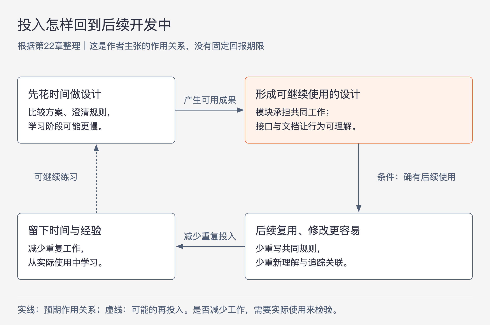

# 《软件设计的哲学》第22章｜结论 · 书镜8.2

本章收束全书：软件设计持续面对的是复杂性，减少复杂性需要投入，而这种投入要在后续复用、修改和理解中得到检验。作者也谈到设计带来的乐趣，以及经验增长后工作方式的变化。阅读这一章，可以把前面的技巧放回同一个问题：今天多做的设计工作，怎样让今后的开发更容易？

## 一、原书回顾：复杂性、前期投入与后续回报

原章没有编号小节。下面的标题为阅读时添加，按原文从总问题、代价、设计体验到回报的顺序组织，不代表原书小节。

### 先回到全书讨论的复杂性

作者首先明确，全书围绕复杂性展开。复杂性让系统难以构建和维护，也常常使系统运行缓慢。依赖关系与模糊性是作者强调的根本原因：前者让一处工作与别处相互牵连，后者让相关信息难以看清。

为了识别这些困难，全书提出了一些警示信号，例如信息泄露、不需要的错误条件，以及过于通用的名称。它们帮助设计者发现哪里可能增加了不必要的复杂性。作者同时回顾了应对思路：创建深类和通用类，通过合适定义让错误条件不再出现，把接口文档和实现文档分开，以及采用愿意为设计投入时间的心态。

这些内容在结尾形成一个相连的过程：认识复杂性的来源，观察设计中是否出现警示信号，再选择有针对性的改进方法。原文没有在此重新展开所有章节的细节，也没有给出一个能够自动判断所有设计好坏的公式。

### 前期多做的工作确实是代价

作者承认，书中的建议通常会在项目早期增加工作量。还不习惯思考设计的人，在学习过程中也会变慢。如果唯一目标是尽快让当前代码运行起来，那么比较不同方案、整理接口和补清楚说明，很容易被体验为阻碍。

这段让后文的回报主张有了时间上的前提：设计投入与获得收益不一定发生在同一刻。不能只保留“好设计节省时间”，却删掉早期需要额外工作和初学时速度较慢这两个条件。

### 把寻找简单结构本身当作值得做的事

作者接着换到设计者的体验：如果良好设计也是目标，编程可能更有趣。面对一个具体问题，探索多种结构，找到既简单又有用的方案，本身就是具有吸引力的难题。作者把简洁明了的设计视为一种美。

这里表达的是作者重视的工作体验。它没有证明每个人都会喜欢所有设计活动，也没有抹去前一段承认的学习成本。其作用是说明，设计投入除了可能降低未来工作量，也可以成为当前工作中有满足感的一部分。

### 回报通过复用、文档和技能积累出现

原书最后给出几条具体的回报路径。项目早期精心定义的模块会被反复使用，因而节省后来开发的时间；重新拿起代码增加功能时，六个月前留下的清晰文档可以帮助恢复理解。这里的六个月是作者描述重新接手代码的情形，并非统计得出的统一回报期限。

设计技能也会累积。作者认为，随着经验增长，设计者能更快找到较好的结构；掌握方法之后，好的设计未必比“快糙猛”的设计更花时间。作者进一步描绘了一种工作分配的变化：有更多时间寻找和完善方案，较少被复杂、脆弱代码中的错误拖住，从而可能同时改善软件质量、开发速度和工作的趣味。

这些是作者对持续设计投入的经验判断与倡议。本章没有报告对照实验、样本或固定回报曲线，因而不能把“很快回报”改写成每个项目都必然发生、具有明确期限的结论。

## 二、主题讲解：一次设计投入怎样减少后续重复工作

### 从一个已经在重复的任务开始

以下是一组假设的后端开发情形，用来解释本章的回报机制。

假设系统已有三条商品文件导入流程。每条流程都自己寻找标题列、读取文本、检查格式、处理缺失备注，再拼成商品记录。它们最初都能工作，但后来修改文件格式时，要在三处保持一致；某处把缺失备注当成错误，另一处却允许空备注。这时设计问题已经具体可见。

三处都要一起适应同一种文件格式，构成依赖关系。对于同样缺失的备注，开发者无法从接口中判断结果，构成模糊性。名称若只叫 `handleData`，还会隐藏它究竟负责读取、校验还是保存。这个例子让结论章提到的根因和警示信号落到可观察的代码关系上，而不只是一组需要记住的术语。

### 投入要形成别人能使用的东西

可以先比较两种做法：继续分别修复三条流程，或者把相同文件格式的读取集中到一个模块，让调用者获得含义清楚的记录和失败结果。

图22-1｜设计投入可能得到回报的过程。根据本章论述整理；箭头表示作者主张的作用关系。右侧向下的条件要求产物确实被后续工作使用，整张图不表示已经测得的时间曲线。

如果选择集中读取，模块应承担文件格式、列位置和共同检查，让调用者不必掌握这些内部步骤。接口仍需说明输入是什么、返回的记录包含什么、遇到格式错误时有什么结果。这就是深模块的方向：接口容易使用，内部完成有分量的工作。仅把三个相同辅助函数换成三个薄包装，未必减少调用者必须理解的内容。

通用性也有范围。这个模块处理的是同一种已存在的文件格式及其共同规则。仅凭三条导入流程，无法推导出现在就需要一个能配置任意格式、任意校验方式的导入平台。后者会增加新的选择和维护工作，其收益还需要另外的需求来说明。

### 规则定义清楚，才能减少错误分支

继续这个假设：商品业务明确允许备注为空。模块可以把缺失备注统一表示为空备注，调用者便不必每次捕获“备注列没有内容”这一错误。这里通过定义让一种错误条件不再存在，是因为缺失备注在业务含义上本来就被允许。

如果必需的商品标识缺失，读取模块不能为了让接口看起来简单而伪造一个标识。它需要给出足以让调用者采取正确行动的失败结果。减少错误条件的前提是重新明确有效行为，不能把真实失败隐藏起来。这是对结论章所列设计方法的假设说明，原章没有给出商品导入案例。

文档也应分清读者。接口文档说明哪些输入有效、缺失备注怎样处理，以及格式失败意味着什么；实现文档解释为什么选择某种内部读取方式。调用者不用先理解逐列扫描过程，才能知道一次调用会返回什么。后来维护者需要改变内部实现时，又能找到那部分设计理由。

### 回报发生在下一次使用，而不只在这次重构结束

当第四条使用同样格式的导入流程出现，它若能直接调用这个模块，就少了一次自行解释和实现格式规则的工作。旧格式发生变化时，如果调用者所需的记录含义没变，修改可以集中在读取模块中。过一段时间重新接手时，清楚的接口说明又能减少重新通读实现的需要。这三种情况分别对应原书说的复用、修改和文档收益。

但“建了模块”还不能证明已经得到这些收益。下一次开发者是否仍需阅读内部代码才能使用？一种格式变化是否仍要求同时修改所有调用者？新接口是否引入许多通常不需要的参数？这些观察可以检验设计是否真的减少了工作。

如果三条流程实际上使用不同的格式规则，硬塞进一个模块可能不断增加模式参数和分支。此时所谓通用模块未必值得保留。若一次性导入以后不会再发生，投入庞大扩展结构也可能没有后续使用机会。这里限定的是设计投入的规模：仍需保证当次工作正确、必要说明清楚，但不必为缺乏依据的未来预建所有能力。

### 技能增长来自判断和反馈的连接

本章的另一项回报是设计者逐渐熟练。继续这个例子，值得留下的经验包括：为什么这些规则适合集中，哪些信息必须放在接口里，哪个默认处理具有业务依据，以及哪次新需求暴露了原判断的边界。这样的记录能帮助下一次更快识别相似问题。

如果只记住“导入都应该提取公共模块”，下一次就可能机械照搬；如果记住“相同格式规则曾在多个地方独立维护，导致修改必须同步”，就更容易识别真正相似的条件。作者谈的投入心态，落实到这里是愿意比较方案、把理由写清楚，并在后续使用中修正判断。

设计乐趣也可以从这种具体进展中理解：过去需要反复追踪的关系变得清楚，新功能能建立在可靠的模块上，工作时间便有机会从排查脆弱代码转向解决新的设计问题。是否更有趣仍因人而异；更少重复解释和更清楚的修改范围，则可以通过实际工作来检查。

## 检验理解：哪一种投入对应本章的回报路径

假设一个团队准备为商品导入增加两项工作。第一项把已经重复的同格式校验集中起来，并写清楚缺失备注与缺失商品标识的不同处理。第二项提前支持二十种尚无使用者的格式模式。两者都被称为“为以后做设计”，是否可以据此认为同样值得？

核对思路：第一项对应已存在的重复、歧义和下一次使用机会，可以通过调用者是否少做工作、格式变化是否集中处理来验证。第二项增加了尚未证明需要的能力；它是否有收益，要看实际需求，不能单靠本章的投入主张获得理由。

再假设第一项做完后，调用者仍需理解全部内部格式分支才能调用，修改一次规则仍要同步改三处。这说明当前设计还没有形成所承诺的深模块和信息隐藏。完成重构、增加注释或减少代码行数，都不能单独代替这个检查。

## 来源、范围与阅读连接

原书为《软件设计的哲学》第22章，PDF物理页240～241，对应书内页215～216；两页均已回看。原章未分小节，本稿第一部分按原文顺序添加阅读标题。商品文件导入、三条已有流程、第四条复用流程及二十种未来模式都是明确的假设，没有真实项目或测量数据的含义。

本章的前期成本、复用收益、文档帮助、技能积累和设计乐趣均保留作者归属。它收束全书，不替代前面各章的具体论证。实际练习可以从一处已经妨碍理解或修改的关系开始，用下一次使用结果判断设计是否改善。

<!-- source_sha256: c751f0fc575096584dcdb5a365ae558a71b32a6aa241d90d7bc248f21fbdbbf7 -->
