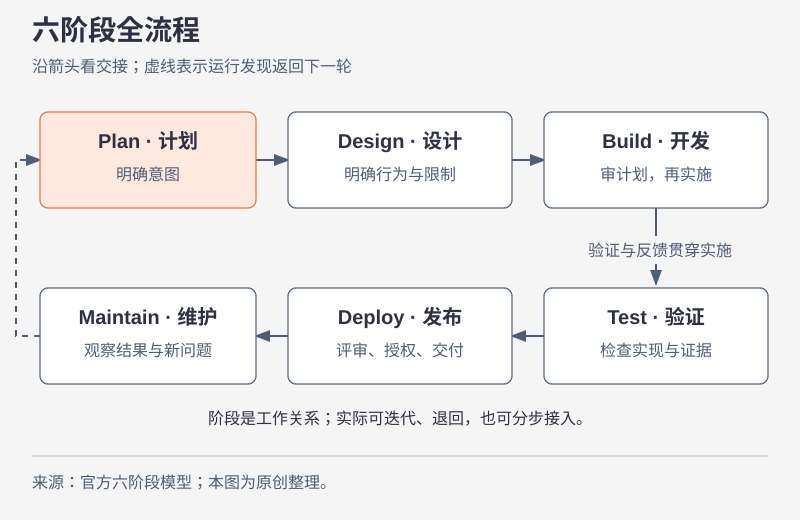
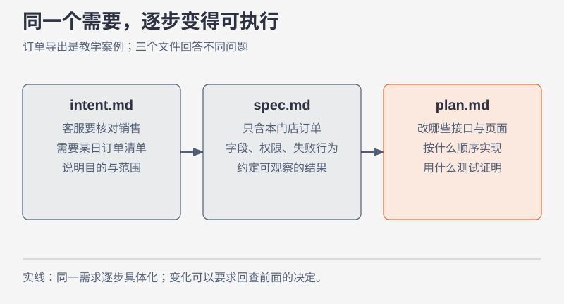
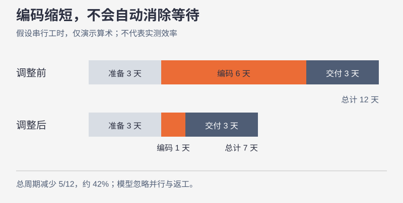

# 一次改动怎样走完整个生命周期

本节要回答：AI 写完代码以后，一次改动还需要经过什么，才算真正交付？先看全图，再用一个具体需求走一遍。

## 先把全流程放在眼前

**原文要点。** Anthropic 用 Plan、Design、Build、Test、Deploy、Maintain 描述完整生命周期。阶段之间传递可追踪的交付物，运行中的发现可以重新进入计划。图表达的是工作关系，具体接入顺序仍取决于团队已有能力。[官方流程说明](https://claude.com/blog/the-ai-native-sdlc-playbook#sd-c2)

## 用一个需求走一次

以下是一贯使用的**假设案例**：客服想在后台导出某家门店的订单，用于核对当天销售；现有系统服务多家门店，操作员只能看到自己获准访问的数据。这里的需求、数字和设计取舍都是教学设定。

一开始，客服说“给我一个导出按钮”。这句话没有说明导出对象、字段和权限。Agent 很快就能写出一个按钮，但“按钮出现了”与“客服能安全完成核对”之间还有距离。我们先把目的写清：客服要拿到指定日期、指定门店的订单清单。有没有手机号、有没有别家门店的数据、失败时怎样重试，都要能在实施前找到答案。

到了设计阶段，我们选择只导出订单号、金额和状态，并沿用后台的门店权限。研发接着检查系统：导出查询会不会占满在线业务使用的数据库连接？既有查询接口能否直接复用？这些答案会改变实施方案。直到这里，我们才知道应该改哪些文件、按什么顺序改，以及用什么测试证明结果。

代码完成后，还要让测试核对权限和数据，再让评审者检查实现是否符合约定。发布时，我们需要知道放出了哪个版本、失败能否撤回。上线后，客服能否完成任务、查询是否拖慢在线请求，才有可观察的结果。最后一段的发现会反过来改变下一次需求。

## 三份文件分别承接什么问题

**案例讲解。** `intent.md` 可以写“为什么要做”，`spec.md` 写“要满足什么行为与限制”，`plan.md` 写“这次怎样实现并证明”。文件名来自原文；图中的订单内容是教学示例。

这三个问题分开以后，一个争议就有了落点。客服认为“没有电话就无法联系顾客”，改变的是使用目的和字段范围，要回到意图与规格讨论。工程师发现数据库负载太高，提出分批导出，主要改变实施计划；如果分批让用户只能次日拿到文件，就又影响了用户承诺，需要回到规格判断。

交付物不必一律写成 Markdown。假设你们已在工单中批准了字段范围，就应指定那里是权威记录，并让实施计划指向对应版本。关键是避免出现两个各自都像最终版本、却给出不同答案的记录。[官方关于权威记录的讨论](https://claude.com/blog/the-ai-native-sdlc-playbook#sd-s3)

## 写代码更快以后，时间花到哪里

图中用一组**假设工时**演示：澄清与设计 3 天，编码 6 天，验证、评审和发布 3 天，共 12 天。即使把编码压到 1 天，总时间仍是 7 天，改善约 42%。这里把各项视为串行、忽略并行和返工；它是算术例子，不是 Anthropic 的实测结果。

当代码更快出现时，团队可以从时间戳寻找下一处等待：需求何时可执行、PR 何时进入评审、发布何时得到授权。只统计生成了多少行代码，会看不见这些延迟。反过来，如果眼下最慢的仍是难以验证的算法实现，先改会议流程也未必能明显缩短交付。

[打开交互式推演：改变各阶段时间，观察总周期](../../interactive/#timing)

并行会话也受审阅能力约束。独立任务可以放进各自的 worktree；共享文件的工作应先后安排。会话里的子代理适合接手验证等有界工作。若评审者已经忙不过来，继续开更多会话可能只会加长待审队列。

## 带着一个判断进入下一节

客服补充“所有门店都要导出”，开发已经完成。你会直接修改查询条件吗？先查这次变化是否改变了访问范围；一旦跨越门店权限，就要重审规格和风险。下一节继续看，应该由谁参与这个判断。

## 来源与范围

本节按官方六阶段模型组织总图；订单导出案例、图中的文件内容和工时是独立教学设计。原文中的全部操作示例、配置样板及指标没有在这里逐项复述。完整材料请从[官方原文](../../original/)阅读。
