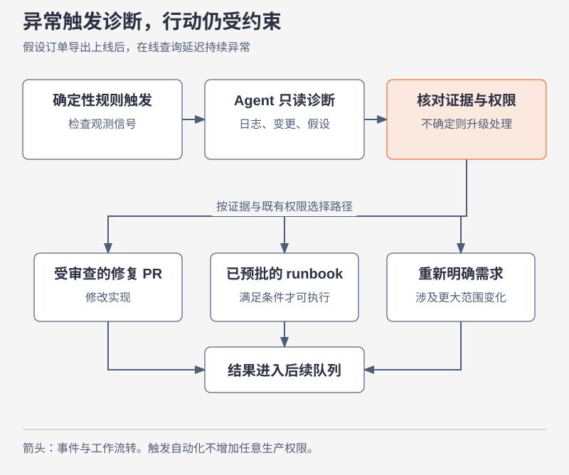
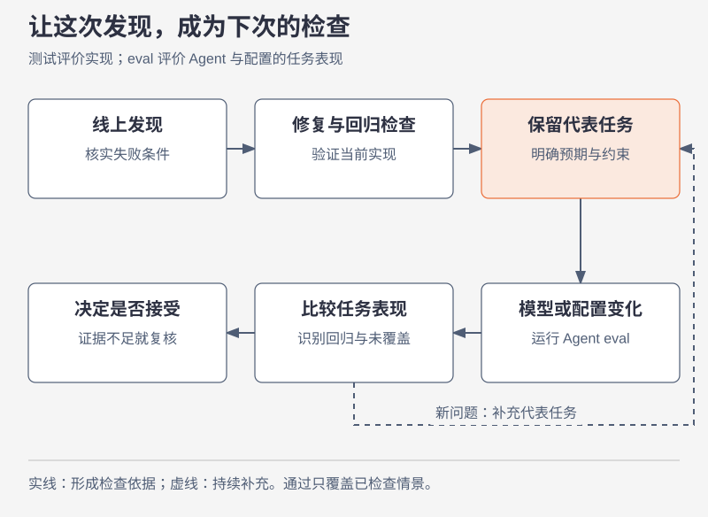

# 上线以后，怎样把发现带回下一次改动

本节要回答：流程画成一个圈以后，什么实际发生的事件会让它再走一遍？最后看订单导出上线后的变化。

## 触发、诊断、行动分开看

**原文要点。** 监测规则可以触发 Agent 诊断；后续行动受既定权限和审批路径约束，发现再进入工作队列。自动发起流程，不等于任意修改生产。[官方 Maintain](https://claude.com/blog/the-ai-native-sdlc-playbook#sd-s6)

**案例讲解。** 假设订单导出上线以后，后台查询延迟持续高于团队定义的正常范围。监测规则负责判断是否满足触发条件，Agent 读取日志和最近变更，提出“导出查询可能占用了在线查询资源”的解释。这时我们得到的是一个待验证的诊断，尚不能把时间上的相邻当成因果结论。

继续核对：慢请求是否集中在导出运行的时段？执行计划是否出现更大范围扫描？其他同期变更有没有共同影响？证据不足时保留多个解释；没有必要为了让自动流程继续而把诊断写得更确定。

若满足团队事先批准的回退条件，可以走既有回退流程；需要改变查询实现，则创建修复 PR；影响用户承诺或架构时，应重新整理需求与方案。三条路径的审批条件不同，不能从“异常严重”直接推导出“Agent 具有任意操作权限”。

## 让一次故障改变下一次行为

假设我们最终确认原因是大日期范围的导出触发全表扫描。只修复这个查询，下次另一个导出入口仍可能复现相同问题。我们增加能够暴露该条件的回归情景，并把日期范围与性能约束写进相关说明，让后续实现更早遇到这个检查。

如果未来换模型、修改 Skills 或调整工具权限，也需要确认 Agent 仍能在代表性任务中遵守这些约束。这里区分两种检查：软件测试看这份实现的行为，Agent 的 eval 看一套模型与配置在一组任务里的表现。它们可能共用测试工具，但评价对象不同。

评估集也有边界。例子太简单，模型全部答对以后就无法区分退步；例子只覆盖过去，仍可能错过新使用方式。团队应保留历史失败样例，再按新问题增补。一次测试通过可以支持当前决定，不能保证所有未遇到的情形。

## 从哪个地方开始改自己的流程

先挑一个能观察完成结果、权限范围清楚的变化，例如只导出当前门店的少量订单。在同一项工作中记录：需求何时明确、计划何时接受、代码何时通过验证、PR 何时合并、用户何时能完成任务。

记录会告诉你最值得调整的环节。若计划反复返工，先检查需求与系统事实是否对齐；若验证总要靠某个人临时准备环境，先让检查能够重复执行；若发布长期排队，就查等待对应什么必要判断，以及哪些准备工作可以提前完成。这是本专题建议的试验方式，不是已经验证适用于所有团队的统一路线。

## 把模型迁移到另一种工作

现在把订单导出换成“自动修复过期依赖”。Agent 找到升级版本，也能生成通过测试的 PR。仍要判断兼容性、变更范围、发布策略和回退条件；若生产异常，回到监测证据与受控行动。迁移时保留的是问题、证据、权限与反馈之间的关系，文件名与角色名称可以适应团队现状。

## 来源与范围

本节以官方维护流程为起点，具体诊断步骤、订单性能事故及试验方案均为教学构造。没有把原文举例的统计阈值当作普遍阈值，也没有声称这套流程已经带来某个效率增幅。
