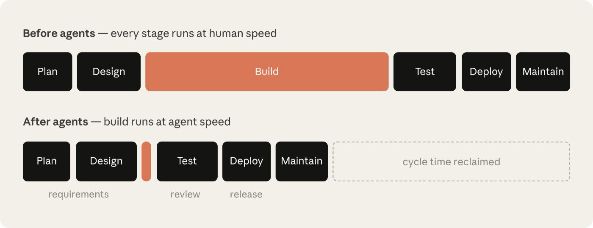
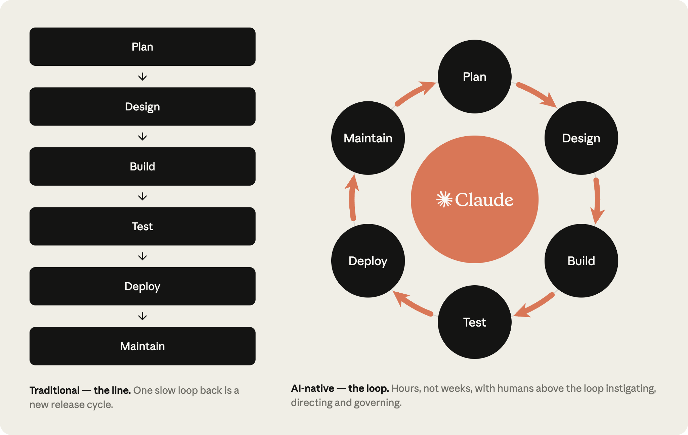
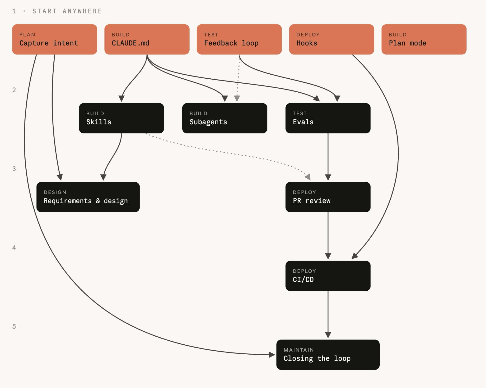

# AI 原生 SDLC 实践手册

如何借助 AI，逐阶段改造软件开发生命周期。

Louis Claxton · Anthropic · 2026 年 8 月 21 日

## 写代码已不再是瓶颈

各组织已经开始利用 AI，以一年前难以想象的速度编写代码。然而，围绕代码运转的流程并没有以同样的速度改变。

许多工程团队依旧采用原有的审批关口、评审、交接和政策，阻碍了 [Claude Code](https://claude.com/product/claude-code) 等 Agent 编程工具带来的生产力提升。

软件开发生命周期（SDLC）是将软件从一个想法推进到生产环境的过程。大多数组织采用的流程都包含六个阶段，分别覆盖计划、设计、开发实现、测试、部署和维护。传统上，各阶段是相对独立的环节，由不同角色负责：产品经理编写需求，技术架构师将其转化为设计，工程师实现设计，受监管企业的 QA 团队进行验证，发布团队交付上线，运维团队监控运行中的系统。工作通过文档、工单和批准记录在阶段间传递。

传统 SDLC 依赖较重的流程，以保证每一步都有责任归属和控制措施。但它最初追求的效率，建立在“编写和实现代码是最耗时、最昂贵的阶段”这一前提上。如今，这个前提已不再成立。PRD、估算活动和产品安全评审，原本是为了让各方在持续数周、数月乃至数个季度的开发过程中保持一致。

传统 SDLC 的控制措施还假定，每个步骤都由人执行。获益最大的组织已经围绕 Agent 当前能做的事情重新设计流程，同时确保人仍参与其中。本指南介绍 Anthropic 应用 AI 团队在内部各个 SDLC 阶段接入 Claude 的一些最佳实践，并吸收了与客户合作的经验，目的是加快开发和流程运转。

当代码不再是瓶颈，而开发实现阶段的速度超出了传统 SDLC 能承受的节奏时，会发生三种变化：

- 瓶颈转移到开发实现之前和之后的步骤，主要是计划、评审与测试、部署。这些环节仍按人的工作速度运行。
- 控制措施与现实脱节，变得难以维持。代码由人编写时，逐行人工检查是合理的；当大部分 diff 由 Agent 编写时，这种方式就跟不上了。
- 治理成本上升，因为例外事项仍要交给每周或每月才开会的会议和委员会处理。

**图中文字。** Agent 出现前，每个阶段都按人的速度运行；出现后，开发实现按 Agent 的速度运行。虚线框表示“节省下来的周期时间”；图下方的 requirements、review、release 分别为需求、评审、发布。

开发实现已不再是制约因素，围绕它、按人类速度运行的步骤才是。开发实现压缩到数小时后，这些环节的耗时仍保持原状。

以安全瓶颈为例。安全团队的规模通常是按人的产出来配置的。Agent 让代码产出成倍增加后，要么评审队列积压，要么代码在审查不足的情况下上线。受监管组织不能接受其中任何一种结果，因此安全与政策检查必须跟上 Agent 的速度。

要更充分地获得 Agent 带来的生产力收益，并确保使用安全，传统 SDLC 也需要经历与开发实现阶段同等程度的改造。

## 什么是 AI 原生 SDLC

AI 原生 SDLC 重新构想了开发过程：沿用原有控制目标，采用新的强制执行机制。流程从直线变为循环，AI 嵌入其中的每个环节。它强调自动交接和自动触发后续操作方法，改善传统阶段交接中依赖人工、衔接繁琐的问题。

你也会听到 Agent 驱动的 SDLC、AI SDLC，或 Agent 驱动的软件开发等名称。叫法不同，指的是同一种变化。

**图中文字。** 传统方式是一条线，一次缓慢的回流意味着又一个发布周期。AI 原生方式是循环，以小时而非周运转；人位于循环之上，负责发起、指导和治理。

### AI 原生 SDLC 六个阶段的变化

下表对比传统 SDLC 与 Claude 支持的 AI 原生 SDLC，呈现的是两个端点。大多数组织处于两者之间。

| 阶段 | 传统 SDLC | AI 原生 SDLC |
| --- | --- | --- |
| Plan · 计划 | 通过委员会收集需求，经研讨和签字确认提炼，再由人写出来 | Claude 直接从来源材料提炼痛点，记录为 `intent.md`，既便于人阅读，也能让机器据此行动 |
| Design · 设计 | 分析师编写规格，设计师再解读规格 | 在一次 Agent 工作会话中完成需求与设计，由写成 Skills、纳入 Git 版本控制的标准提供指导 |
| Build · 开发实现 | 人手编写测试与代码，主要开发结束后才写文档 | AI 生成测试与代码，组织知识保存在有版本记录、机器可读的 `CLAUDE.md` 和 Skills 中 |
| Test · 测试 | 在阶段边界设置 QA 关口 | 将持续 eval 融入实现过程 |
| Deploy · 部署 | 人逐行评审代码，治理发生在评审周期中，执行往往不一致 | 通过多层 Agent 评审，把人工审阅留给受监管和关键代码；AI 行动时就执行治理，以 Hooks 作为审批关口 |
| Maintain · 维护 | 人监控生产环境、寻找缺陷 | Agent 监测线上部署；指标越出控制带后进行诊断，并以新的 `intent.md` 写回循环 |

贯穿右栏的是已经提交的交付物（artifact）。每个阶段结束时，都向版本控制系统写入一份交付物；下一阶段从读取它开始。交付物包括 `intent.md`、`spec.md`、`plan.md`、代码差异及其测试、附带评审发现的 PR，以及事故记录。在早期阶段，`.md` 文件占主导，因为产品负责人和 Agent 都能阅读同一份文件并据此行动。从开发实现阶段起，交付物包括代码及其记录。提交链同时构成审计轨迹：谁提出了什么、Agent 生成了什么、谁批准了它。

凡是需要判断的决定，人仍然承担责任。在 Agent 驱动的 SDLC 中，人的注意力会随着需要审阅的交付物一起转移。

每个阶段都会提交下一阶段能够读取的交付物。意图、规格、计划、代码差异和评审发现，共同构成审计轨迹。

## 操作方法

这些操作方法是本手册的主体，按 Plan、Design、Build、Test、Deploy、Maintain 六个非线性阶段组织，共同覆盖完整生命周期。

每项方法都会说明：

- 哪些事情发生变化；
- 如何开始；
- 具体实施步骤；
- 治理方面的考虑；
- 怎样衡量是否奏效。

这些方法可以分别采用。组织可根据自身需要，优先改造不同阶段。每项方法在“前置条件”中列出依赖，依赖关系图进一步说明了这些关系。

阶段结束时提交交付物，提交会启动下一阶段：获准的 `intent.md` 触发需求与设计处理，批准的 `spec.md` 触发计划模式，合并的 PR 触发流水线，生产指标越出控制带则写出下一份 `intent.md`，循环由此继续。

开始时，你手动提示每一步。最终目标是形成一个循环，让每份获准的交付物触发下一个关口。人的注意力集中在关口，审阅 Agent 标出的事项，无需从头启动每个阶段。

图中的方法按阶段排列，箭头表示采用它们的先后依赖，两者并不相同。可以从任意陶土色的方法开始：没有箭头指向它，意味着它不需要先采用其他方法。采用其他方法前，先采用指向它的箭头所标出的前置方法。

**依赖图中的文字。** 第一层标题“START ANYWHERE”表示可以从这一层的任一入口开始。图中方法名对应如下：

| 图内英文 | 中文 |
| --- | --- |
| Capture intent | 捕获意图 |
| CLAUDE.md | CLAUDE.md 上下文文件 |
| Feedback loop | 反馈回路 |
| Hooks | 钩子 |
| Plan mode | 计划模式 |
| Skills | 技能 |
| Subagents | 子代理 |
| Evals | Agent 评估 |
| Requirements & design | 需求与设计 |
| PR review | PR 评审 |
| CI/CD | 持续集成与持续交付 |
| Closing the loop | 闭合循环 |
