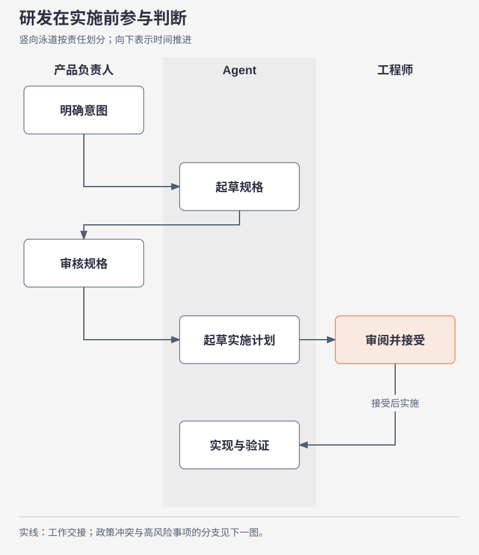
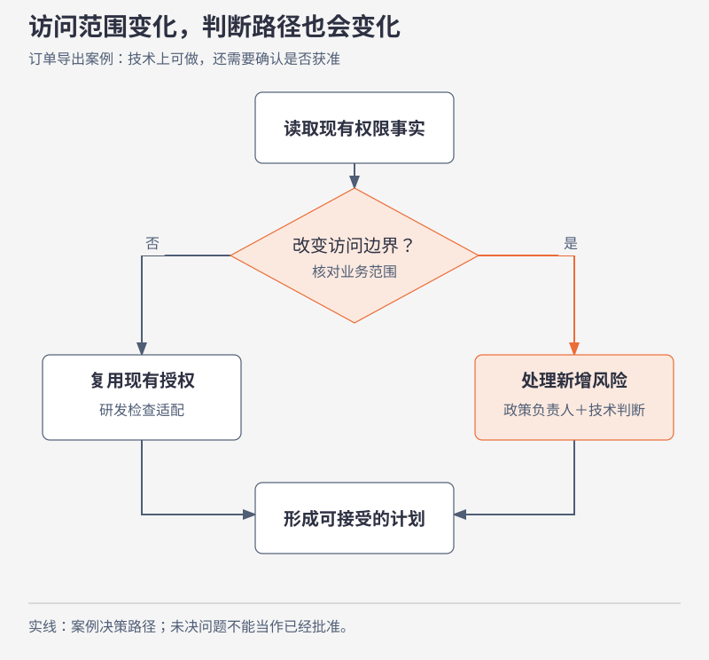
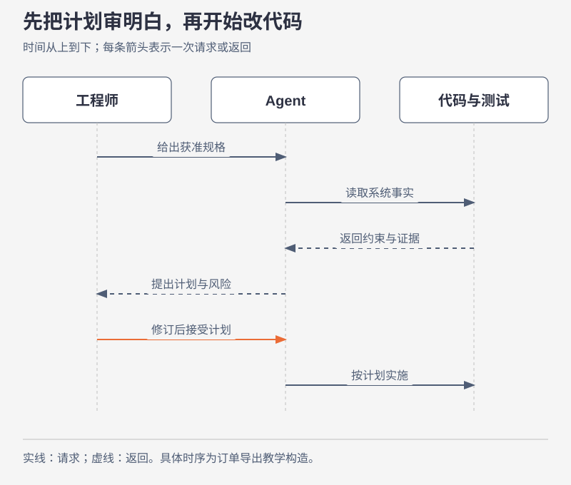
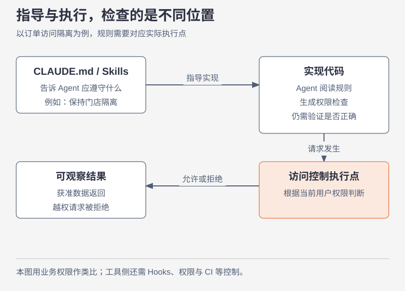
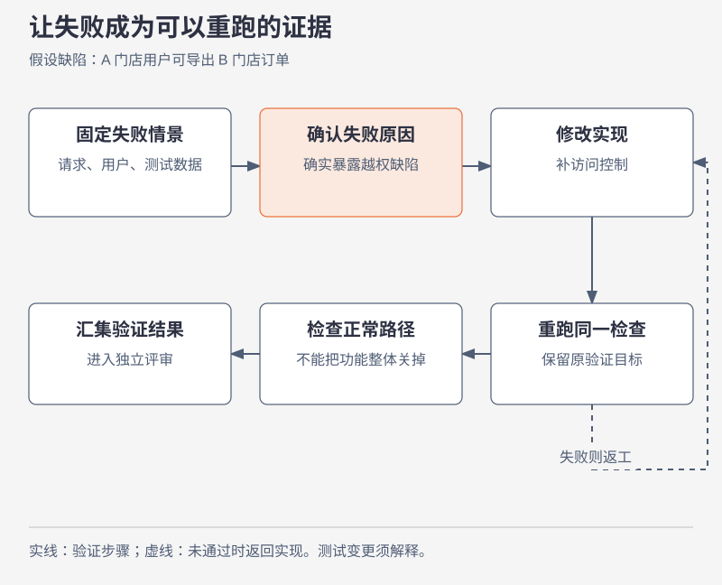
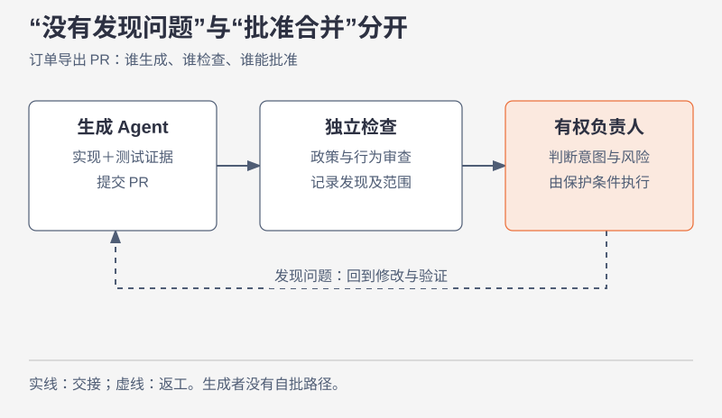
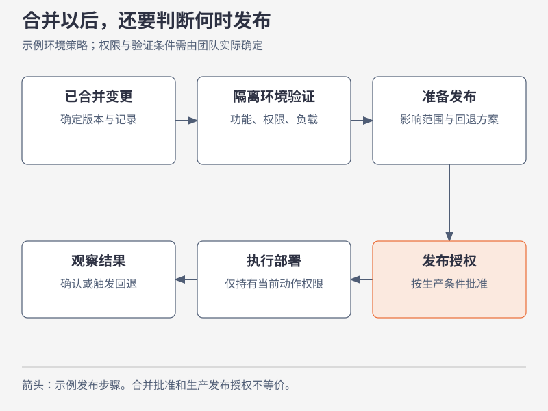

# 图稿目录

12 张原创中文图，每张均提供可缩放 SVG、高清 PNG 和独立图稿页。

## 1. 六阶段全流程

[独立图稿](../diagrams/01-lifecycle.html) · [高清图片](../images/01-lifecycle.png)

## 2. 同一个需要，逐步变得可执行

[独立图稿](../diagrams/02-artifacts.html) · [高清图片](../images/02-artifacts.png)

## 3. 编码缩短，不会自动消除等待

[独立图稿](../diagrams/03-waiting.html) · [高清图片](../images/03-waiting.png)

## 4. 研发在实施前参与判断

[独立图稿](../diagrams/04-responsibilities.html) · [高清图片](../images/04-responsibilities.png)

## 5. 访问范围变化，判断路径也会变化

[独立图稿](../diagrams/05-risk-routing.html) · [高清图片](../images/05-risk-routing.png)

## 6. 先把计划审明白，再开始改代码

[独立图稿](../diagrams/06-plan-review.html) · [高清图片](../images/06-plan-review.png)

## 7. 指导与执行，检查的是不同位置

[独立图稿](../diagrams/07-controls.html) · [高清图片](../images/07-controls.png)

## 8. 让失败成为可以重跑的证据

[独立图稿](../diagrams/08-verification.html) · [高清图片](../images/08-verification.png)

## 9. “没有发现问题”与“批准合并”分开

[独立图稿](../diagrams/09-review.html) · [高清图片](../images/09-review.png)

## 10. 合并以后，还要判断何时发布

[独立图稿](../diagrams/10-deployment.html) · [高清图片](../images/10-deployment.png)

## 11. 异常触发诊断，行动仍受约束

[独立图稿](../diagrams/11-maintenance.html) · [高清图片](../images/11-maintenance.png)

## 12. 让这次发现，成为下次的检查

[独立图稿](../diagrams/12-learning.html) · [高清图片](../images/12-learning.png)
