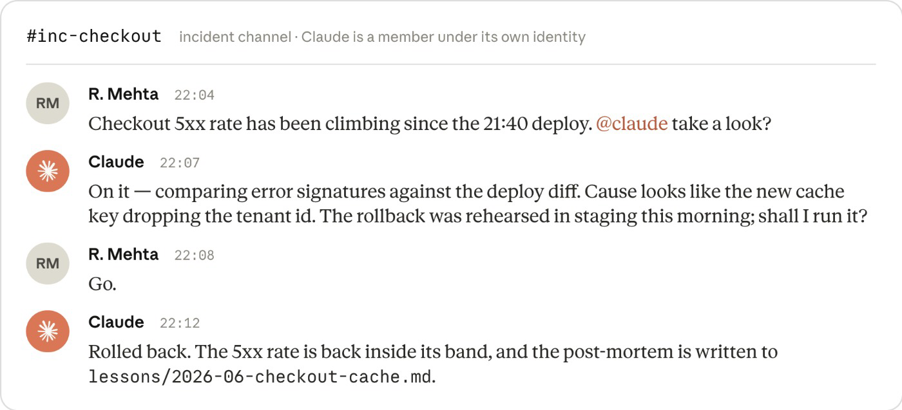

# Maintain · PDF full text

## Maintain

The loop closes. A trigger invokes Claude with no person in the invocation path, and what it finds re-enters the pipeline as intent.md.

### Maintenance and closing the loop

So far, we've discussed how to add Claude to each stage of the SDLC process, with each stage requiring a human to launch the initial steps. This stage, however, shifts the focus to autonomous running of Claude to close the loop.

For example, a continuously running monitoring agent could, off the back of a bug ticket being raised, create an intent.md, and flow through the requirements, plan, build test and review phases. Stage 6: Maintenance runs headless, with an independent confidence gate between stages, a deterministic check or an adversarial reviewing agent, deciding whether the previous stage's output continues or is escalated to a human.

**Traditional.** Maintenance is a reactive phase. All tickets or incidents wait on a person to act on it and restart the process. An alert fires at 3 a.m. and can be missed, a ticket can sit in the backlog until someone picks it up, and post-mortem actions may not reach the codebase at all if another fire starts first.

**AI-native.** A trigger such as a control-band breach, a ticket, a channel message or a schedule invokes Claude without a person in the path. Claude diagnoses, acts only through gated routes, and writes what it finds as intent.md, which then goes through the stages described above. People triage and review that work, and no longer have to start it.

### Closing the loop

A deterministic script watches production and invokes Claude when a control band is breached. Monitoring of a breach is a helpful example of the pattern for the loop running autonomously, while the [Claude Tag](https://claude.com/product/tag) (public beta) section at the end of the stage covers work arriving through different channels.

#### Getting started

**Prerequisites**

Intent.md which gives the loop a structured output to restart. Claude accelerated PR reviews, hooks as an action boundary, and a rollback path for CI/CD (which the highest autonomy tier invokes).

**Infrastructure**

A metrics store the detection script can query (Prometheus, the CI system's API, or equivalents), read access to the repository, a way to run Claude Code non-interactively in CI, or the [Agent SDK](https://platform.claude.com/docs/en/agent-sdk/overview) for a service that receives webhooks.

#### How to execute it

- The service owner or platform engineer picks one metric with a stable rolling baseline, such as CI test failure rate, post-deploy 5xx rate, or PR cycle time.

- They write the detection script, typically mean and standard deviation over a rolling window with rules (Western Electric or similar) so the bands catch slow drift as well as spikes. The script is version controlled and unit tested, and detection stays entirely deterministic, with no model involved.

- Response tiers are defined in version-controlled config (bands.yaml below). At 1σ the script only logs, at 2σ it invokes Claude read-only to diagnose, and at 3σ Claude may act, though only by opening a PR into the review gate or triggering a pre-approved runbook.

- The trigger layer can be a scheduled workflow in GitHub or GitLab, a webhook from the existing monitoring stack, or a Cron Job inside the network. Claude runs stateless, either as a non-interactive step on a CI runner or as an Agent SDK service in a sandboxed container, and the CI/CD play covers the deployment and model-access options. Because the run is stateless and non-interactive, a loop can begin and end without anyone starting it.

- The agent writes its diagnosis as intent.md in the Stage 1: Plan format, covering the anomaly and its evidence, a proposed outcome, the affected systems and any open questions. From there the finding goes through the pipeline like anything else.

- The service owner or on-call engineer triages the queue, routing product-facing findings to the product owner. Fix now, schedule, or dismiss. Dismissals tune the bands and help to reduce noise.

- When a fix ships, add an eval for the incident (the continuous evals play) to ensure that such issues are protected against going forwards.

#### What it looks like (for example, a bands.yaml monitoring CI test failure rate)

```yaml
metric: ci_test_failure_rate
baseline: rolling_30d
rules: western_electric
tiers:
  1sigma: { action: log }
  2sigma: { action: diagnose,
            tools: "Read,Grep,Bash(gh run view *)" }
  3sigma: { action: propose,
            routes: [pull_request, runbook:rollback-deploy] }
```

#### Governance considerations

The tier boundaries are enforced from version-controlled config, with permissions and managed settings denying production access. Invocations, findings and triage decisions are logged with a timestamp. A service owner triages and approves findings, resulting changes go through the normal PR review gate, and the runbooks the agent may trigger were approved in advance.

#### How to measure it

**Leading indicator**

Time from band breach to an intent.md in the triage queue, against the old time from incident to post-mortem action. The detection script's log has the breach timestamp and tier of incident.

**Lagging indicator**

The share of findings that become merged fixes (triage queue against actual PR history), and repeat incidents of the same class, which should fall as the fixes add cases to the eval suite.

#### Examples

- When the CI test failure rate breaches 3σ, the agent quarantines the flaky test or opens a revert PR, and the review gate decides.

- When the post-deploy 5xx rate breaches 3σ with a deployment in the window, the agent triggers the existing rollback pipeline.

- When PR cycle time trips a drift rule, the agent writes a report for engineering leadership, which shows the harness works for process metrics as well as production ones.

Detection stays deterministic. Claude is invoked once a band is breached, and the tier sets what it may do.

### Recurring codebase scans

A security scan is a point-in-time statement about a codebase under a particular model, and both halves go stale: the code changes every week, and each model generation finds vulnerabilities the previous one missed. The AI-native answer is to run the scan on a schedule, without a human in the invocation path, and to send what it finds through the same gates as any other change to the codebase.

[Claude Security](https://claude.com/product/claude-security) is the hosted form of scheduled scanning. Connect a GitHub repository, and scans run on Claude Mythos 5 in Anthropic's infrastructure, with each finding validated before it is reported and a confidence rating attached. Suggested patches are reviewed and applied in Claude Code on the web. The organization gets the findings without needing access to the model itself.

**Traditional.** Security scanning is an event with a scan launched before a release or an audit. The report goes to a tracker, and the backlog is worked down by hand until the next event. Code written in between is covered by whatever the PR review caught.

**AI-native.** Scans run on a schedule against every connected repository, on the most capable model available, with findings validated before anyone reads them. Each finding is handled the way a breached control band is: a fix that fits in one PR goes through the review gate, and anything larger becomes an intent.md. Coverage is dated from the last run, not from the first

#### Getting started

**Prerequisites**

The PR review gate and hooks as approval gates ([Stage 5: Deploy](../05-deploy/)), so that findings go through review like any other change. The intent.md format from [Stage 1: Plan](../01-plan/) for findings too large for a single PR.

**Infrastructure**

Claude Security is available to Claude Enterprise organizations in public beta. It needs the Anthropic GitHub App installed on the target repositories (cloud-hosted github.com), Claude Code on the Web enabled, Extra Usage turned on with a spend limit set, premium seats for the people who run scans, and the feature switched on by an admin at claude.ai/admin-settings/claude-code. Scans are billed on consumption at Mythos 5 rates, so the spend limit should match the size and number of repositories.

#### How to execute it

- The security lead connects the repositories and organizes them into projects by repo, service, or team, so ownership of findings is clear from the start.

- Run a first full scan of the most critical repositories, including ones that have been scanned before by other tools or by earlier models. Treat the first scan as the baseline. The first scan will likely surface findings in code that was considered clean.

- Set a schedule per project. Weekly is a sensible default for actively developed services; scope scans to a directory or branch where a repository is large or mixed.

- Triage findings with the confidence rating in hand. Dismiss with a reason, so the dismissal is recorded and the same finding does not return as new on the next run.

- For a bounded finding, open the suggested patch in Claude Code on the Web, review it, and send it through the PR review gate like any other change. The agent that proposed the fix has no route to approve it.

- For anything wider than one patch, such as an architectural weakness or a pattern repeated across services, write it up as intent.md in the Stage 1 format and start it at Plan.

- When a fix is released to production, add an eval for the vulnerability class to the suite from the continuous evals play, so the configuration that steers the agent is tested against that class from then on.

- Export findings as CSV or Markdown, or use webhooks, to keep the organization's existing tracker and audit systems as the system of record where auditors already expect them.

#### Governance considerations

The scan runs under the organization's admin controls meaning what repositories are connected, who holds a scan seat, and the spend limit are all set centrally. Every finding has a validation result and a confidence rating, and every dismissal has a reason, so the scan history is an audit record of what was found, fixed, and consciously accepted.

Fixes reach production through the PR review gate and branch protection rather than from the scan itself. Claude Security augments existing static analysis and dependency scanning. The deterministic checks stay in CI, and the model-driven scan covers the context-dependent vulnerabilities those checks are not built to find.

#### How to measure it

**Leading indicator**

Share of connected repositories on a schedule, and time from a finding being reported to its patch entering the PR review gate, read from the scan history and the PR metadata.

**Lagging indicator**

Vulnerabilities found by the scheduled scan set against those found in production or by external report, from the incident tracker; and the trend in findings per scan on repositories that have been through several runs, which should fall as fixes and evals accumulate.

### Claude on call with Claude Tag

Incidents can also arrive via other means such as workplace communication apps, like Slack or Teams. Incidents can look like a 10pm Slack message for an urgent fix on an incident channel and can now be actioned immediately. Claude Tag (public beta currently available in Slack) makes Claude a member of those channels under its own identity, so each new incident gets a first responder and the response itself becomes part of the loop and memory for future incidents.

The conversation and institutional knowledge stay in the channel, with anyone in the channel able to guide and action the response. Any team member can test hypotheses, explore new options and investigate in real time with the channel history adding to the auditability. Through access to MCP Claude verifies the metric is back at baseline and confirms it in the thread, writes the post-mortem to a version-controlled lessons file that future investigations can read.

Incidents are not the only work Claude Tag picks up. Tagged on a ticket over MCP or asked in the channel, Claude triages the work the same way. A small, well-bounded fix arrives as a PR through the review gate, and anything larger is written up as intent.md for Stage 1: Plan, at which point the loop starts feeding itself. See: [how Claude Tag runs on-call for CI/CD at Anthropic](https://claude.com/blog/ai-ci-cd-on-call).



The channel is the audit trail: request, diagnosis, human authorization and fix all stay where the incident was handled.
